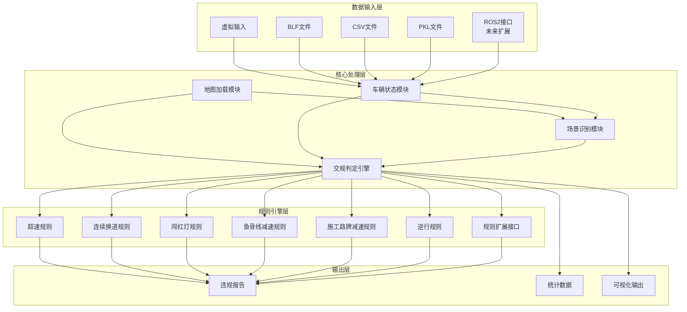
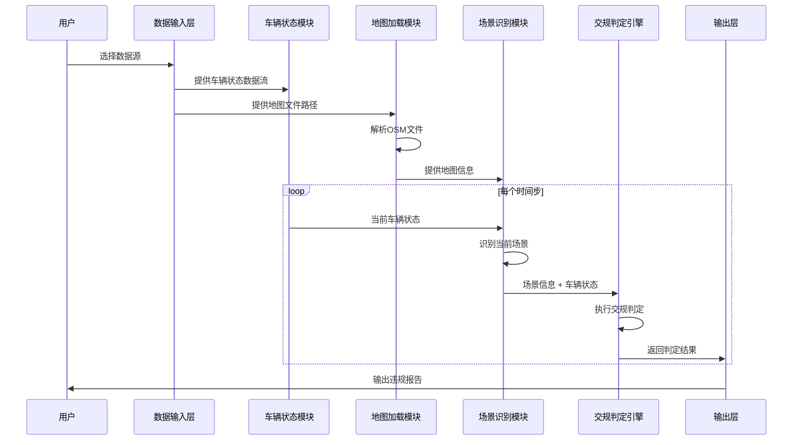
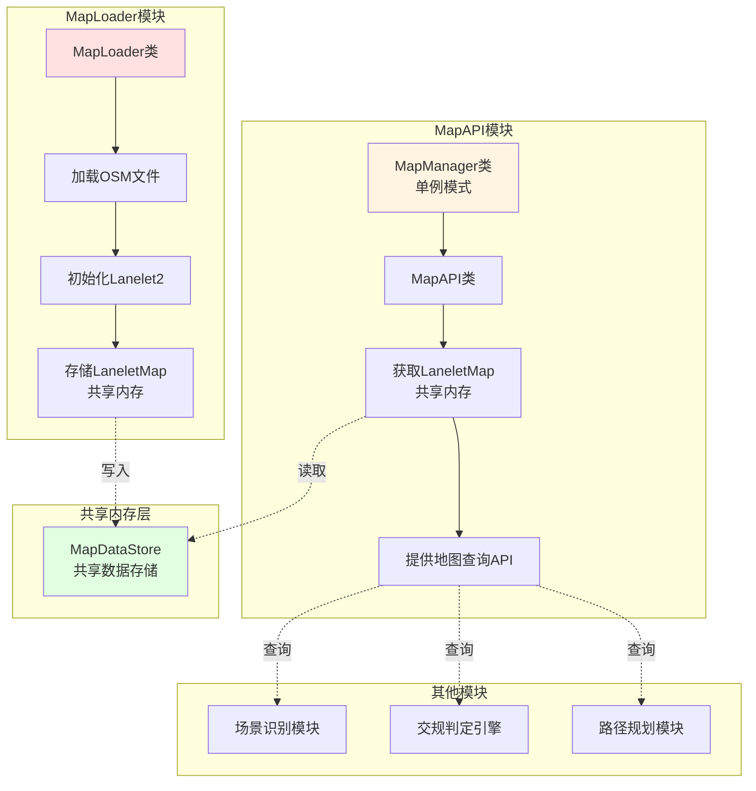

# 交通规则符合性判定系统 - 架构设计文档

## 1. 项目概述

### 1.1 项目目标
构建一个基于Python的交通规则符合性判定系统，用于分析车辆在高速公路场景下的驾驶行为是否符合交通规则。

### 1.2 应用场景
- **当前阶段**：离线分析系统，用于回放和分析历史驾驶数据
- **未来扩展**：在线实时监控系统，用于实时判定交规符合性

### 1.3 技术栈
- **地图处理**：Lanelet2 - 专门用于自动驾驶的高精度地图库
- **编程语言**：Python 3.8+
- **数据输入**：当前使用PKL文件（预留接口用于未来扩展BLF、CSV、ROS2）

---

## 2. 需求分析

### 2.1 功能需求

| 需求编号 | 需求描述 | 优先级 |
|---------|---------|--------|
| FR-001 | 加载.osm地图文件，并提供可扩展的自定义API接口层 | P0 |
| FR-002 | 获取自车状态数据（GPS坐标、车速、航向角等） | P0 |
| FR-003 | 场景识别：识别高速公路场景（匝道、结构化道路等） | P0 |
| FR-004 | 交规判定：超速检测 | P0 |
| FR-005 | 交规判定：10秒内连续换道检测 | P0 |
| FR-006 | 交规判定：闯红灯检测（高速公路场景） | P1 |
| FR-007 | 交规判定：鱼骨线不减速检测 | P1 |
| FR-008 | 交规判定：施工路牌不减速检测 | P1 |
| FR-009 | 交规判定：逆行检测 | P1 |
| FR-010 | 支持多种数据输入格式（虚拟输入、BLF、CSV、PKL） | P0 |
| FR-011 | 支持未来ROS2数据接入 | P2 |

### 2.2 非功能需求

| 需求编号 | 需求描述 | 优先级 |
|---------|---------|--------|
| NFR-001 | 系统应具有良好的可扩展性，便于添加新的交规判定规则 | P0 |
| NFR-002 | 代码结构清晰，模块化设计 | P0 |
| NFR-003 | 支持配置化管理（如速度阈值、时间窗口等参数） | P1 |
| NFR-004 | 提供清晰的违规报告输出 | P1 |

---

## 3. 系统架构设计

### 3.1 整体架构



### 3.2 数据流图



---

## 4. 模块详细设计

### 4.1 数据输入层 (Data Input Layer)

#### 4.1.1 模块职责
- 统一的数据输入接口
- 支持多种数据格式
- 数据格式转换和标准化

#### 4.1.2 接口设计

```python
class DataInputAdapter(ABC):
    """数据输入适配器基类"""
    
    @abstractmethod
    def load_data(self, source: str) -> Iterator[VehicleState]:
        """加载车辆状态数据"""
        pass
    
    @abstractmethod
    def get_metadata(self) -> Dict:
        """获取数据元信息"""
        pass
```

#### 4.1.3 实现类
- `VirtualInputAdapter`: 虚拟输入适配器
- `BLFInputAdapter`: BLF文件适配器
- `CSVInputAdapter`: CSV文件适配器
- `PKLInputAdapter`: PKL文件适配器
- `ROS2InputAdapter`: ROS2接口适配器（未来扩展）

### 4.2 地图加载模块 (Map Loading Module)

#### 4.2.1 模块概述
地图加载模块采用完全解耦的设计，分为两个独立子模块：
- **MapLoader模块**：负责加载OSM地图文件，将LaneletMap存储到共享内存
- **MapAPI模块**：从共享内存获取地图数据，提供地图查询API

详细架构设计请参考：
- [`maploader_architecture.md`](maploader_architecture.md) - MapLoader模块架构
- [`mapapi_architecture.md`](mapapi_architecture.md) - MapAPI模块架构

#### 4.2.2 架构设计



**核心设计原则**：
- **完全解耦**：MapLoader和MapAPI通过共享内存完全解耦
- **共享内存模式**：MapLoader将LaneletMap存储在共享内存，MapAPI从中读取
- **单例模式**：MapManager使用单例模式，确保全局只有一个实例
- **手动配置**：Projector必须通过配置或参数指定，不自动计算

#### 4.2.3 MapLoader模块

**职责**：
- 加载和解析OSM地图文件
- 初始化Lanelet2
- 将LaneletMap存储到共享内存
- 生成地图元信息

**核心类**：
- `MapLoader`：地图加载器
- `MapDataStore`：共享内存存储
- `Projector`：投影器接口
- `UtmProjectorWrapper`：UTM投影器实现

**使用示例**：
```python
from src.maploader.loader import MapLoader
from src.maploader.utils import UtmProjectorWrapper
from lanelet2.io import Origin
from lanelet2.core import GPSPoint

# 创建地图加载器
loader = MapLoader()

# 创建投影器（必须手动指定原点）
gps_point = GPSPoint(lat=39.9042, lon=116.4074)
origin = Origin(gps_point)
projector = UtmProjectorWrapper(origin)

# 加载地图
success = loader.load_map("Town10HD.osm", projector)
```

#### 4.2.4 MapAPI模块

**职责**：
- 从共享内存获取LaneletMap
- 提供地图查询API
- 支持车道查询、速度限制查询、交通标志查询等

**核心类**：
- `MapManager`：地图管理器（单例模式）
- `MapAPI`：地图查询API
- `Lanelet`：车道信息
- `TrafficSign`：交通标志信息

**使用示例**：
```python
from src.mapapi.manager import MapManager
from src.map.base import Position

# 创建地图管理器（单例模式）
map_manager = MapManager()

# 初始化MapAPI（从共享内存获取地图数据）
map_manager.initialize()

# 查询车道
position = Position(latitude=39.9042, longitude=116.4074)
lanelet = map_manager.get_lanelet(position)

# 查询速度限制
speed_limit = map_manager.get_speed_limit(position)
```

#### 4.2.5 自定义API层
```python
class CustomMapAPI:
    """自定义地图API接口层"""
    
    def __init__(self, map_manager: MapManager):
        self.map_manager = map_manager
    
    def query_ramp_info(self, position: Position) -> Optional[RampInfo]:
        """查询匝道信息"""
        pass
    
    def query_structured_road(self, position: Position) -> bool:
        """判断是否为结构化道路"""
        pass
    
    def query_fishbone_lines(self, position: Position) -> List[FishboneLine]:
        """查询鱼骨线信息"""
        pass
    
    def query_construction_signs(self, position: Position) -> List[ConstructionSign]:
        """查询施工路牌信息"""
        pass
```

### 4.3 车辆状态模块 (Vehicle State Module)

#### 4.3.1 模块职责
- 管理车辆状态数据
- 提供状态查询接口
- 维护历史状态记录

#### 4.3.2 数据结构

```python
@dataclass
class VehicleState:
    """车辆状态数据结构"""
    timestamp: float
    position: Position  # GPS坐标
    speed: float  # m/s
    heading: float  # 航向角 (rad)
    lane_id: Optional[str] = None
    acceleration: Optional[float] = None
    yaw_rate: Optional[float] = None
```

#### 4.3.3 接口设计

```python
class VehicleStateManager:
    """车辆状态管理器"""
    
    def __init__(self, history_window: float = 10.0):
        self.history: List[VehicleState] = []
        self.history_window = history_window
    
    def update_state(self, state: VehicleState) -> None:
        """更新当前状态"""
        pass
    
    def get_current_state(self) -> VehicleState:
        """获取当前状态"""
        pass
    
    def get_history_states(self, duration: float) -> List[VehicleState]:
        """获取指定时间窗口内的历史状态"""
        pass
    
    def get_lane_change_history(self, duration: float) -> List[LaneChangeEvent]:
        """获取换道历史记录"""
        pass
```

### 4.4 场景识别模块 (Scene Recognition Module)

#### 4.4.1 模块职责
- 识别当前驾驶场景
- 判断道路类型
- 检测特殊区域

#### 4.4.2 场景类型定义

```python
@dataclass
class SceneInfo:
    """场景信息"""
    scene_type: SceneType
    is_highway: bool
    is_ramp: bool
    is_structured_road: bool
    current_lanelet: Optional[Lanelet]
    nearby_traffic_signs: List[TrafficSign]
    nearby_fishbone_lines: List[FishboneLine]
    nearby_construction_signs: List[ConstructionSign]

class SceneType(Enum):
    """场景类型枚举"""
    HIGHWAY_MAIN = "highway_main"
    HIGHWAY_RAMP = "highway_ramp"
    HIGHWAY_EXIT = "highway_exit"
    HIGHWAY_ENTRY = "highway_entry"
    TOLL_STATION = "toll_station"
    SERVICE_AREA = "service_area"
    UNKNOWN = "unknown"
```

#### 4.4.3 接口设计

```python
class SceneRecognizer:
    """场景识别器"""
    
    def __init__(self, map_api: CustomMapAPI):
        self.map_api = map_api
    
    def recognize_scene(self, vehicle_state: VehicleState) -> SceneInfo:
        """识别当前场景"""
        pass
    
    def is_on_ramp(self, position: Position) -> bool:
        """判断是否在匝道上"""
        pass
    
    def is_structured_road(self, position: Position) -> bool:
        """判断是否为结构化道路"""
        pass
```

### 4.5 交规判定引擎 (Traffic Rule Engine)

#### 4.5.1 模块职责
- 执行各种交规判定
- 管理规则注册和执行
- 生成违规报告

#### 4.5.2 规则基类设计

```python
@dataclass
class Violation:
    """违规记录"""
    rule_id: str
    rule_name: str
    timestamp: float
    position: Position
    severity: ViolationSeverity
    description: str
    details: Dict

class ViolationSeverity(Enum):
    """违规严重程度"""
    WARNING = "warning"
    MINOR = "minor"
    MAJOR = "major"
    CRITICAL = "critical"

class TrafficRule(ABC):
    """交通规则基类"""
    
    def __init__(self, rule_id: str, rule_name: str):
        self.rule_id = rule_id
        self.rule_name = rule_name
    
    @abstractmethod
    def check(self, 
              vehicle_state: VehicleState,
              scene_info: SceneInfo,
              history: List[VehicleState]) -> Optional[Violation]:
        """执行规则检查"""
        pass
```

#### 4.5.3 具体规则实现

##### 4.5.3.1 超速规则 (SpeedingRule)
```python
class SpeedingRule(TrafficRule):
    """超速检测规则"""
    
    def __init__(self, tolerance: float = 5.0):
        super().__init__("R001", "超速检测")
        self.tolerance = tolerance  # 容差 km/h
    
    def check(self, vehicle_state, scene_info, history) -> Optional[Violation]:
        """检查是否超速"""
        speed_limit = self._get_speed_limit(vehicle_state.position, scene_info)
        if speed_limit is None:
            return None
        
        current_speed_kmh = vehicle_state.speed * 3.6
        if current_speed_kmh > speed_limit + self.tolerance:
            return Violation(
                rule_id=self.rule_id,
                rule_name=self.rule_name,
                timestamp=vehicle_state.timestamp,
                position=vehicle_state.position,
                severity=ViolationSeverity.MAJOR,
                description=f"超速行驶: {current_speed_kmh:.1f} km/h (限速 {speed_limit} km/h)",
                details={"current_speed": current_speed_kmh, "speed_limit": speed_limit}
            )
        return None
```

##### 4.5.3.2 连续换道规则 (ContinuousLaneChangeRule)
```python
class ContinuousLaneChangeRule(TrafficRule):
    """10秒内连续换道检测规则"""
    
    def __init__(self, time_window: float = 10.0, max_changes: int = 2):
        super().__init__("R002", "连续换道检测")
        self.time_window = time_window
        self.max_changes = max_changes
    
    def check(self, vehicle_state, scene_info, history) -> Optional[Violation]:
        """检查是否在10秒内连续换道"""
        lane_changes = self._count_lane_changes(history, self.time_window)
        
        if lane_changes > self.max_changes:
            return Violation(
                rule_id=self.rule_id,
                rule_name=self.rule_name,
                timestamp=vehicle_state.timestamp,
                position=vehicle_state.position,
                severity=ViolationSeverity.MINOR,
                description=f"{self.time_window}秒内连续换道{lane_changes}次",
                details={"lane_changes": lane_changes, "time_window": self.time_window}
            )
        return None
```

##### 4.5.3.3 闯红灯规则 (RedLightRule)
```python
class RedLightRule(TrafficRule):
    """闯红灯检测规则（高速公路场景）"""
    
    def __init__(self):
        super().__init__("R003", "闯红灯检测")
    
    def check(self, vehicle_state, scene_info, history) -> Optional[Violation]:
        """检查是否闯红灯"""
        traffic_lights = self._get_nearby_traffic_lights(vehicle_state.position, scene_info)
        
        for light in traffic_lights:
            if light.state == TrafficLightState.RED and self._is_crossing(vehicle_state, light):
                return Violation(
                    rule_id=self.rule_id,
                    rule_name=self.rule_name,
                    timestamp=vehicle_state.timestamp,
                    position=vehicle_state.position,
                    severity=ViolationSeverity.CRITICAL,
                    description="闯红灯",
                    details={"traffic_light_id": light.id}
                )
        return None
```

##### 4.5.3.4 鱼骨线减速规则 (FishboneDecelerationRule)
```python
class FishboneDecelerationRule(TrafficRule):
    """鱼骨线不减速检测规则"""
    
    def __init__(self, required_deceleration: float = 2.0):
        super().__init__("R004", "鱼骨线减速检测")
        self.required_deceleration = required_deceleration  # m/s²
    
    def check(self, vehicle_state, scene_info, history) -> Optional[Violation]:
        """检查经过鱼骨线时是否减速"""
        fishbone_lines = scene_info.nearby_fishbone_lines
        
        for line in fishbone_lines:
            if self._is_crossing_fishbone(vehicle_state, line):
                deceleration = self._calculate_deceleration(history)
                if deceleration < self.required_deceleration:
                    return Violation(
                        rule_id=self.rule_id,
                        rule_name=self.rule_name,
                        timestamp=vehicle_state.timestamp,
                        position=vehicle_state.position,
                        severity=ViolationSeverity.MAJOR,
                        description=f"经过鱼骨线未充分减速 (减速: {deceleration:.2f} m/s²)",
                        details={"deceleration": deceleration, "required": self.required_deceleration}
                    )
        return None
```

##### 4.5.3.5 施工路牌减速规则 (ConstructionSignDecelerationRule)
```python
class ConstructionSignDecelerationRule(TrafficRule):
    """施工路牌不减速检测规则"""
    
    def __init__(self, required_deceleration: float = 1.5, distance_threshold: float = 100.0):
        super().__init__("R005", "施工路牌减速检测")
        self.required_deceleration = required_deceleration
        self.distance_threshold = distance_threshold  # 米
    
    def check(self, vehicle_state, scene_info, history) -> Optional[Violation]:
        """检查经过施工路牌时是否减速"""
        construction_signs = scene_info.nearby_construction_signs
        
        for sign in construction_signs:
            if self._is_approaching_construction_sign(vehicle_state, sign):
                deceleration = self._calculate_deceleration(history)
                if deceleration < self.required_deceleration:
                    return Violation(
                        rule_id=self.rule_id,
                        rule_name=self.rule_name,
                        timestamp=vehicle_state.timestamp,
                        position=vehicle_state.position,
                        severity=ViolationSeverity.MAJOR,
                        description=f"经过施工路牌未充分减速 (减速: {deceleration:.2f} m/s²)",
                        details={"deceleration": deceleration, "required": self.required_deceleration}
                    )
        return None
```

##### 4.5.3.6 逆行规则 (WrongWayRule)
```python
class WrongWayRule(TrafficRule):
    """逆行检测规则"""
    
    def __init__(self, heading_tolerance: float = 45.0):
        super().__init__("R006", "逆行检测")
        self.heading_tolerance = heading_tolerance  # 度
    
    def check(self, vehicle_state, scene_info, history) -> Optional[Violation]:
        """检查是否逆行"""
        if scene_info.current_lanelet is None:
            return None
        
        lane_direction = scene_info.current_lanelet.direction
        heading_diff = abs(vehicle_state.heading - lane_direction)
        
        if heading_diff > math.radians(180 - self.heading_tolerance):
            return Violation(
                rule_id=self.rule_id,
                rule_name=self.rule_name,
                timestamp=vehicle_state.timestamp,
                position=vehicle_state.position,
                severity=ViolationSeverity.CRITICAL,
                description="逆行行驶",
                details={"heading_diff": math.degrees(heading_diff)}
            )
        return None
```

#### 4.5.4 规则引擎接口

```python
class TrafficRuleEngine:
    """交通规则判定引擎"""
    
    def __init__(self):
        self.rules: Dict[str, TrafficRule] = {}
    
    def register_rule(self, rule: TrafficRule) -> None:
        """注册交通规则"""
        self.rules[rule.rule_id] = rule
    
    def unregister_rule(self, rule_id: str) -> None:
        """注销交通规则"""
        self.rules.pop(rule_id, None)
    
    def check_all_rules(self, 
                       vehicle_state: VehicleState,
                       scene_info: SceneInfo,
                       history: List[VehicleState]) -> List[Violation]:
        """执行所有规则检查"""
        violations = []
        for rule in self.rules.values():
            violation = rule.check(vehicle_state, scene_info, history)
            if violation is not None:
                violations.append(violation)
        return violations
    
    def check_rule(self, 
                   rule_id: str,
                   vehicle_state: VehicleState,
                   scene_info: SceneInfo,
                   history: List[VehicleState]) -> Optional[Violation]:
        """执行指定规则检查"""
        rule = self.rules.get(rule_id)
        if rule is None:
            return None
        return rule.check(vehicle_state, scene_info, history)
```

### 4.6 输出层 (Output Layer)

#### 4.6.1 模块职责
- 生成违规报告
- 统计分析
- 可视化输出

#### 4.6.2 接口设计

```python
class ReportGenerator:
    """报告生成器"""
    
    def generate_report(self, violations: List[Violation]) -> str:
        """生成文本报告"""
        pass
    
    def generate_json_report(self, violations: List[Violation]) -> str:
        """生成JSON格式报告"""
        pass
    
    def generate_html_report(self, violations: List[Violation]) -> str:
        """生成HTML格式报告"""
        pass

class StatisticsAnalyzer:
    """统计分析器"""
    
    def analyze_violations(self, violations: List[Violation]) -> Dict:
        """分析违规数据"""
        pass
    
    def get_violation_by_severity(self, violations: List[Violation]) -> Dict[ViolationSeverity, List[Violation]]:
        """按严重程度分类违规"""
        pass
    
    def get_violation_by_rule(self, violations: List[Violation]) -> Dict[str, List[Violation]]:
        """按规则类型分类违规"""
        pass
```

---

## 5. 目录结构设计

```
lanelet_test/
├── architect.md                 # 架构设计文档
├── maploader_architecture.md     # MapLoader模块架构文档
├── mapapi_architecture.md       # MapAPI模块架构文档
├── Town10HD.osm               # 地图文件
├── src/                         # 源代码目录
│   ├── __init__.py
│   ├── traffic_rule_verification_system.py  # TrafficRuleVerificationSystem
│   ├── config.py                # 配置文件
│   ├── data_input/              # 数据输入层
│   │   ├── __init__.py
│   │   ├── base.py              # 基类定义
│   │   ├── virtual_input.py     # 虚拟输入
│   │   ├── blf_input.py         # BLF文件输入
│   │   ├── csv_input.py         # CSV文件输入
│   │   ├── pkl_input.py         # PKL文件输入
│   │   └── ros2_input.py        # ROS2输入（未来）
│   ├── map/                     # 共享模块（基础数据结构）
│   │   ├── __init__.py
│   │   └── base.py             # 基础数据结构
│   ├── maploader/               # MapLoader模块
│   │   ├── __init__.py
│   │   ├── loader.py            # 地图加载器
│   │   └── utils.py            # 工具函数（坐标转换等）
│   ├── mapapi/                 # MapAPI模块（待实现）
│   │   └── __init__.py
│   ├── vehicle/                 # 车辆状态模块
│   │   ├── __init__.py
│   │   ├── state.py             # 车辆状态数据结构
│   │   └── manager.py           # 状态管理器
│   ├── scene/                   # 场景识别模块
│   │   ├── __init__.py
│   │   ├── types.py             # 场景类型定义
│   │   └── recognizer.py        # 场景识别器
│   ├── rules/                   # 交规判定模块
│   │   ├── __init__.py
│   │   ├── base.py              # 规则基类
│   │   ├── engine.py            # 规则引擎
│   │   ├── speeding_rule.py     # 超速规则
│   │   ├── lane_change_rule.py  # 连续换道规则
│   │   ├── red_light_rule.py    # 闯红灯规则
│   │   ├── fishbone_rule.py     # 鱼骨线减速规则
│   │   ├── construction_rule.py # 施工路牌减速规则
│   │   └── wrong_way_rule.py    # 逆行规则
│   └── output/                  # 输出模块
│       ├── __init__.py
│       ├── report.py            # 报告生成器
│       └── statistics.py        # 统计分析器
├── tests/                       # 测试目录
│   ├── __init__.py
│   ├── test_data_input.py
│   ├── test_maploader.py       # MapLoader测试
│   ├── test_vehicle.py
│   ├── test_scene.py
│   └── test_rules.py
├── configs/                     # 配置文件目录
│   └── default_config.yaml      # 默认配置
├── data/                        # 数据目录
│   ├── input/                   # 输入数据
│   └── output/                  # 输出数据
├── requirements.txt             # Python依赖
└── README.md                    # 项目说明
```

---

## 6. 配置管理

### 6.1 配置文件结构 (default_config.yaml)

```yaml
# 数据输入配置
data_input:
  source_type: "virtual"  # virtual, blf, csv, pkl, ros2
  source_path: ""
  sampling_rate: 10.0  # Hz

# 地图配置
map:
  osm_file: "Town10HD.osm"
  coordinate_system: "WGS84"
  
  # 原点配置（必须手动指定）
  origin:
    latitude: 39.9042  # 纬度，必须指定
    longitude: 116.4074  # 经度，必须指定

# 车辆状态配置
vehicle:
  history_window: 10.0  # 秒

# 场景识别配置
scene:
  highway_speed_threshold: 60.0  # km/h
  ramp_detection_distance: 50.0  # 米

# 交规判定配置
rules:
  # 超速规则
  speeding:
    enabled: true
    tolerance: 5.0  # km/h
  
  # 连续换道规则
  continuous_lane_change:
    enabled: true
    time_window: 10.0  # 秒
    max_changes: 2
  
  # 闯红灯规则
  red_light:
    enabled: true
  
  # 鱼骨线减速规则
  fishbone_deceleration:
    enabled: true
    required_deceleration: 2.0  # m/s²
  
  # 施工路牌减速规则
  construction_deceleration:
    enabled: true
    required_deceleration: 1.5  # m/s²
    distance_threshold: 100.0  # 米
  
  # 逆行规则
  wrong_way:
    enabled: true
    heading_tolerance: 45.0  # 度

# 输出配置
output:
  report_format: "json"  # text, json, html
  output_dir: "data/output"
  generate_statistics: true
```

---

## 7. 扩展性设计

### 7.1 添加新的数据输入源
1. 继承 `DataInputAdapter` 基类
2. 实现 `load_data()` 和 `get_metadata()` 方法
3. 在配置文件中注册新的数据源类型

### 7.2 添加新的交通规则
1. 继承 `TrafficRule` 基类
2. 实现 `check()` 方法
3. 在规则引擎中注册新规则

### 7.3 添加新的场景类型
1. 在 `SceneType` 枚举中添加新类型
2. 在 `SceneRecognizer` 中实现识别逻辑
3. 更新 `SceneInfo` 数据结构

---

## 8. 实施计划

### 8.1 第一阶段：地图加载和自定义API（当前阶段）
- [ ] 搭建项目目录结构
- [ ] 安装和配置Lanelet2
- [ ] 实现MapLoader模块（基于Lanelet2）
- [ ] 实现MapAPI模块
- [ ] 实现共享内存机制（MapDataStore）
- [ ] 实现Projector接口和UtmProjectorWrapper
- [ ] 编写地图加载和查询测试脚本

### 8.2 第二阶段：数据输入和车辆状态
- [ ] 实现数据输入层基础框架（PKL适配器）
- [ ] 实现车辆状态模块
- [ ] 预留其他数据源接口（BLF、CSV、ROS2）

### 8.3 第三阶段：场景识别
- [ ] 实现场景识别模块
- [ ] 实现匝道识别
- [ ] 实现结构化道路识别

### 8.4 第四阶段：交规判定
- [ ] 实现规则引擎框架
- [ ] 实现超速检测规则
- [ ] 实现连续换道检测规则
- [ ] 实现其他扩展规则

### 8.5 第五阶段：输出和优化
- [ ] 实现报告生成器
- [ ] 实现统计分析器
- [ ] 添加单元测试
- [ ] 性能优化

---

## 9. 技术选型

| 组件 | 技术选型 | 说明 |
|-----|---------|------|
| 编程语言 | Python 3.8+ | 主要开发语言 |
| 地图处理 | Lanelet2 | 高精度地图库，支持OSM格式 |
| 数据处理 | pandas, numpy | 数据处理和分析 |
| 配置管理 | PyYAML | 配置文件解析 |
| 日志 | logging | 日志记录 |
| 测试 | pytest | 单元测试 |

### 9.1 Lanelet2 简介
Lanelet2是一个专门为自动驾驶设计的高精度地图库，提供：
- 支持OpenStreetMap (OSM) 格式
- 车道拓扑关系查询
- 交通规则信息存储
- 几何计算和空间查询
- Python绑定支持
- 内置UTM投影器

---

## 10. 风险和挑战

| 风险 | 影响 | 缓解措施 |
|-----|------|---------|
| Lanelet2安装复杂 | 中 | 提供详细的安装文档，考虑Docker容器化 |
| 坐标转换精度问题 | 高 | 使用成熟的投影库，充分测试 |
| 多种数据格式兼容性 | 中 | 设计统一的适配器接口，逐步实现 |
| 规则判定准确性 | 高 | 充分测试，参数可配置化 |
| 性能问题（大数据量） | 中 | 优化算法，考虑并行处理 |

---

## 11. 附录

### 11.1 术语表

| 术语 | 说明 |
|-----|------|
| OSM | OpenStreetMap，开源地图格式 |
| Lanelet | 车道单元，地图中的最小车道描述单位 |
| Lanelet2 | 专门为自动驾驶设计的高精度地图库 |
| Projector | 投影器，用于GPS坐标与地图坐标的转换 |
| UTM | Universal Transverse Mercator，通用横轴墨卡托投影 |
| BLF | Binary Log Format，Vector CANoe日志格式 |
| PKL | Python Pickle，Python序列化格式 |
| 鱼骨线 | 高速公路上的减速标线，形似鱼骨 |

### 11.2 参考资料
- Lanelet2: https://github.com/fzi-forschungszentrum-informatik/Lanelet2
- Lanelet2 Python教程: https://github.com/fzi-forschungszentrum-informatik/Lanelet2/tree/master/python-api
- OpenStreetMap: https://www.openstreetmap.org/

### 11.3 Lanelet2 安装说明
```bash
# Ubuntu/Debian
sudo apt-get install liblanelet2-dev python3-lanelet2

# 或从源码编译
git clone https://github.com/fzi-forschungszentrum-informatik/Lanelet2.git
cd Lanelet2
mkdir build && cd build
cmake ..
make -j$(nproc)
sudo make install
```
