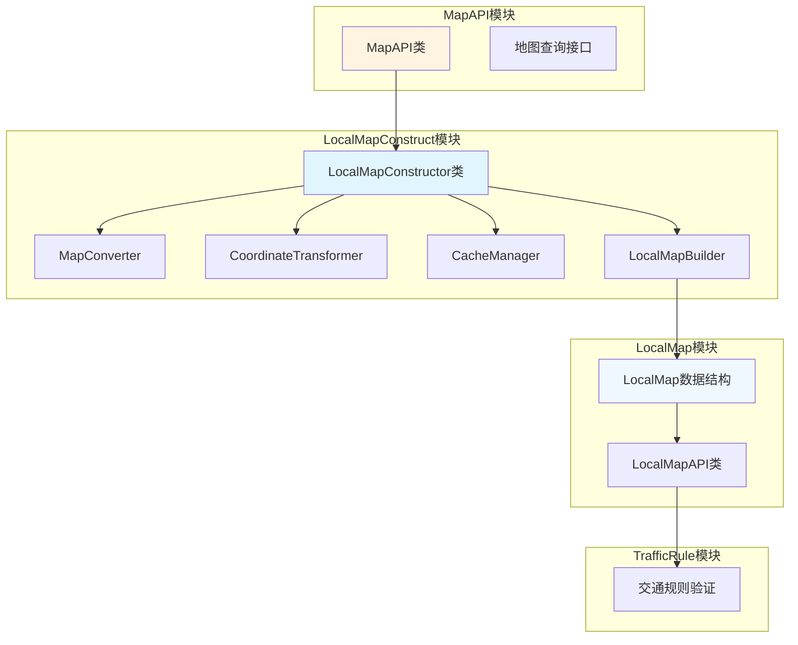

# LocalMapConstruct模块架构设计文档

## 1. 概述

LocalMapConstruct模块是地图处理流程中的关键组件，负责从MapAPI获取地图数据，并将其转换为统一的局部地图表示。该模块位于map_node内部，作为MapLoader/MapAPI和TrafficRule之间的中间层，提供标准化的局部地图接口。

## 2. 模块职责

### 2.1 核心职责
- 从MapAPI获取全局地图数据
- 将全局地图数据转换为局部地图表示
- 管理局部地图的更新和缓存
- 提供坐标转换功能（全局坐标到局部坐标）
- 支持多种地图格式的适配器模式

### 2.2 设计目标
- **解耦**: 将TrafficRule与具体的地图实现解耦
- **统一**: 提供统一的局部地图表示和查询接口
- **扩展**: 支持多种地图格式和灵活的配置
- **优化**: 针对局部地图查询进行专门优化

## 3. 架构设计

### 3.1 整体架构图



### 3.2 数据流程

1. **地图数据获取**: LocalMapConstructor从MapAPI获取全局地图数据
2. **坐标转换**: CoordinateTransformer将全局坐标转换为局部坐标
3. **地图转换**: MapConverter将MapAPI格式转换为LocalMap格式
4. **局部地图构建**: LocalMapBuilder构建LocalMap数据结构
5. **缓存管理**: CacheManager管理局部地图的缓存
6. **API提供**: LocalMapAPI提供局部地图查询接口

## 4. 详细模块设计

### 4.1 LocalMapConstructor

#### 4.1.1 类职责
- 初始化和配置局部地图构造器
- 管理局部地图的生命周期
- 协调各子模块的工作
- 提供局部地图构建的统一接口

#### 4.1.2 核心接口

```python
class LocalMapConstructor:
    """局部地图构造器"""
    
    def __init__(self, map_api: MapAPI, ego_pose: Pose, range: float = 200.0):
        """
        初始化局部地图构造器
        
        Args:
            map_api: MapAPI接口
            ego_pose: 自车位姿
            range: 局部地图范围（米）
        """
        self.map_api = map_api
        self.ego_pose = ego_pose
        self.range = range
        self.converter = MapConverter()
        self.coord_transformer = CoordinateTransformer()
        self.cache_manager = CacheManager()
    
    def construct_local_map(self, ego_pose: Pose = None) -> LocalMap:
        """
        构建局部地图
        
        Args:
            ego_pose: 自车位姿，如果为None则使用初始化时的位姿
            
        Returns:
            局部地图对象
        """
        if ego_pose is not None:
            self.ego_pose = ego_pose
        
        # 检查缓存
        cache_key = self._generate_cache_key()
        cached_map = self.cache_manager.get(cache_key)
        if cached_map is not None:
            return cached_map
        
        # 构建新的局部地图
        local_map = self._build_local_map()
        
        # 缓存结果
        self.cache_manager.set(cache_key, local_map)
        
        return local_map
    
    def update_ego_pose(self, ego_pose: Pose) -> None:
        """更新自车位姿"""
        self.ego_pose = ego_pose
        self.cache_manager.clear()  # 清除缓存以强制重建
```

### 4.2 MapConverter

#### 4.2.1 类职责
- 将MapAPI的数据结构转换为LocalMap的数据结构
- 处理不同地图格式的适配
- 确保数据转换的一致性

#### 4.2.2 核心接口

```python
class MapConverter:
    """地图格式转换器"""
    
    def convert_lanelet(self, lanelet: Lanelet, ego_pose: Pose) -> Lane:
        """
        将MapAPI的Lanelet转换为LocalMap的Lane
        
        Args:
            lanelet: MapAPI的车道对象
            ego_pose: 自车位姿
            
        Returns:
            LocalMap的车道对象
        """
        # 1. 转换车道中心线
        centerline_points = self._convert_centerline(lanelet, ego_pose)
        
        # 2. 转换车道边界
        left_boundary_idx, right_boundary_idx = self._convert_boundaries(
            lanelet, ego_pose
        )
        
        # 3. 转换限速信息
        speed_limits = self._convert_speed_limits(lanelet, ego_pose)
        
        # 4. 构建车道对象
        return Lane(
            lane_id=int(lanelet.id),
            lanelet_id=int(lanelet.id),
            lane_type=self._convert_lane_type(lanelet.lanelet_type),
            lane_direction=self._convert_lane_direction(lanelet),
            centerline_points=centerline_points,
            left_boundary_segment_indices=left_boundary_idx,
            right_boundary_segment_indices=right_boundary_idx,
            speed_limits=speed_limits
        )
    
    def convert_traffic_light(self, traffic_light: TrafficLight, ego_pose: Pose) -> TrafficLight:
        """将MapAPI的TrafficLight转换为LocalMap的TrafficLight"""
        pass
    
    def convert_traffic_sign(self, traffic_sign: TrafficSign, ego_pose: Pose) -> TrafficSign:
        """将MapAPI的TrafficSign转换为LocalMap的TrafficSign"""
        pass
```

### 4.3 CoordinateTransformer

#### 4.3.1 类职责
- 提供全局坐标到局部坐标的转换
- 支持多种坐标系统
- 确保坐标转换的精度

#### 4.3.2 核心接口

```python
class CoordinateTransformer:
    """坐标转换器"""
    
    def __init__(self, ego_pose: Pose):
        """
        初始化坐标转换器
        
        Args:
            ego_pose: 自车位姿
        """
        self.ego_pose = ego_pose
    
    def global_to_local(self, global_position: Position) -> Point3D:
        """
        将全局坐标转换为局部坐标
        
        Args:
            global_position: 全局坐标位置
            
        Returns:
            局部坐标点
        """
        # 计算相对位置和旋转
        dx = global_position.longitude - self.ego_pose.longitude
        dy = global_position.latitude - self.ego_pose.latitude
        
        # 应用旋转变换
        cos_heading = math.cos(self.ego_pose.heading)
        sin_heading = math.sin(self.ego_pose.heading)
        
        local_x = dx * cos_heading + dy * sin_heading
        local_y = -dx * sin_heading + dy * cos_heading
        
        return Point3D(x=local_x, y=local_y, z=0.0)
    
    def local_to_global(self, local_point: Point3D) -> Position:
        """
        将局部坐标转换为全局坐标
        
        Args:
            local_point: 局部坐标点
            
        Returns:
            全局坐标位置
        """
        # 应用反向旋转变换
        cos_heading = math.cos(self.ego_pose.heading)
        sin_heading = math.sin(self.ego_pose.heading)
        
        global_x = local_point.x * cos_heading - local_point.y * sin_heading
        global_y = local_point.x * sin_heading + local_point.y * cos_heading
        
        return Position(
            latitude=global_y + self.ego_pose.latitude,
            longitude=global_x + self.ego_pose.longitude
        )
```

### 4.4 CacheManager

#### 4.4.1 类职责
- 管理局部地图的缓存
- 提供高效的缓存策略
- 支持缓存失效和更新

#### 4.4.2 核心接口

```python
class CacheManager:
    """缓存管理器"""
    
    def __init__(self, max_size: int = 10, ttl: float = 1.0):
        """
        初始化缓存管理器
        
        Args:
            max_size: 最大缓存条目数
            ttl: 缓存生存时间（秒）
        """
        self.max_size = max_size
        self.ttl = ttl
        self.cache = {}
        self.timestamps = {}
    
    def get(self, key: str) -> Optional[LocalMap]:
        """
        获取缓存
        
        Args:
            key: 缓存键
            
        Returns:
            局部地图对象，如果不存在或已过期则返回None
        """
        if key not in self.cache:
            return None
        
        # 检查是否过期
        if time.time() - self.timestamps[key] > self.ttl:
            return None
        
        return self.cache[key]
    
    def set(self, key: str, value: LocalMap) -> None:
        """
        设置缓存
        
        Args:
            key: 缓存键
            value: 局部地图对象
        """
        # 如果缓存已满，删除最旧的条目
        if len(self.cache) >= self.max_size:
            oldest_key = min(self.timestamps.keys(), 
                             key=lambda k: self.timestamps[k])
            self.cache.pop(oldest_key, None)
            self.timestamps.pop(oldest_key, None)
        
        self.cache[key] = value
        self.timestamps[key] = time.time()
    
    def clear(self) -> None:
        """清除所有缓存"""
        self.cache.clear()
        self.timestamps.clear()
```

### 4.5 LocalMapBuilder

#### 4.5.1 类职责
- 组装LocalMap数据结构
- 确保数据完整性
- 优化数据组织

#### 4.5.2 核心接口

```python
class LocalMapBuilder:
    """局部地图构建器"""
    
    def __init__(self):
        """初始化局部地图构建器"""
        self.boundary_segments = []
        self.traffic_element_ids = set()
    
    def build_local_map(self, 
                     lanes: List[Lane],
                     traffic_lights: List[TrafficLight],
                     traffic_signs: List[TrafficSign],
                     ego_pose: Pose,
                     range: float) -> LocalMap:
        """
        构建局部地图
        
        Args:
            lanes: 车道列表
            traffic_lights: 交通信号灯列表
            traffic_signs: 交通标志列表
            ego_pose: 自车位姿
            range: 局部地图范围
            
        Returns:
            局部地图对象
        """
        # 创建空的局部地图结构
        now = datetime.now()
        
        header = Header(
            timestamp=now,
            frame_id="ego_vehicle_local",
            sequence_number=0
        )
        
        metadata = LocalMapMetadata(
            map_range_x=range,
            map_range_y=range,
            map_range_z=10.0,
            ego_vehicle_x=ego_pose.position.x,
            ego_vehicle_y=ego_pose.position.y,
            ego_vehicle_heading=ego_pose.heading,
            ego_vehicle_velocity=0.0,
            timestamp=now
        )
        
        # 构建局部地图
        local_map = LocalMap(
            header=header,
            metadata=metadata,
            lanes=lanes,
            traffic_lights=traffic_lights,
            traffic_signs=traffic_signs,
            boundary_segments=self.boundary_segments
        )
        
        return local_map
```

## 5. 与现有系统的集成

### 5.1 MapAPI集成

LocalMapConstruct通过MapAPI获取地图数据，支持以下查询：
- get_lanelet: 获取车道信息
- get_nearby_lanelets: 获取附近车道
- get_traffic_lights: 获取交通信号灯
- get_traffic_signs: 获取交通标志
- get_speed_limit: 获取速度限制

### 5.2 TrafficRule集成

TrafficRule模块通过LocalMapAPI访问局部地图数据，不再直接依赖MapAPI。修改包括：

1. **初始化修改**: 在TrafficRuleVerificationSystem中初始化LocalMapConstructor和LocalMapAPI
2. **环境数据获取修改**: 使用LocalMapAPI获取环境数据，而不是MapAPI
3. **规则执行修改**: 所有规则使用LocalMapAPI进行查询

### 5.3 集成示例

```python
# 在TrafficRuleVerificationSystem中初始化
def _initialize_map_manager(self) -> bool:
    # 获取地图数据
    map_data = self.map_loader.get_map_data()
    
    # 初始化地图管理器
    self.map_manager = MapManager()
    self.map_manager.initialize(map_data)
    
    # 初始化局部地图构造器
    self.local_map_constructor = LocalMapConstructor(
        map_api=self.map_manager,
        ego_pose=Pose(position=Point3D(0, 0, 0), heading=0),
        range=200.0
    )
    
    # 构建初始局部地图
    local_map = self.local_map_constructor.construct_local_map()
    
    # 初始化局部地图API
    self.local_map_api = LocalMapAPI(local_map)
    
    return True

# 在环境数据获取中使用LocalMapAPI
def _get_environment_data(self, state: VehicleState) -> Dict[str, Any]:
    # 更新自车位姿
    ego_pose = Pose(
        position=Point3D(
            x=state.local_x if state.use_local_coords else state.latitude,
            y=state.local_y if state.use_local_coords else state.longitude,
            z=state.altitude if state.altitude is not None else 0.0
        ),
        heading=state.heading if not state.use_local_coords else state.local_heading
    )
    
    # 更新局部地图
    if self.local_map_constructor is not None:
        local_map = self.local_map_constructor.construct_local_map(ego_pose)
        self.local_map_api.update_local_map(local_map)
    
    # 使用LocalMapAPI获取环境数据
    current_lane = None
    speed_limit = None
    
    if self.local_map_api is not None:
        # 获取当前位置
        position = Point3D(
            x=state.local_x if state.use_local_coords else state.latitude,
            y=state.local_y if state.use_local_coords else state.longitude,
            z=state.altitude if state.altitude is not None else 0.0
        )
        
        # 查找最近的车道
        nearest_result = self.local_map_api.find_nearest_lane(position)
        if nearest_result is not None:
            nearest_lane, _ = nearest_result
            current_lane = nearest_lane
            speed_limit = self.local_map_api.get_lane_speed_limit(
                nearest_lane.lane_id, position
            )
    
    return {
        'current_lanelet': current_lane,
        'speed_limit': speed_limit,
        # ... 其他环境数据
    }
```

## 6. 配置管理

### 6.1 配置参数

```yaml
# LocalMapConstruct配置
local_map_construct:
  enabled: true
  range: 200.0  # 局部地图范围（米）
  cache_enabled: true
  cache_max_size: 10
  cache_ttl: 1.0  # 缓存生存时间（秒）
  
  # 坐标转换配置
  coordinate_transform:
    precision_threshold: 0.01  # 坐标转换精度阈值（米）
```

## 7. 性能优化

### 7.1 缓存策略
- 基于自车位姿的缓存键
- 时间戳驱动的缓存失效
- LRU缓存策略

### 7.2 数据优化
- 增量更新机制
- 空间索引优化
- 内存池管理

## 8. 错误处理和日志

### 8.1 异常处理
- 数据转换异常处理
- 坐标转换异常处理
- 缓存异常处理

### 8.2 日志记录
- 构建过程日志
- 性能监控日志
- 错误追踪日志

## 9. 测试策略

### 9.1 单元测试
- LocalMapConstructor测试
- MapConverter测试
- CoordinateTransformer测试
- CacheManager测试
- LocalMapBuilder测试

### 9.2 集成测试
- 与MapAPI的集成测试
- 与TrafficRule的集成测试
- 端到端功能测试

## 10. 扩展性设计

### 10.1 支持新地图格式
- 通过实现新的MapConverter子类支持新格式
- 插件化的转换器架构

### 10.2 支持新查询接口
- 在LocalMapAPI中添加新的查询方法
- 保持向后兼容性

## 11. 实施计划

### 11.1 第一阶段：基础框架
- [ ] 实现LocalMapConstructor基础框架
- [ ] 实现基础的MapConverter
- [ ] 实现CoordinateTransformer
- [ ] 实现CacheManager
- [ ] 实现LocalMapBuilder

### 11.2 第二阶段：核心功能
- [ ] 完善MapConverter，支持所有必要元素
- [ ] 实现坐标转换的精度优化
- [ ] 实现缓存策略优化

### 11.3 第三阶段：集成测试
- [ ] 与MapAPI集成测试
- [ ] 与TrafficRule集成测试
- [ ] 性能测试和优化

## 12. 总结

LocalMapConstruct模块作为地图处理流程中的关键中间层，提供了以下价值：

1. **解耦**: 将TrafficRule与具体的地图实现解耦，提高了系统的灵活性和可维护性
2. **统一**: 提供统一的局部地图表示，简化了上层应用的开发
3. **优化**: 针对局部地图查询进行专门优化，提高了查询性能
4. **扩展**: 支持多种地图格式，为未来的扩展提供了良好的基础

通过引入LocalMapConstruct模块，系统架构变得更加清晰和模块化，为后续的功能扩展和维护提供了良好的基础。