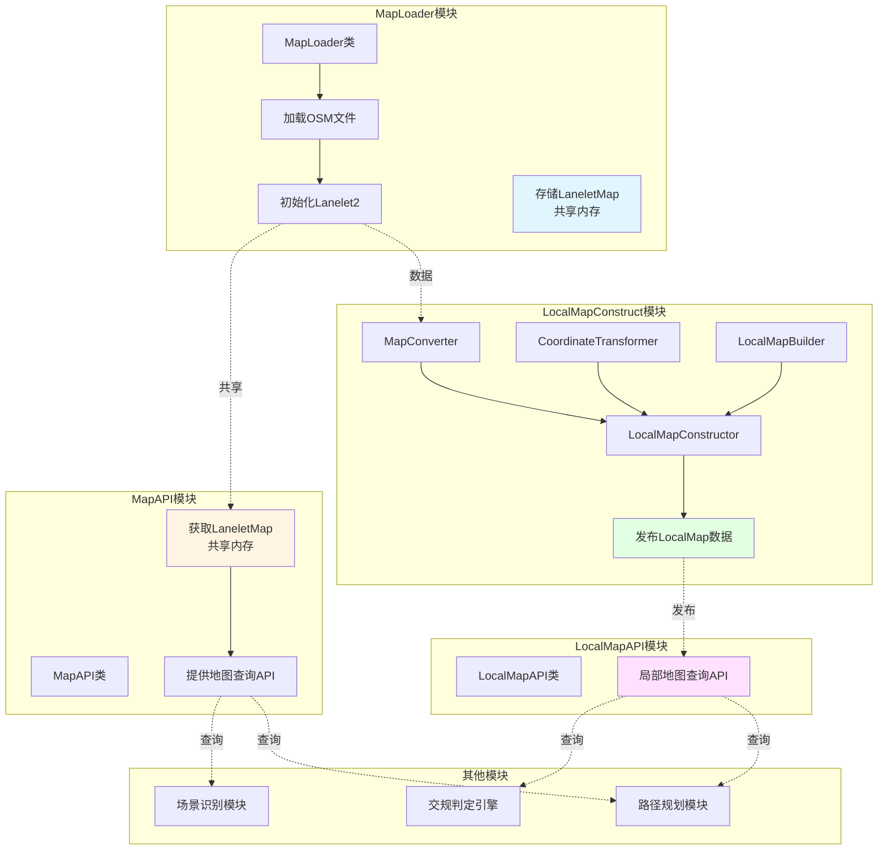
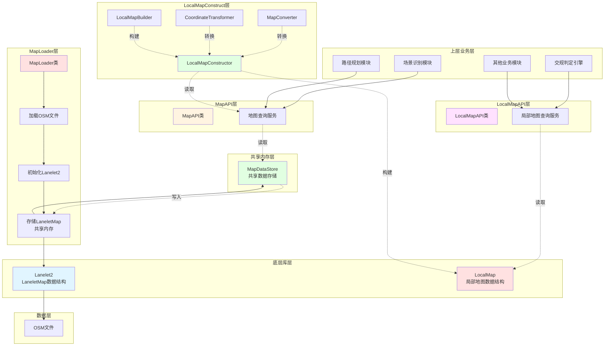
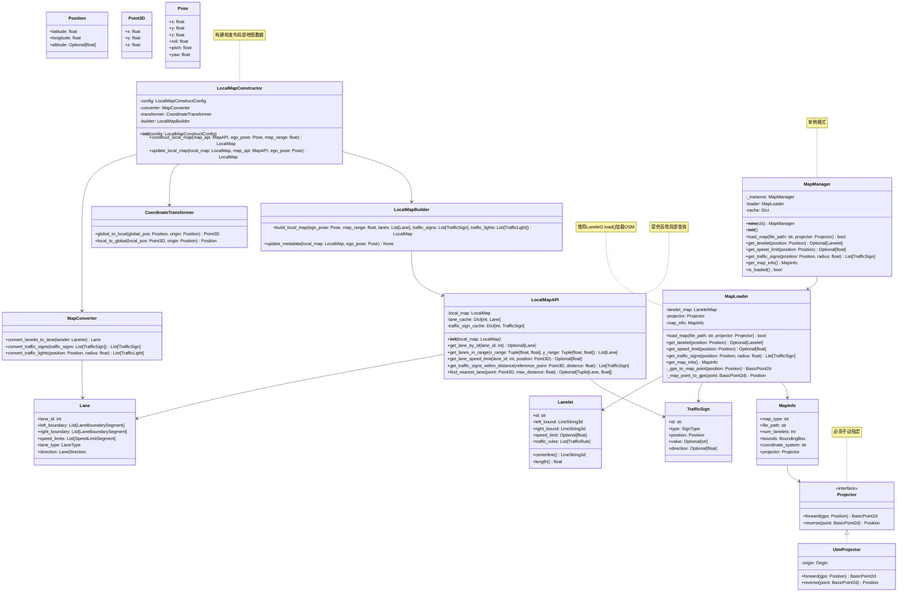

# 地图加载模块 - 架构设计文档

## 1. 模块概述

### 1.1 模块目标
构建一个基于Lanelet2的地图加载模块，支持OSM格式地图，通过共享内存模式实现MapLoader、LocalMapConstruct和MapAPI的完全解耦，提供高效的地图查询API和局部地图API供上层业务调用。

### 1.2 设计原则
- **解耦设计**：MapLoader、LocalMapConstruct和MapAPI通过共享内存完全解耦
- **共享内存模式**：MapLoader将地图数据存储在共享内存，其他模块从中读取
- **统一接口**：提供简洁易用的地图查询API，重点强调局部地图API的高效性
- **高性能**：支持高效的地图查询和空间搜索
- **可扩展性**：便于添加新的查询功能和地图格式支持
- **类型安全**：使用Python类型注解确保代码质量

### 1.3 核心设计决策

#### 1.3.1 地图格式
**使用Lanelet2 + OSM格式**

Lanelet2是一个成熟的高精度地图库，原生支持OSM格式：

```python
import lanelet2

# 加载OSM格式
lanelet_map = lanelet2.io.load("map.osm")
```

**数据流**：
```
OSM文件 → Lanelet2.load() → LaneletMap (统一格式)
```

**优势**：
- Lanelet2提供丰富的查询API（拓扑关系、几何计算等）
- 生产环境验证，被多家自动驾驶公司使用
- OSM格式开源，社区支持广泛

**关于XODR格式**：
XODR格式的地图可以离线转换为OSM格式（可能需要人工审核），转换后的OSM文件可直接使用本模块加载。

#### 1.3.2 架构模式：完全解耦设计 + LocalMap集成

**MapLoader、LocalMapConstruct和MapAPI完全解耦**



**架构说明**：
- MapLoader模块负责加载OSM文件并初始化Lanelet2
- MapLoader将LaneletMap存储在共享内存中
- LocalMapConstruct模块从MapAPI获取数据，构建LocalMap数据
- LocalMapConstruct包含MapConverter（格式转换）、CoordinateTransformer（坐标转换）、LocalMapBuilder（数据构建）
- LocalMapConstruct负责将构建的LocalMap数据发布出去，供其他模块使用
- MapAPI模块从共享内存获取LaneletMap，提供地图查询服务
- LocalMapAPI模块提供基于LocalMap的高效查询服务
- 其他模块（场景识别、交规判定、路径规划等）通过MapAPI或LocalMapAPI查询地图信息
- 完全解耦，各模块可以独立开发和测试
- 共享内存确保数据一致性，避免重复加载
- LocalMap提供更高效的局部查询机制

**共享内存设计**：
```python
# 共享内存存储
class MapDataStore:
    _instance = None
    _lanelet_map = None
    
    @classmethod
    def set_lanelet_map(cls, lanelet_map):
        cls._lanelet_map = lanelet_map
    
    @classmethod
    def get_lanelet_map(cls):
        return cls._lanelet_map
```

#### 1.3.3 地图加载策略

**全局加载 vs 局部动态加载**

| 策略 | 优点 | 缺点 | 适用场景 |
|-----|------|------|---------|
| 全局加载 | 实现简单，查询速度快 | 内存占用大，加载时间长 | 小地图、测试环境 |
| 局部动态加载 | 内存占用小，支持大地图 | 实现复杂，需要空间索引 | 大地图、生产环境 |

**推荐方案**：
- **当前阶段**：采用全局加载策略，简化实现
- **LocalMap补充**：通过LocalMapConstruct提供局部地图的数据转换和发布
- **未来扩展**：考虑实现局部动态加载，支持大地图场景

#### 1.3.4 地图Projector（投影器）处理

Lanelet2使用局部坐标系，需要设置Projector用于坐标转换：

```python
from lanelet2.projection import UtmProjector

# 设置投影器（使用UTM投影）
projector = UtmProjector(Origin(116.4074, 39.9042))  # 北京天安门
```

**Projector选择策略**：
1. **UTM投影**：适用于大多数场景，Lanelet2内置支持
2. **Mercator投影**：适用于大范围地图
3. **自定义投影**：根据项目需求自定义

**推荐方案**：
- 使用Lanelet2内置的UtmProjector
- Projector必须通过配置文件或初始化参数指定
- 不自动计算，确保坐标转换的一致性
- 在MapInfo中记录Projector信息，供上层使用

---

## 2. 需求分析

### 2.1 功能需求

| 需求编号 | 需求描述 | 优先级 |
|---------|---------|--------|
| MR-001 | 支持加载OSM格式地图文件 | P0 |
| MR-002 | 提供统一的地图查询API | P0 |
| MR-003 | 根据GPS坐标查询所在车道 | P0 |
| MR-004 | 查询指定位置的速度限制 | P0 |
| MR-005 | 查询指定范围内的交通标志 | P1 |
| MR-006 | 查询车道拓扑关系 | P1 |
| MR-007 | 支持地图缓存机制 | P1 |
| MR-008 | 提供地图元信息查询 | P2 |
| MR-009 | 手动指定地图Projector | P0 |
| MR-010 | 支持LocalMap构建和发布 | P0 |
| MR-011 | 提供LocalMapAPI接口 | P0 |
| MR-012 | 支持局部地图数据转换 | P1 |

### 2.2 非功能需求

| 需求编号 | 需求描述 | 优先级 |
|---------|---------|--------|
| MNR-001 | 地图加载时间 < 5秒 | P1 |
| MNR-002 | 查询响应时间 < 10ms | P1 |
| MNR-003 | 内存占用合理（支持大地图） | P1 |
| MNR-004 | 代码模块化，易于测试 | P0 |
| MNR-005 | LocalMap查询响应时间 < 5ms | P1 |

---

## 3. 系统架构设计

### 3.1 整体架构



**架构说明**：
- Lanelet2和LocalMap作为底层库，提供不同的数据结构
- MapLoader类负责加载OSM文件并初始化Lanelet2
- MapLoader将LaneletMap存储在共享内存（MapDataStore）中
- MapAPI类从共享内存获取LaneletMap，提供地图查询服务
- LocalMapConstruct模块从MapAPI获取数据，构建LocalMap数据
- LocalMapConstruct负责将构建的LocalMap数据发布出去
- LocalMapAPI类提供基于LocalMap的高效查询服务
- 其他业务模块（场景识别、交规判定、路径规划等）通过MapAPI或LocalMapAPI查询地图信息
- 完全解耦，各模块可以独立开发和测试
- 采用全局加载策略，简化实现
- LocalMap提供更高效的局部查询机制
- Projector必须手动指定，不自动计算

### 3.2 类图设计



**关键点**：
- MapManager采用单例模式，确保全局只有一个实例
- MapLoader负责加载OSM文件并初始化Lanelet2
- Projector必须通过配置或初始化参数指定，不自动计算
- 提供GPS坐标与地图坐标的双向转换
- MapManager作为统一入口，提供简洁的查询API
- LocalMapConstructor负责构建局部地图数据，包含格式转换、坐标转换和数据构建
- LocalMapConstructor将构建的LocalMap数据发布出去，供其他模块使用
- LocalMapAPI提供基于局部地图的高效查询服务

---

## 4. 数据结构设计

### 4.1 位置信息

```python
from dataclasses import dataclass
from typing import Optional

@dataclass
class Position:
    """位置信息（WGS84坐标系）"""
    latitude: float  # 纬度
    longitude: float  # 经度
    altitude: Optional[float] = None  # 海拔高度（可选）
    
    def to_tuple(self) -> tuple:
        """转换为元组格式"""
        return (self.latitude, self.longitude, self.altitude)

@dataclass
class Point3D:
    """三维点（局部坐标系）"""
    x: float
    y: float
    z: float = 0.0

@dataclass
class Pose:
    """位姿信息"""
    x: float
    y: float
    z: float = 0.0
    roll: float = 0.0
    pitch: float = 0.0
    yaw: float = 0.0
```

### 4.2 车道信息

```python
from typing import List, Optional
from enum import Enum

class LaneletType(Enum):
    """车道类型"""
    HIGHWAY = "highway"
    RURAL = "rural"
    URBAN = "urban"
    RAMP = "ramp"
    EXIT = "exit"
    ENTRY = "entry"

class LaneType(IntEnum):
    """LocalMap车道类型"""
    DRIVING = 1
    STOP = 2
    SHOULDER = 3
    BIKING = 4
    SIDEWALK = 5
    BORDER = 6
    RESTRICTED = 7
    PARKING = 8
    BIDIRECTIONAL = 9
    MEDIAN = 10
    ROADWORK = 11
    TRAM = 12
    BUS = 13
    TAXI = 14
    ENTRY = 15
    EXIT = 16
    OFFRAMP = 17
    ONRAMP = 18

class LaneDirection(IntEnum):
    """车道方向"""
    FORWARD = 1
    BACKWARD = 2
    BIDIRECTIONAL = 3

@dataclass
class Lanelet:
    """车道信息（Lanelet2格式）"""
    id: str
    left_bound: List[Position]  # 左边界点序列
    right_bound: List[Position]  # 右边界点序列
    speed_limit: Optional[float] = None  # 速度限制 (km/h)
    lanelet_type: LaneletType = LaneletType.URBAN
    
    def centerline(self) -> List[Position]:
        """计算车道中心线"""
        pass
    
    def length(self) -> float:
        """计算车道长度"""
        pass
    
    def width(self) -> float:
        """计算车道平均宽度"""
        pass

@dataclass
class Lane:
    """车道信息（LocalMap格式）"""
    lane_id: int
    left_boundary: List[LaneBoundarySegment]
    right_boundary: List[LaneBoundarySegment]
    speed_limits: List[SpeedLimitSegment]
    lane_type: LaneType
    direction: LaneDirection
    predecessor_ids: List[int]
    successor_ids: List[int]
    adjacent_left_id: Optional[int]
    adjacent_right_id: Optional[int]
    
    def get_length(self) -> float:
        """计算车道长度"""
        pass
    
    def get_width(self) -> float:
        """计算车道平均宽度"""
        pass
```

### 4.3 交通标志

```python
class SignType(Enum):
    """交通标志类型"""
    SPEED_LIMIT = "speed_limit"
    STOP = "stop"
    YIELD = "yield"
    NO_ENTRY = "no_entry"
    ONE_WAY = "one_way"
    CONSTRUCTION = "construction"
    FISHBONE = "fishbone"
    TRAFFIC_LIGHT = "traffic_light"

class TrafficSignType(IntEnum):
    """LocalMap交通标志类型"""
    UNKNOWN = 0
    SPEED_LIMIT_BEGIN = 1
    SPEED_LIMIT_END = 2
    MAX_SPEED = 3
    MIN_SPEED = 4
    STOP = 5
    YIELD = 6
    NO_PARKING = 7
    NO_STOPPING = 8
    NO_ENTRY = 9
    ONE_WAY = 10
    PEDESTRIAN_CROSSING = 11
    TRAFFIC_LIGHTS_AHEAD = 12
    ROUNDABOUT = 13
    HIGHWAY = 14
    HIGHWAY_EXIT = 15
    CONSTRUCTION = 16
    FISHBONE = 17

@dataclass
class TrafficSign:
    """交通标志信息"""
    id: str
    sign_type: SignType
    position: Position
    value: Optional[str] = None  # 标志值（如限速值）
    direction: Optional[float] = None  # 标志朝向（弧度）

@dataclass
class LocalMapTrafficSign:
    """LocalMap交通标志信息"""
    traffic_sign_id: int
    sign_type: TrafficSignType
    position: Point3D
    value: Optional[str] = None
    direction: Optional[float] = None
    valid_until: Optional[datetime] = None
```

### 4.4 地图信息

```python
@dataclass
class BoundingBox:
    """地图边界框"""
    min_lat: float
    max_lat: float
    min_lon: float
    max_lon: float

@dataclass
class MapInfo:
    """地图元信息"""
    map_type: str  # "osm"
    file_path: str
    num_lanelets: int
    bounds: BoundingBox
    coordinate_system: str
    projector: Optional[Projector] = None
    is_loaded: bool = False

@dataclass
class LocalMapMetadata:
    """LocalMap元数据"""
    header: Header
    ego_pose: Pose
    map_range: float
    timestamp: datetime
    num_lanes: int
    num_traffic_signs: int
    num_traffic_lights: int
    num_road_markings: int
    version: str
```

---

## 5. 接口设计

### 5.1 地图管理器（单例模式）

```python
from typing import Dict, Optional

class MapManager:
    """地图管理器 - 单例模式，统一入口"""
    
    _instance = None
    
    def __new__(cls):
        """单例模式实现"""
        if cls._instance is None:
            cls._instance = super().__new__(cls)
        return cls._instance
    
    def __init__(self):
        """
        初始化地图管理器
        """
        self.loader: Optional[MapLoader] = None
    
    def load_map(self, file_path: str, projector: Projector) -> bool:
        """
        加载OSM地图文件
        
        Args:
            file_path: 地图文件路径
            projector: 投影器（必须手动指定）
            
        Returns:
            加载是否成功
        """
        self.loader = MapLoader()
        return self.loader.load_map(file_path, projector)
    
    def get_lanelet(self, position: Position) -> Optional[Lanelet]:
        """
        获取所在车道
        
        Args:
            position: GPS位置
            
        Returns:
            车道信息，如果不在任何车道内则返回None
        """
        if self.loader is None:
            return None
        return self.loader.get_lanelet(position)
    
    def get_speed_limit(self, position: Position) -> Optional[float]:
        """
        获取速度限制
        
        Args:
            position: GPS位置
            
        Returns:
            速度限制 (km/h)，如果无限制则返回None
        """
        if self.loader is None:
            return None
        return self.loader.get_speed_limit(position)
    
    def get_traffic_signs(self, position: Position, radius: float) -> List[TrafficSign]:
        """
        获取交通标志
        
        Args:
            position: 中心位置
            radius: 搜索半径（米）
            
        Returns:
            交通标志列表
        """
        if self.loader is None:
            return []
        return self.loader.get_traffic_signs(position, radius)
    
    def get_map_info(self) -> Optional[MapInfo]:
        """
        获取地图信息
        
        Returns:
            地图信息
        """
        if self.loader is None:
            return None
        return self.loader.get_map_info()
    
    def is_loaded(self) -> bool:
        """
        检查地图是否已加载
        
        Returns:
            是否已加载
        """
        if self.loader is None:
            return False
        return self.loader.is_loaded()
```

### 5.2 LocalMapConstructor接口

```python
@dataclass
class LocalMapConstructConfig:
    """LocalMapConstruct配置"""
    map_range: float = 200.0          # 局部地图范围（米）
    update_threshold: float = 50.0     # 更新阈值（米）

class LocalMapConstructor:
    """LocalMap构造器主类"""
    
    def __init__(self, config: LocalMapConstructConfig):
        self.config = config
        self.converter = MapConverter()
        self.transformer = CoordinateTransformer()
        self.builder = LocalMapBuilder()
        
    def construct_local_map(self, 
                          map_api: MapAPI, 
                          ego_pose: Pose, 
                          map_range: float = 200.0) -> LocalMap:
        """
        构建局部地图
        
        Args:
            map_api: MapAPI实例
            ego_pose: 自车位姿
            map_range: 地图范围
            
        Returns:
            构建的LocalMap
        """
        
    def update_local_map(self, 
                        local_map: LocalMap, 
                        map_api: MapAPI, 
                        ego_pose: Pose) -> LocalMap:
        """
        更新局部地图
        
        Args:
            local_map: 现有局部地图
            map_api: MapAPI实例
            ego_pose: 自车位姿
            
        Returns:
            更新后的LocalMap
        """
```

### 5.3 LocalMapAPI接口

```python
class LocalMapAPI:
    """LocalMap API类，提供高效的局部地图查询"""
    
    def __init__(self, local_map: LocalMap):
        self.local_map = local_map
        self._build_caches()
        
    def get_lane_by_id(self, lane_id: int) -> Optional[Lane]:
        """根据ID获取车道"""
        
    def get_lanes_in_range(self, x_range: Tuple[float, float], y_range: Tuple[float, float]) -> List[Lane]:
        """获取范围内的车道"""
        
    def get_lane_speed_limit(self, lane_id: int, position: Point3D) -> Optional[float]:
        """获取车道速度限制"""
        
    def get_traffic_signs_within_distance(self, reference_point: Point3D, distance: float) -> List[TrafficSign]:
        """获取距离内的交通标志"""
        
    def find_nearest_lane(self, point: Point3D, max_distance: float = 50.0) -> Optional[Tuple[Lane, float]]:
        """查找最近的车道"""
        
    def update_local_map(self, local_map: LocalMap) -> None:
        """更新局部地图并重建缓存"""
```

### 5.4 投影器接口

```python
from abc import ABC, abstractmethod
from lanelet2.core import BasicPoint2d

class Projector(ABC):
    """投影器接口"""
    
    @abstractmethod
    def forward(self, gps: Position) -> BasicPoint2d:
        """
        GPS坐标转换为地图坐标
        
        Args:
            gps: GPS位置
            
        Returns:
            地图坐标点
        """
        pass
    
    @abstractmethod
    def reverse(self, point: BasicPoint2d) -> Position:
        """
        地图坐标转换为GPS坐标
        
        Args:
            point: 地图坐标点
            
        Returns:
            GPS位置
        """
        pass
```

---

## 6. LocalMapConstruct模块设计

### 6.1 模块结构

```
src/map_node/local_map_construct/
├── __init__.py
├── constructor.py          # LocalMapConstructor主类
├── converter.py            # MapConverter类
├── transformer.py          # CoordinateTransformer类
├── builder.py              # LocalMapBuilder类
└── types.py                # 类型定义
```

### 6.2 MapConverter实现

```python
class MapConverter:
    """地图格式转换器，将MapAPI数据转换为LocalMap数据结构"""
    
    def convert_lanelet_to_lane(self, lanelet: Lanelet) -> Lane:
        """将Lanelet转换为Lane"""
        # 转换边界
        left_boundary = self._convert_boundary(lanelet.left_bound)
        right_boundary = self._convert_boundary(lanelet.right_bound)
        
        # 转换速度限制
        speed_limits = []
        if lanelet.speed_limit:
            speed_limits.append(SpeedLimitSegment(
                start_position=Point3D(x=0, y=0, z=0),
                end_position=Point3D(x=100, y=0, z=0),
                speed_limit=lanelet.speed_limit,
                speed_limit_type=SpeedLimitType.MAX_SPEED
            ))
        
        # 转换车道类型
        lane_type = self._convert_lanelet_type(lanelet.lanelet_type)
        
        return Lane(
            lane_id=int(lanelet.id),
            left_boundary=left_boundary,
            right_boundary=right_boundary,
            speed_limits=speed_limits,
            lane_type=lane_type,
            direction=LaneDirection.FORWARD,
            predecessor_ids=[],
            successor_ids=[],
            adjacent_left_id=None,
            adjacent_right_id=None
        )
    
    def convert_traffic_signs(self, traffic_signs: List[TrafficSign]) -> List[LocalMapTrafficSign]:
        """转换交通标志"""
        local_signs = []
        for sign in traffic_signs:
            local_sign = LocalMapTrafficSign(
                traffic_sign_id=int(sign.id),
                sign_type=self._convert_sign_type(sign.sign_type),
                position=Point3D(
                    x=sign.position.longitude,  # 简化处理
                    y=sign.position.latitude,
                    z=sign.position.altitude or 0.0
                ),
                value=sign.value,
                direction=sign.direction
            )
            local_signs.append(local_sign)
        return local_signs
```

### 6.3 CoordinateTransformer实现

```python
class CoordinateTransformer:
    """坐标转换器，处理全局坐标和局部坐标之间的转换"""
    
    def global_to_local(self, global_pos: Position, origin: Position) -> Point3D:
        """全局坐标转局部坐标"""
        # 简化的坐标转换，实际应该使用更精确的投影算法
        x = global_pos.longitude - origin.longitude
        y = global_pos.latitude - origin.latitude
        z = global_pos.altitude or 0.0
        
        # 转换为米（粗略估算）
        x_meters = x * 111320 * math.cos(math.radians(origin.latitude))
        y_meters = y * 110540
        
        return Point3D(x=x_meters, y=y_meters, z=z)
    
    def local_to_global(self, local_pos: Point3D, origin: Position) -> Position:
        """局部坐标转全局坐标"""
        # 转换为度
        x_degrees = local_pos.x / (111320 * math.cos(math.radians(origin.latitude)))
        y_degrees = local_pos.y / 110540
        
        return Position(
            latitude=origin.latitude + y_degrees,
            longitude=origin.longitude + x_degrees,
            altitude=local_pos.z
        )
```

---

## 7. 集成方案

### 7.1 TrafficRuleVerificationSystem集成

```python
class TrafficRuleVerificationSystem:
    def __init__(self, config: TrafficRuleConfig):
        # 现有代码...
        self.local_map_constructor: Optional[LocalMapConstructor] = None
        self.local_map_api: Optional[LocalMapAPI] = None
        self.current_local_map: Optional[LocalMap] = None
        
    def initialize(self) -> bool:
        """初始化系统"""
        # 现有代码...
        
        # Step 4: Initialize LocalMapConstructor
        if not self._initialize_local_map_constructor():
            logger.error("Failed to initialize LocalMapConstructor")
            return False
            
        # Step 5: Initialize LocalMapAPI
        if not self._initialize_local_map_api():
            logger.error("Failed to initialize LocalMapAPI")
            return False
            
        self._initialized = True
        return True
        
    def _initialize_local_map_constructor(self) -> bool:
        """初始化LocalMapConstructor"""
        try:
            from map_node.local_map_construct.constructor import LocalMapConstructor
            from map_node.local_map_construct.types import LocalMapConstructConfig
            
            # 创建配置
            config = LocalMapConstructConfig(
                map_range=200.0,
                update_threshold=50.0
            )
            
            # 初始化构造器
            self.local_map_constructor = LocalMapConstructor(config)
            logger.info("LocalMapConstructor initialized")
            return True
            
        except Exception as e:
            logger.error(f"Error initializing LocalMapConstructor: {e}")
            return False
            
    def _initialize_local_map_api(self) -> None:
        """初始化LocalMapAPI"""
        # 创建初始局部地图
        ego_pose = Pose(
            x=0.0, y=0.0, z=0.0,
            roll=0.0, pitch=0.0, yaw=0.0
        )
        
        self.current_local_map = self.local_map_constructor.construct_local_map(
            self.map_manager.api, ego_pose
        )
        
        # 初始化LocalMapAPI
        from common.local_map.local_map_api import LocalMapAPI
        self.local_map_api = LocalMapAPI(self.current_local_map)
        
        logger.info("LocalMapAPI initialized")
```

### 7.2 环境数据获取方法修改

```python
def _get_environment_data(self, state: VehicleState) -> Dict[str, Any]:
    """获取环境数据，使用LocalMapAPI"""
    try:
        # 更新局部地图（如果需要）
        ego_pose = Pose(
            x=state.local_x if state.local_x is not None else 0.0,
            y=state.local_y if state.local_y is not None else 0.0,
            z=state.altitude if state.altitude is not None else 0.0,
            roll=0.0, pitch=0.0, yaw=state.heading if state.heading is not None else 0.0
        )
        
        # 检查是否需要更新局部地图
        if self._should_update_local_map(ego_pose):
            self.current_local_map = self.local_map_constructor.update_local_map(
                self.current_local_map, self.map_manager.api, ego_pose
            )
            self.local_map_api.update_local_map(self.current_local_map)
        
        # 使用LocalMapAPI获取环境数据
        current_lane = self.local_map_api.find_nearest_lane(
            Point3D(x=ego_pose.x, y=ego_pose.y, z=ego_pose.z)
        )
        
        speed_limit = None
        if current_lane:
            speed_limit = self.local_map_api.get_lane_speed_limit(
                current_lane[0].lane_id,
                Point3D(x=ego_pose.x, y=ego_pose.y, z=ego_pose.z)
            )
        
        # 获取附近的交通标志
        nearby_traffic_signs = self.local_map_api.get_traffic_signs_within_distance(
            Point3D(x=ego_pose.x, y=ego_pose.y, z=ego_pose.z),
            distance=100.0
        )
        
        return {
            'current_lane': current_lane[0] if current_lane else None,
            'speed_limit': speed_limit,
            'nearby_traffic_signs': nearby_traffic_signs,
            'ego_pose': ego_pose
        }
        
    except Exception as e:
        logger.error(f"Error getting environment data: {e}")
        return {}
```

---

## 8. 目录结构设计

```
lanelet_test/
├── architect.md                 # 主架构文档
├── map_architecture.md          # 地图模块架构文档（本文件）
├── Town10HD.osm                 # OSM地图文件
├── src/
│   ├── __init__.py
│   ├── map_node/                # 地图节点模块
│   │   ├── __init__.py
│   │   ├── maploader/           # 地图加载器
│   │   │   ├── __init__.py
│   │   │   ├── loader.py
│   │   │   └── utils.py
│   │   ├── mapapi/              # 地图API
│   │   │   ├── __init__.py
│   │   │   ├── api.py
│   │   │   └── manager.py
│   │   ├── local_map_construct/  # LocalMap构造器
│   │   │   ├── __init__.py
│   │   │   ├── constructor.py
│   │   │   ├── converter.py
│   │   │   ├── transformer.py
│   │   │   ├── builder.py
│   │   │   └── types.py
│   │   └── map_common/          # 公共数据结构
│   │       ├── __init__.py
│   │       └── base.py
│   ├── common/                  # 公共模块
│   │   └── local_map/          # LocalMap数据结构
│   │       ├── __init__.py
│   │       ├── local_map_data.py
│   │       ├── local_map_api.py
│   │       └── test/
│   ├── traffic_rule/            # 交规模块
│   │   ├── __init__.py
│   │   ├── traffic_rule_verification_system.py
│   │   └── rules/
│   └── examples/                # 示例代码
│       ├── load_osm_map.py      # OSM加载示例
│       ├── query_map.py         # 地图查询示例
│       └── local_map_example.py # LocalMap示例
├── tests/                       # 测试目录
│   ├── __init__.py
│   ├── test_manager.py         # 地图管理器测试
│   ├── test_loader.py          # 地图加载器测试
│   └── test_local_map_construct.py # LocalMap构造器测试
├── configs/                     # 配置文件
│   └── map_config.yaml          # 地图配置
└── requirements.txt             # Python依赖
```

---

## 9. 配置管理

### 9.1 地图配置文件 (map_config.yaml)

```yaml
# 地图配置
map:
  # 地图文件路径
  osm_file: "Town10HD.osm"
  
  # 坐标系配置
  coordinate_system: "WGS84"
  
  # 原点配置（必须手动指定）
  origin:
    latitude: 39.9042  # 纬度，必须指定
    longitude: 116.4074  # 经度，必须指定
  
  # 查询配置
  query:
    default_radius: 100.0  # 默认查询半径（米）
    max_search_distance: 50.0  # 最大搜索距离（米）

# LocalMap配置
local_map:
  # 局部地图范围（米）
  map_range: 200.0
  
  # 更新阈值（米）
  update_threshold: 50.0
  
  # 构建配置
  construction:
    include_traffic_signs: true
    include_traffic_lights: true
    include_road_markings: true
    max_traffic_sign_distance: 100.0
    max_traffic_light_distance: 100.0
```

---

## 10. 技术选型

| 组件 | 技术选型 | 说明 |
|-----|---------|------|
| 地图库 | Lanelet2 | 支持OSM格式 |
| 坐标转换 | Lanelet2内置UtmProjector | 地理坐标投影转换 |
| 配置管理 | PyYAML | 配置文件解析 |
| 类型检查 | typing | Python类型注解 |
| 测试 | pytest | 单元测试 |

### 10.1 Lanelet2 简介
Lanelet2是一个专门为自动驾驶设计的高精度地图库，提供：
- 支持OpenStreetMap (OSM) 格式
- 车道拓扑关系查询
- 交通规则信息存储
- 几何计算和空间查询
- Python绑定支持
- 内置UTM投影器

### 10.2 依赖安装

```bash
# 安装Lanelet2
sudo apt-get install liblanelet2-dev python3-lanelet2

# 安装Python依赖
pip install pyproj pyyaml pytest numpy
```

---

## 11. 使用示例

### 11.1 加载OSM地图

```python
from src.map_node.mapapi.manager import MapManager
from src.map_node.map_common.base import Position
from src.map_node.maploader.utils import UtmProjectorWrapper
from lanelet2.io import Origin

# 创建地图管理器
map_manager = MapManager()

# 创建投影器（必须手动指定原点）
origin = Origin(latitude=39.9042, longitude=116.4074)
projector = UtmProjectorWrapper(origin)

# 加载地图
success = map_manager.load_map("Town10HD.osm", projector)
if not success:
    print("Failed to load map")
    exit(1)

# 查询地图信息
map_info = map_manager.get_map_info()
print(f"Map type: {map_info.map_type}")
print(f"Number of lanelets: {map_info.num_lanelets}")
print(f"Bounds: {map_info.bounds}")

# 查询车道
position = Position(latitude=39.9042, longitude=116.4074)
lanelet = map_manager.get_lanelet(position)
if lanelet:
    print(f"Lanelet ID: {lanelet.id}")
    print(f"Speed limit: {lanelet.speed_limit} km/h")
else:
    print("Not on any lanelet")

# 查询速度限制
speed_limit = map_manager.get_speed_limit(position)
print(f"Speed limit: {speed_limit} km/h")

# 查询交通标志
signs = map_manager.get_traffic_signs(position, radius=100.0)
print(f"Found {len(signs)} traffic signs")
for sign in signs:
    print(f"  - {sign.sign_type}: {sign.value}")
```

### 11.2 使用LocalMapConstruct

```python
from src.map_node.local_map_construct.constructor import LocalMapConstructor
from src.map_node.local_map_construct.types import LocalMapConstructConfig
from src.common.local_map.local_map_api import LocalMapAPI
from src.map_node.map_common.base import Pose

# 创建LocalMapConstructor配置
config = LocalMapConstructConfig(
    map_range=200.0,
    update_threshold=50.0
)

# 初始化LocalMapConstructor
constructor = LocalMapConstructor(config)

# 创建自车位姿
ego_pose = Pose(
    x=0.0, y=0.0, z=0.0,
    roll=0.0, pitch=0.0, yaw=0.0
)

# 构建局部地图
local_map = constructor.construct_local_map(
    map_manager.api, ego_pose, map_range=200.0
)

# 初始化LocalMapAPI
local_map_api = LocalMapAPI(local_map)

# 查询最近的车道
from src.common.local_map.local_map_data import Point3D
point = Point3D(x=0.0, y=0.0, z=0.0)
nearest_lane, distance = local_map_api.find_nearest_lane(point)
if nearest_lane:
    print(f"Nearest lane ID: {nearest_lane.lane_id}")
    print(f"Distance: {distance} meters")
    
    # 获取车道速度限制
    speed_limit = local_map_api.get_lane_speed_limit(
        nearest_lane.lane_id, point
    )
    print(f"Speed limit: {speed_limit} km/h")

# 获取附近的交通标志
traffic_signs = local_map_api.get_traffic_signs_within_distance(
    point, distance=100.0
)
print(f"Found {len(traffic_signs)} traffic signs")
for sign in traffic_signs:
    print(f"  - ID: {sign.traffic_sign_id}, Type: {sign.sign_type}")
```

### 11.3 在TrafficRuleVerificationSystem中使用

```python
from src.traffic_rule.traffic_rule_verification_system import TrafficRuleVerificationSystem
from src.traffic_rule.config import TrafficRuleConfig

# 创建配置
config = TrafficRuleConfig()
config.map.map_file = "Town10HD.osm"
config.map.coordinate_type = "local"

# 初始化系统
system = TrafficRuleVerificationSystem(config)
if not system.initialize():
    print("Failed to initialize system")
    exit(1)

# 创建车辆状态
from src.traffic_rule.types import VehicleState
state = VehicleState(
    timestamp=datetime.now(),
    local_x=0.0,
    local_y=0.0,
    heading=0.0,
    speed=10.0,
    use_local_coords=True
)

# 验证交通规则
violation = system.verify_state(state)
if violation:
    print(f"Violation detected: {violation.rule_id}")
    print(f"Description: {violation.description}")
else:
    print("No violation detected")
```

---

## 12. 风险和挑战

| 风险 | 影响 | 缓解措施 |
|-----|------|---------|
| Lanelet2安装复杂 | 中 | 提供详细的安装文档，考虑Docker容器化 |
| 坐标转换精度问题 | 高 | 使用成熟的投影库，充分测试 |
| 不同地图格式差异 | 中 | 设计统一的抽象层，隐藏格式差异 |
| 大地图内存占用 | 中 | 实现分块加载机制 |
| LocalMap构建性能 | 中 | 优化转换算法 |

---

## 13. 附录

### 13.1 术语表

| 术语 | 说明 |
|-----|------|
| OSM | OpenStreetMap，开源地图格式 |
| Lanelet | 车道单元，地图中的最小车道描述单位 |
| Lanelet2 | 专门为自动驾驶设计的高精度地图库 |
| LocalMap | 局部地图，基于自车位置的高效地图表示 |
| Projector | 投影器，用于GPS坐标与地图坐标的转换 |
| UTM | Universal Transverse Mercator，通用横轴墨卡托投影 |
| LocalMapConstruct | LocalMap构造器，负责构建和发布局部地图数据 |

### 13.2 参考资料
- Lanelet2: https://github.com/fzi-forschungszentrum-informatik/Lanelet2
- OpenStreetMap: https://www.openstreetmap.org/
- LocalMap设计文档: src/common/local_map/local_map_data_introduction.md
- LocalMapAPI文档: src/common/local_map/README.md

### 13.3 版本历史

| 版本 | 日期 | 说明 |
|-----|------|------|
| 1.0 | 2024-01-01 | 初始版本，支持MapLoader和MapAPI |
| 2.0 | 2024-02-01 | 添加LocalMapConstruct模块支持 |
| 2.1 | 2024-02-04 | 完善LocalMap集成和架构文档，移除缓存机制 |
