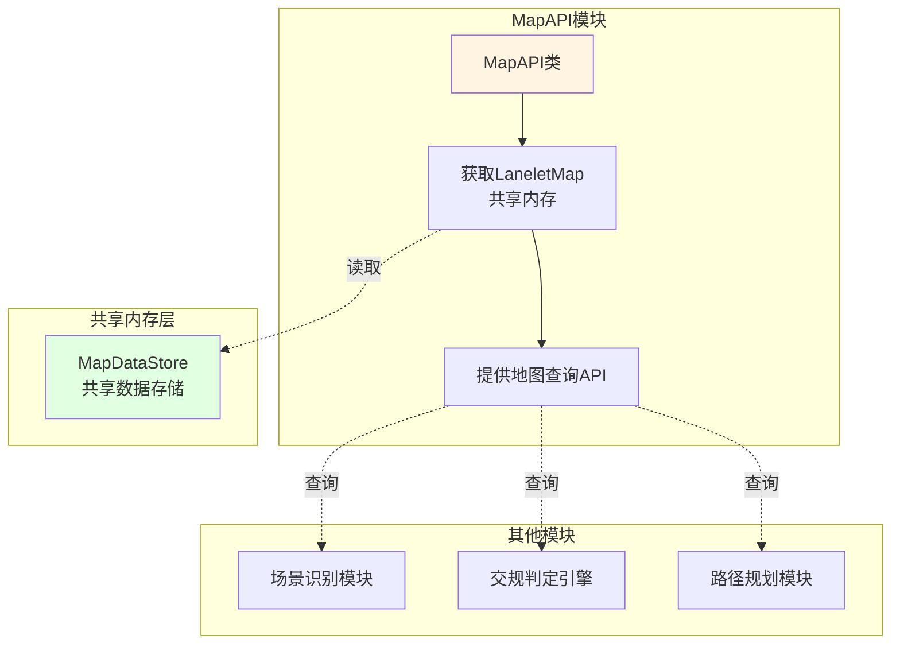
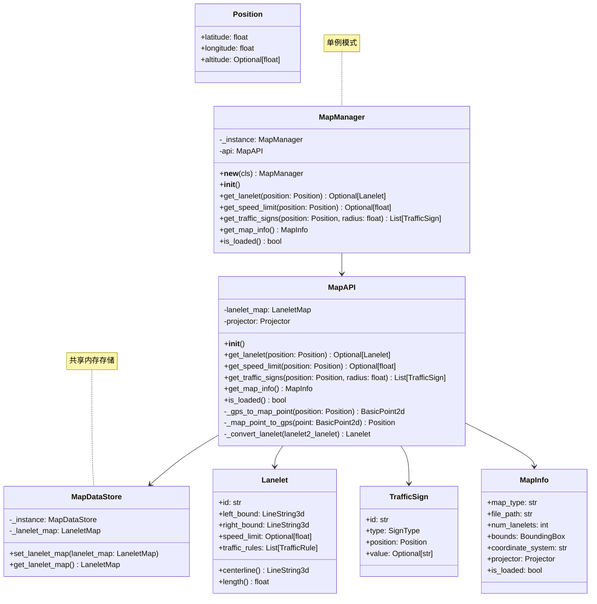

# 地图API模块 (MapAPI) - 架构设计文档

## 1. 模块概述

### 1.1 模块目标
构建一个基于Lanelet2的地图API模块，从共享内存获取地图数据，提供高效的地图查询API供上层业务调用。

### 1.2 设计原则
- **单一职责**：专注于地图查询和API提供
- **共享内存模式**：从共享内存获取LaneletMap
- **统一接口**：提供简洁易用的地图查询API
- **高性能**：支持高效的地图查询和空间搜索
- **可扩展性**：便于添加新的查询功能
- **类型安全**：使用Python类型注解确保代码质量

### 1.3 核心设计决策

#### 1.3.1 共享内存模式

**MapAPI从共享内存获取LaneletMap**



**共享内存设计**：
```python
# 共享内存存储
class MapDataStore:
    _instance = None
    _lanelet_map = None
    
    @classmethod
    def set_lanelet_map(cls, lanelet_map):
        cls._lanelet_map = lanelet_map
    
    @classmethod
    def get_lanelet_map(cls):
        return cls._lanelet_map
```

#### 1.3.2 单例模式

**MapManager使用单例模式**

```python
class MapManager:
    """地图管理器 - 单例模式，统一入口"""
    
    _instance = None
    
    def __new__(cls):
        """单例模式实现"""
        if cls._instance is None:
            cls._instance = super().__new__(cls)
        return cls._instance
```

---

## 2. 需求分析

### 2.1 功能需求

| 需求编号 | 需求描述 | 优先级 |
|---------|---------|--------|
| MA-001 | 从共享内存获取LaneletMap | P0 |
| MA-002 | 根据GPS坐标查询所在车道 | P0 |
| MA-003 | 查询指定位置的速度限制 | P0 |
| MA-004 | 查询指定范围内的交通标志 | P1 |
| MA-005 | 查询车道拓扑关系 | P1 |
| MA-006 | 提供地图元信息查询 | P2 |
| MA-007 | 支持地图缓存机制 | P1 |

### 2.2 非功能需求

| 需求编号 | 需求描述 | 优先级 |
|---------|---------|--------|
| MAN-001 | 查询响应时间 < 10ms | P1 |
| MAN-002 | 代码模块化，易于测试 | P0 |

---

## 3. 系统架构设计

### 3.1 类图设计



**关键点**：
- MapManager采用单例模式，确保全局只有一个实例
- MapAPI从共享内存（MapDataStore）获取LaneletMap
- 提供GPS坐标与地图坐标的双向转换
- MapManager作为统一入口，提供简洁的查询API

---

## 4. 数据结构设计

### 4.1 位置信息

```python
from dataclasses import dataclass
from typing import Optional

@dataclass
class Position:
    """位置信息（WGS84坐标系）"""
    latitude: float  # 纬度
    longitude: float  # 经度
    altitude: Optional[float] = None  # 海拔高度（可选）
    
    def to_tuple(self) -> tuple:
        """转换为元组格式"""
        return (self.latitude, self.longitude, self.altitude)
```

### 4.2 车道信息

```python
from typing import List, Optional
from enum import Enum

class LaneletType(Enum):
    """车道类型"""
    HIGHWAY = "highway"
    RURAL = "rural"
    URBAN = "urban"
    RAMP = "ramp"
    EXIT = "exit"
    ENTRY = "entry"

@dataclass
class Lanelet:
    """车道信息"""
    id: str
    left_bound: List[Position]  # 左边界点序列
    right_bound: List[Position]  # 右边界点序列
    speed_limit: Optional[float] = None  # 速度限制 (km/h)
    lanelet_type: LaneletType = LaneletType.URBAN
    
    def centerline(self) -> List[Position]:
        """计算车道中心线"""
        pass
    
    def length(self) -> float:
        """计算车道长度"""
        pass
    
    def width(self) -> float:
        """计算车道平均宽度"""
        pass
```

### 4.3 交通标志

```python
class SignType(Enum):
    """交通标志类型"""
    SPEED_LIMIT = "speed_limit"
    STOP = "stop"
    YIELD = "yield"
    NO_ENTRY = "no_entry"
    ONE_WAY = "one_way"
    CONSTRUCTION = "construction"
    FISHBONE = "fishbone"
    TRAFFIC_LIGHT = "traffic_light"

@dataclass
class TrafficSign:
    """交通标志信息"""
    id: str
    sign_type: SignType
    position: Position
    value: Optional[str] = None  # 标志值（如限速值）
    direction: Optional[float] = None  # 标志朝向（弧度）
```

### 4.4 地图信息

```python
@dataclass
class BoundingBox:
    """地图边界框"""
    min_lat: float
    max_lat: float
    min_lon: float
    max_lon: float

@dataclass
class MapInfo:
    """地图元信息"""
    map_type: str  # "osm"
    file_path: str
    num_lanelets: int
    bounds: BoundingBox
    coordinate_system: str
    projector: Optional[Projector] = None
    is_loaded: bool = False
```

---

## 5. 接口设计

### 5.1 共享内存存储

```python
from lanelet2.core import LaneletMap
from typing import Optional

class MapDataStore:
    """共享内存存储 - 用于MapLoader和MapAPI之间的数据共享"""
    
    _instance = None
    _lanelet_map: Optional[LaneletMap] = None
    
    @classmethod
    def set_lanelet_map(cls, lanelet_map: LaneletMap) -> None:
        """
        设置LaneletMap到共享内存
        
        Args:
            lanelet_map: LaneletMap对象
        """
        cls._lanelet_map = lanelet_map
    
    @classmethod
    def get_lanelet_map(cls) -> Optional[LaneletMap]:
        """
        从共享内存获取LaneletMap
        
        Returns:
            LaneletMap对象，如果未设置则返回None
        """
        return cls._lanelet_map
    
    @classmethod
    def clear(cls) -> None:
        """清空共享内存"""
        cls._lanelet_map = None
```

### 5.2 地图管理器（单例模式）

```python
from typing import Dict, Optional

class MapManager:
    """地图管理器 - 单例模式，统一入口"""
    
    _instance = None
    
    def __new__(cls):
        """单例模式实现"""
        if cls._instance is None:
            cls._instance = super().__new__(cls)
        return cls._instance
    
    def __init__(self):
        """
        初始化地图管理器
        """
        self.api: Optional[MapAPI] = None
    
    def initialize(self) -> None:
        """
        初始化MapAPI（从共享内存获取地图数据）
        """
        self.api = MapAPI()
    
    def get_lanelet(self, position: Position) -> Optional[Lanelet]:
        """
        获取所在车道
        
        Args:
            position: GPS位置
            
        Returns:
            车道信息，如果不在任何车道内则返回None
        """
        if self.api is None:
            return None
        return self.api.get_lanelet(position)
    
    def get_speed_limit(self, position: Position) -> Optional[float]:
        """
        获取速度限制
        
        Args:
            position: GPS位置
            
        Returns:
            速度限制 (km/h)，如果无限制则返回None
        """
        if self.api is None:
            return None
        return self.api.get_speed_limit(position)
    
    def get_traffic_signs(self, position: Position, radius: float) -> List[TrafficSign]:
        """
        获取交通标志
        
        Args:
            position: 中心位置
            radius: 搜索半径（米）
            
        Returns:
            交通标志列表
        """
        if self.api is None:
            return []
        return self.api.get_traffic_signs(position, radius)
    
    def get_map_info(self) -> Optional[MapInfo]:
        """
        获取地图信息
        
        Returns:
            地图信息
        """
        if self.api is None:
            return None
        return self.api.get_map_info()
    
    def is_loaded(self) -> bool:
        """
        检查地图是否已加载
        
        Returns:
            是否已加载
        """
        if self.api is None:
            return False
        return self.api.is_loaded()
```

---

## 6. 地图API实现设计

```python
import lanelet2
from lanelet2.core import LaneletMap, BasicPoint2d
from typing import List, Optional

class MapAPI:
    """地图查询API"""
    
    def __init__(self):
        """初始化MapAPI，从共享内存获取LaneletMap"""
        self.lanelet_map: Optional[LaneletMap] = MapDataStore.get_lanelet_map()
        self.projector: Optional[Projector] = None
        self.map_info: Optional[MapInfo] = None
        
        # 如果地图已加载，尝试获取projector信息
        if self.lanelet_map is not None:
            self._initialize_from_map()
    
    def _initialize_from_map(self) -> None:
        """从已加载的地图初始化"""
        # 这里需要从MapDataStore或其他方式获取projector
        # 暂时留空，实际实现时需要完善
        pass
    
    def get_lanelet(self, position: Position) -> Optional[Lanelet]:
        """
        根据GPS位置获取所在车道
        
        Args:
            position: GPS位置
            
        Returns:
            车道信息，如果不在任何车道内则返回None
        """
        if self.lanelet_map is None or self.projector is None:
            return None
        
        # 将GPS坐标转换为地图坐标系
        point = self._gps_to_map_point(position)
        
        # 查找最近的车道
        lanelets = lanelet2.geometry.findNearest(
            self.lanelet_map.laneletLayer, point, 1
        )
        
        if not lanelets:
            return None
        
        # 转换为统一的车道格式
        return self._convert_lanelet(lanelets[0][0])
    
    def get_speed_limit(self, position: Position) -> Optional[float]:
        """
        获取速度限制
        
        Args:
            position: GPS位置
            
        Returns:
            速度限制 (km/h)，如果无限制则返回None
        """
        lanelet = self.get_lanelet(position)
        if lanelet is None:
            return None
        return lanelet.speed_limit
    
    def get_traffic_signs(self, position: Position, radius: float) -> List[TrafficSign]:
        """
        获取交通标志
        
        Args:
            position: 中心位置
            radius: 搜索半径（米）
            
        Returns:
            交通标志列表
        """
        if self.lanelet_map is None or self.projector is None:
            return []
        
        point = self._gps_to_map_point(position)
        
        # 查找范围内的交通标志
        signs = []
        for element in self.lanelet_map.regulatoryElementLayer:
            # 这里需要根据具体的交通规则元素类型进行过滤
            pass
        
        return signs
    
    def get_map_info(self) -> Optional[MapInfo]:
        """
        获取地图信息
        
        Returns:
            地图信息
        """
        return self.map_info
    
    def is_loaded(self) -> bool:
        """
        检查地图是否已加载
        
        Returns:
            是否已加载
        """
        return self.lanelet_map is not None
    
    def _gps_to_map_point(self, position: Position) -> BasicPoint2d:
        """
        GPS坐标转换为地图坐标
        
        Args:
            position: GPS位置
            
        Returns:
            地图坐标点
        """
        if self.projector is None:
            raise ValueError("Projector not set")
        
        # 使用投影器进行坐标转换
        return self.projector.forward(position)
    
    def _map_point_to_gps(self, point: BasicPoint2d) -> Position:
        """
        地图坐标转换为GPS坐标
        
        Args:
            point: 地图坐标点
            
        Returns:
            GPS位置
        """
        if self.projector is None:
            raise ValueError("Projector not set")
        
        # 使用投影器进行坐标转换
        return self.projector.reverse(point)
    
    def _convert_lanelet(self, lanelet2_lanelet) -> Lanelet:
        """
        将Lanelet2的车道转换为统一格式
        
        Args:
            lanelet2_lanelet: Lanelet2的车道对象
            
        Returns:
            统一格式的车道信息
        """
        # 转换左边界
        left_bound = []
        for point in lanelet2_lanelet.leftBound:
            gps_pos = self._map_point_to_gps(BasicPoint2d(point.x, point.y))
            left_bound.append(gps_pos)
        
        # 转换右边界
        right_bound = []
        for point in lanelet2_lanelet.rightBound:
            gps_pos = self._map_point_to_gps(BasicPoint2d(point.x, point.y))
            right_bound.append(gps_pos)
        
        # 获取速度限制
        speed_limit = None
        for rule in lanelet2_lanelet.trafficRules:
            if hasattr(rule, 'speedLimit'):
                speed_limit = rule.speedLimit
                break
        
        return Lanelet(
            id=str(lanelet2_lanelet.id),
            left_bound=left_bound,
            right_bound=right_bound,
            speed_limit=speed_limit
        )
```

---

## 7. 目录结构设计

```
lanelet_test/
├── api_architecture.md            # MapAPI架构文档（本文件）
├── src/
│   ├── __init__.py
│   └── map/
│       ├── __init__.py
│       ├── base.py                # 基础数据结构
│       ├── api.py                 # 地图API
│       ├── manager.py             # 地图管理器
│       └── utils.py               # 工具函数（坐标转换等）
├── tests/                         # 测试目录
│   ├── __init__.py
│   └── test_api.py                # 地图API测试
└── examples/                      # 示例代码
    └── query_map.py               # 地图查询示例
```

---

## 8. 配置管理

### 8.1 查询配置 (map_config.yaml)

```yaml
# 查询配置
query:
  default_radius: 100.0  # 默认查询半径（米）
  max_search_distance: 50.0  # 最大搜索距离（米）
  
# 缓存配置
cache:
  enabled: true
  max_size: 100  # 最大缓存条目数
```

---

## 9. 技术选型

| 组件 | 技术选型 | 说明 |
|-----|---------|------|
| 地图库 | Lanelet2 | 支持OSM格式 |
| 坐标转换 | Lanelet2内置UtmProjector | 地理坐标投影转换 |
| 类型检查 | typing | Python类型注解 |
| 测试 | pytest | 单元测试 |

---

## 10. 实施计划

### 10.1 第一阶段：基础框架
- [ ] 搭建项目目录结构
- [ ] 定义基础数据结构（Position, Lanelet, TrafficSign等）
- [ ] 实现MapDataStore共享内存
- [ ] 实现MapManager管理器

### 10.2 第二阶段：地图查询功能
- [ ] 实现MapAPI基础框架
- [ ] 实现车道查询功能
- [ ] 实现速度限制查询
- [ ] 实现交通标志查询
- [ ] 编写测试用例

### 10.3 第三阶段：完善和优化
- [ ] 添加缓存机制
- [ ] 性能优化
- [ ] 编写示例代码
- [ ] 完善文档

---

## 11. 使用示例

### 11.1 初始化MapAPI

```python
from src.map.manager import MapManager
from src.map.base import Position

# 创建地图管理器（单例模式）
map_manager = MapManager()

# 初始化MapAPI（从共享内存获取地图数据）
map_manager.initialize()

# 检查地图是否已加载
if not map_manager.is_loaded():
    print("Map not loaded. Please load map first using MapLoader.")
    exit(1)
```

### 11.2 查询地图信息

```python
# 查询地图信息
map_info = map_manager.get_map_info()
print(f"Map type: {map_info.map_type}")
print(f"Number of lanelets: {map_info.num_lanelets}")
print(f"Bounds: {map_info.bounds}")
```

### 11.3 查询车道

```python
# 查询车道
position = Position(latitude=39.9042, longitude=116.4074)
lanelet = map_manager.get_lanelet(position)
if lanelet:
    print(f"Lanelet ID: {lanelet.id}")
    print(f"Speed limit: {lanelet.speed_limit} km/h")
else:
    print("Not on any lanelet")
```

### 11.4 查询速度限制

```python
# 查询速度限制
speed_limit = map_manager.get_speed_limit(position)
print(f"Speed limit: {speed_limit} km/h")
```

### 11.5 查询交通标志

```python
# 查询交通标志
signs = map_manager.get_traffic_signs(position, radius=100.0)
print(f"Found {len(signs)} traffic signs")
for sign in signs:
    print(f"  - {sign.sign_type}: {sign.value}")
```

---

## 12. 风险和挑战

| 风险 | 影响 | 缓解措施 |
|-----|------|---------|
| 查询性能问题 | 中 | 实现缓存机制，优化查询算法 |
| 坐标转换精度问题 | 高 | 使用成熟的投影库，充分测试 |
| 共享内存数据一致性 | 中 | 确保MapLoader和MapAPI使用相同的数据结构 |

---

## 13. 附录

### 13.1 术语表

| 术语 | 说明 |
|-----|------|
| OSM | OpenStreetMap，开源地图格式 |
| Lanelet | 车道单元，地图中的最小车道描述单位 |
| Lanelet2 | 专门为自动驾驶设计的高精度地图库 |
| Projector | 投影器，用于GPS坐标与地图坐标的转换 |
| UTM | Universal Transverse Mercator，通用横轴墨卡托投影 |

### 13.2 参考资料
- Lanelet2: https://github.com/fzi-forschungszentrum-informatik/Lanelet2
- OpenStreetMap: https://www.openstreetmap.org/
