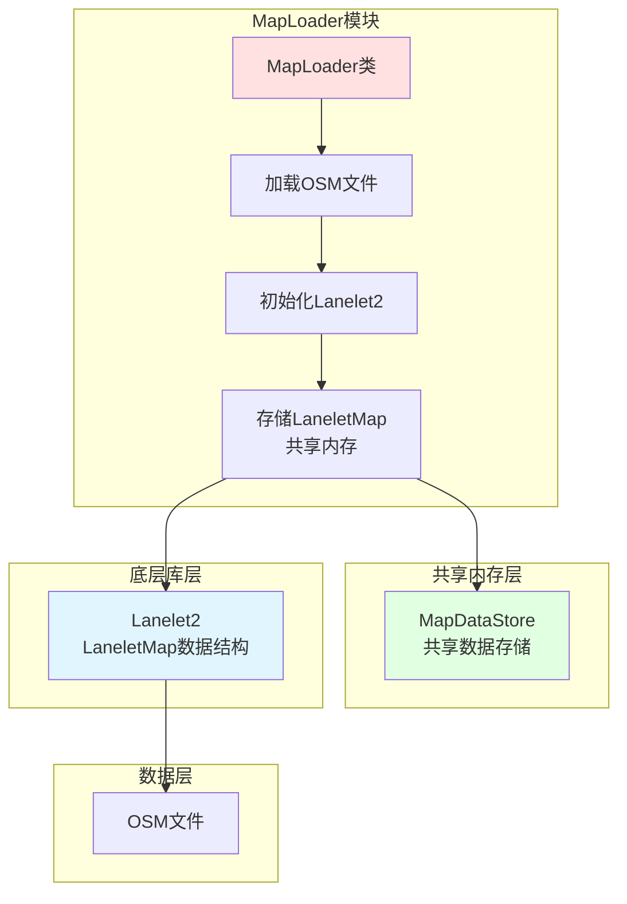
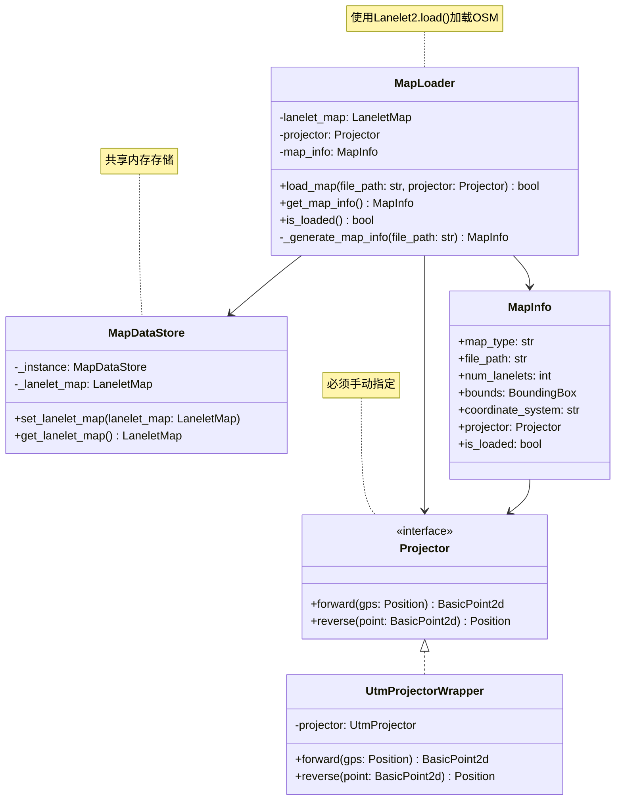

# 地图加载模块 (MapLoader) - 架构设计文档

## 1. 模块概述

### 1.1 模块目标
构建一个基于Lanelet2的地图加载模块，支持OSM格式地图，将加载的地图数据存储到共享内存中，供MapAPI模块使用。

### 1.2 设计原则
- **单一职责**：专注于地图加载和初始化
- **共享内存模式**：将LaneletMap存储在共享内存中
- **手动配置**：Projector必须通过配置或参数指定
- **类型安全**：使用Python类型注解确保代码质量

### 1.3 核心设计决策

#### 1.3.1 地图格式
**使用Lanelet2 + OSM格式**

Lanelet2是一个成熟的高精度地图库，原生支持OSM格式：

```python
import lanelet2

# 加载OSM格式
lanelet_map = lanelet2.io.load("map.osm")
```

**数据流**：
```
OSM文件 → Lanelet2.load() → LaneletMap (统一格式)
```

**优势**：
- Lanelet2提供丰富的查询API（拓扑关系、几何计算等）
- 生产环境验证，被多家自动驾驶公司使用
- OSM格式开源，社区支持广泛

**关于XODR格式**：
XODR格式的地图可以离线转换为OSM格式（可能需要人工审核），转换后的OSM文件可直接使用本模块加载。

#### 1.3.2 共享内存设计

**MapLoader将LaneletMap存储在共享内存中**



**共享内存设计**：
```python
# 共享内存存储
class MapDataStore:
    _instance = None
    _lanelet_map = None
    
    @classmethod
    def set_lanelet_map(cls, lanelet_map):
        cls._lanelet_map = lanelet_map
    
    @classmethod
    def get_lanelet_map(cls):
        return cls._lanelet_map
```

#### 1.3.3 地图Projector（投影器）处理

Lanelet2使用局部坐标系，需要设置Projector用于坐标转换：

```python
from lanelet2.projection import UtmProjector

# 设置投影器（使用UTM投影）
projector = UtmProjector(Origin(116.4074, 39.9042))  # 北京天安门
```

**Projector选择策略**：
1. **UTM投影**：适用于大多数场景，Lanelet2内置支持
2. **Mercator投影**：适用于大范围地图
3. **自定义投影**：根据项目需求自定义

**推荐方案**：
- 使用Lanelet2内置的UtmProjector
- Projector必须通过配置文件或初始化参数指定
- 不自动计算，确保坐标转换的一致性
- 在MapInfo中记录Projector信息，供上层使用

---

## 2. 需求分析

### 2.1 功能需求

| 需求编号 | 需求描述 | 优先级 |
|---------|---------|--------|
| ML-001 | 支持加载OSM格式地图文件 | P0 |
| ML-002 | 支持手动指定地图Projector | P0 |
| ML-003 | 将LaneletMap存储到共享内存 | P0 |
| ML-004 | 生成地图元信息 | P1 |
| ML-005 | 提供地图加载状态查询 | P1 |

### 2.2 非功能需求

| 需求编号 | 需求描述 | 优先级 |
|---------|---------|--------|
| MLN-001 | 地图加载时间 < 5秒 | P1 |
| MLN-002 | 内存占用合理（支持大地图） | P1 |
| MLN-003 | 代码模块化，易于测试 | P0 |

---

## 3. 系统架构设计

### 3.1 类图设计



**关键点**：
- MapLoader负责加载OSM文件并初始化Lanelet2
- MapLoader将LaneletMap存储到MapDataStore（共享内存）
- Projector必须通过配置或初始化参数指定，不自动计算
- MapDataStore使用类变量实现共享内存

---

## 4. 数据结构设计

### 4.1 位置信息

```python
from dataclasses import dataclass
from typing import Optional

@dataclass
class Position:
    """位置信息（WGS84坐标系）"""
    latitude: float  # 纬度
    longitude: float  # 经度
    altitude: Optional[float] = None  # 海拔高度（可选）
    
    def to_tuple(self) -> tuple:
        """转换为元组格式"""
        return (self.latitude, self.longitude, self.altitude)
```

### 4.2 地图信息

```python
@dataclass
class BoundingBox:
    """地图边界框"""
    min_lat: float
    max_lat: float
    min_lon: float
    max_lon: float

@dataclass
class MapInfo:
    """地图元信息"""
    map_type: str  # "osm"
    file_path: str
    num_lanelets: int
    bounds: BoundingBox
    coordinate_system: str
    projector: Optional[Projector] = None
    is_loaded: bool = False
```

---

## 5. 接口设计

### 5.1 投影器接口

```python
from abc import ABC, abstractmethod
from lanelet2.core import BasicPoint2d

class Projector(ABC):
    """投影器接口"""
    
    @abstractmethod
    def forward(self, gps: Position) -> BasicPoint2d:
        """
        GPS坐标转换为地图坐标
        
        Args:
            gps: GPS位置
            
        Returns:
            地图坐标点
        """
        pass
    
    @abstractmethod
    def reverse(self, point: BasicPoint2d) -> Position:
        """
        地图坐标转换为GPS坐标
        
        Args:
            point: 地图坐标点
            
        Returns:
            GPS位置
        """
        pass
```

### 5.2 UTM投影器实现

```python
from lanelet2.projection import UtmProjector
from lanelet2.io import Origin

class UtmProjectorWrapper(Projector):
    """UTM投影器包装类"""
    
    def __init__(self, origin: Origin):
        """
        初始化UTM投影器
        
        Args:
            origin: 地图原点（经度、纬度）
        """
        self.projector = UtmProjector(origin)
    
    def forward(self, gps: Position) -> BasicPoint2d:
        """GPS坐标转换为地图坐标"""
        return self.projector.forward(gps.longitude, gps.latitude)
    
    def reverse(self, point: BasicPoint2d) -> Position:
        """地图坐标转换为GPS坐标"""
        lon, lat = self.projector.reverse(point)
        return Position(latitude=lat, longitude=lon)
```

### 5.3 共享内存存储

```python
from lanelet2.core import LaneletMap
from typing import Optional

class MapDataStore:
    """共享内存存储 - 用于MapLoader和MapAPI之间的数据共享"""
    
    _instance = None
    _lanelet_map: Optional[LaneletMap] = None
    
    @classmethod
    def set_lanelet_map(cls, lanelet_map: LaneletMap) -> None:
        """
        设置LaneletMap到共享内存
        
        Args:
            lanelet_map: LaneletMap对象
        """
        cls._lanelet_map = lanelet_map
    
    @classmethod
    def get_lanelet_map(cls) -> Optional[LaneletMap]:
        """
        从共享内存获取LaneletMap
        
        Returns:
            LaneletMap对象，如果未设置则返回None
        """
        return cls._lanelet_map
    
    @classmethod
    def clear(cls) -> None:
        """清空共享内存"""
        cls._lanelet_map = None
```

---

## 6. 地图加载器实现设计

```python
import lanelet2
from lanelet2.core import LaneletMap
from typing import Optional

class MapLoader:
    """OSM地图加载器"""
    
    def __init__(self):
        self.lanelet_map: Optional[LaneletMap] = None
        self.projector: Optional[Projector] = None
        self.map_info: Optional[MapInfo] = None
    
    def load_map(self, file_path: str, projector: Projector) -> bool:
        """
        加载OSM地图文件
        
        Args:
            file_path: OSM文件路径
            projector: 投影器（必须手动指定）
            
        Returns:
            加载是否成功
        """
        try:
            # 使用Lanelet2加载OSM文件
            self.lanelet_map = lanelet2.io.load(file_path)
            
            # 设置投影器
            self.projector = projector
            
            # 生成地图信息
            self.map_info = self._generate_map_info(file_path)
            
            # 将LaneletMap存储到共享内存
            MapDataStore.set_lanelet_map(self.lanelet_map)
            
            return True
        except Exception as e:
            print(f"Failed to load OSM map: {e}")
            return False
    
    def get_map_info(self) -> Optional[MapInfo]:
        """
        获取地图信息
        
        Returns:
            地图信息
        """
        return self.map_info
    
    def is_loaded(self) -> bool:
        """
        检查地图是否已加载
        
        Returns:
            是否已加载
        """
        return self.lanelet_map is not None
    
    def _generate_map_info(self, file_path: str) -> MapInfo:
        """
        生成地图信息
        
        Args:
            file_path: 地图文件路径
            
        Returns:
            地图信息
        """
        if self.lanelet_map is None:
            raise ValueError("Map not loaded")
        
        # 计算边界框
        min_lat = float('inf')
        max_lat = float('-inf')
        min_lon = float('inf')
        max_lon = float('-inf')
        
        for lanelet in self.lanelet_map.laneletLayer:
            for point in lanelet.leftBound:
                min_lat = min(min_lat, point.lat)
                max_lat = max(max_lat, point.lat)
                min_lon = min(min_lon, point.lon)
                max_lon = max(max_lon, point.lon)
            
            for point in lanelet.rightBound:
                min_lat = min(min_lat, point.lat)
                max_lat = max(max_lat, point.lat)
                min_lon = min(min_lon, point.lon)
                max_lon = max(max_lon, point.lon)
        
        bounds = BoundingBox(
            min_lat=min_lat,
            max_lat=max_lat,
            min_lon=min_lon,
            max_lon=max_lon
        )
        
        return MapInfo(
            map_type="osm",
            file_path=file_path,
            num_lanelets=len(self.lanelet_map.laneletLayer),
            bounds=bounds,
            coordinate_system="WGS84",
            projector=self.projector,
            is_loaded=True
        )
```

---

## 7. 目录结构设计

```
lanelet_test/
├── loader_architecture.md         # MapLoader架构文档（本文件）
├── Town10HD.osm                   # OSM地图文件
├── src/
│   ├── __init__.py
│   └── map/
│       ├── __init__.py
│       ├── base.py                # 基础数据结构
│       ├── loader.py              # 地图加载器
│       └── utils.py               # 工具函数（坐标转换等）
├── tests/                         # 测试目录
│   ├── __init__.py
│   └── test_loader.py             # 地图加载器测试
└── configs/                       # 配置文件
    └── map_config.yaml            # 地图配置
```

---

## 8. 配置管理

### 8.1 地图配置文件 (map_config.yaml)

```yaml
# 地图配置
map:
  # 地图文件路径
  osm_file: "Town10HD.osm"
  
  # 坐标系配置
  coordinate_system: "WGS84"
  
  # 原点配置（必须手动指定）
  origin:
    latitude: 39.9042  # 纬度，必须指定
    longitude: 116.4074  # 经度，必须指定
  
  # 缓存配置
  cache:
    enabled: true
    max_size: 100  # 最大缓存条目数
```

---

## 9. 技术选型

| 组件 | 技术选型 | 说明 |
|-----|---------|------|
| 地图库 | Lanelet2 | 支持OSM格式 |
| 坐标转换 | Lanelet2内置UtmProjector | 地理坐标投影转换 |
| 配置管理 | PyYAML | 配置文件解析 |
| 类型检查 | typing | Python类型注解 |
| 测试 | pytest | 单元测试 |

### 9.1 Lanelet2 简介
Lanelet2是一个专门为自动驾驶设计的高精度地图库，提供：
- 支持OpenStreetMap (OSM) 格式
- 车道拓扑关系查询
- 交通规则信息存储
- 几何计算和空间查询
- Python绑定支持
- 内置UTM投影器

### 9.2 依赖安装

```bash
# 安装Lanelet2
sudo apt-get install liblanelet2-dev python3-lanelet2

# 安装Python依赖
pip install pyyaml pytest
```

---

## 10. 实施计划

### 10.1 第一阶段：基础框架
- [ ] 搭建项目目录结构
- [ ] 定义基础数据结构（Position, MapInfo等）
- [ ] 实现MapLoader基础框架

### 10.2 第二阶段：地图加载
- [ ] 实现OSM地图加载功能
- [ ] 实现Projector接口和UtmProjectorWrapper
- [ ] 实现MapDataStore共享内存
- [ ] 实现地图信息生成
- [ ] 编写测试用例

---

## 11. 使用示例

### 11.1 加载OSM地图

```python
from src.map.loader import MapLoader
from src.map.utils import UtmProjectorWrapper
from lanelet2.io import Origin

# 创建地图加载器
loader = MapLoader()

# 创建投影器（必须手动指定原点）
origin = Origin(latitude=39.9042, longitude=116.4074)
projector = UtmProjectorWrapper(origin)

# 加载地图
success = loader.load_map("Town10HD.osm", projector)
if not success:
    print("Failed to load map")
    exit(1)

# 查询地图信息
map_info = loader.get_map_info()
print(f"Map type: {map_info.map_type}")
print(f"Number of lanelets: {map_info.num_lanelets}")
print(f"Bounds: {map_info.bounds}")
print(f"Is loaded: {loader.is_loaded()}")
```

---

## 12. 风险和挑战

| 风险 | 影响 | 缓解措施 |
|-----|------|---------|
| Lanelet2安装复杂 | 中 | 提供详细的安装文档，考虑Docker容器化 |
| 大地图内存占用 | 中 | 实现分块加载和缓存机制 |
| 坐标转换精度问题 | 高 | 使用成熟的投影库，充分测试 |

---

## 13. 附录

### 13.1 术语表

| 术语 | 说明 |
|-----|------|
| OSM | OpenStreetMap，开源地图格式 |
| Lanelet | 车道单元，地图中的最小车道描述单位 |
| Lanelet2 | 专门为自动驾驶设计的高精度地图库 |
| Projector | 投影器，用于GPS坐标与地图坐标的转换 |
| UTM | Universal Transverse Mercator，通用横轴墨卡托投影 |

### 13.2 参考资料
- Lanelet2: https://github.com/fzi-forschungszentrum-informatik/Lanelet2
- OpenStreetMap: https://www.openstreetmap.org/
