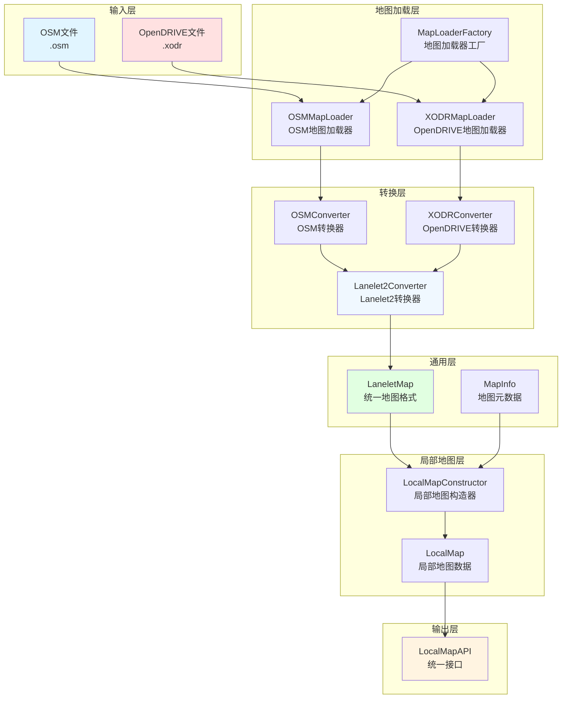
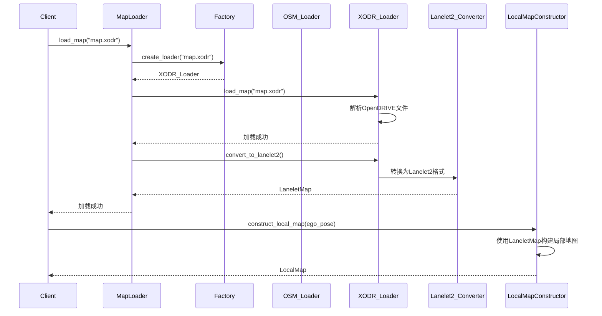

# OpenDRIVE地图支持架构设计文档

## 1. 概述

### 1.1 目标
在现有map_node系统中增加OpenDRIVE格式地图的加载支持，同时保持局部地图输出接口不变。

### 1.2 设计原则
- **接口一致性**: 局部地图输出接口保持不变
- **可扩展性**: 支持未来添加更多地图格式
- **解耦性**: 地图加载与地图处理逻辑分离
- **单一职责**: 每个组件专注于特定功能

---

## 2. OpenDRIVE解析引擎选择

### 2.1 解析引擎：libOpenDRIVE

**选择libOpenDRIVE的理由**:
1. **轻量级**: 专注于OpenDRIVE解析，没有额外的仿真和可视化功能
2. **简单API**: 提供基础的Road/Lane访问接口，易于集成
3. **Python原生**: 支持pip直接安装，无需编译
4. **符合需求**: 正好满足"加载xodr + 基础API + 进一步转换"的需求
5. **开源许可**: MIT许可证，商业友好
6. **持续维护**: 活跃的社区和持续更新

**项目地址**: https://github.com/pageldev/libOpenDRIVE

**安装方式**:
```bash
# pip直接安装
pip install libOpenDRIVE
```

**基本使用**:
```python
from libOpenDRIVE import OpenDriveLoader

# 加载OpenDRIVE文件
loader = OpenDriveLoader()
loader.load("map.xodr")

# 获取道路信息
for road in loader.get_roads():
    print(f"Road ID: {road.id}")
    print(f"Road length: {road.length}")
    
    # 获取车道信息
    for lane_section in road.lane_sections:
        for lane in lane_section.lanes:
            print(f"Lane ID: {lane.id}")
            print(f"Lane type: {lane.type}")
            
            # 获取车道几何信息
            for point in lane.center_line:
                print(f"Point: ({point.x}, {point.y}, {point.z})")
```

### 2.2 与esmini的对比

| 特性 | libOpenDRIVE | esmini |
|------|---------------|---------|
| **定位** | 专注于OpenDRIVE解析 | 仿真+可视化+解析 |
| **复杂度** | 轻量级，API简洁 | 功能丰富，API复杂 |
| **Python绑定** | 原生Python支持 | 需要编译 |
| **安装** | pip install | 需要源码编译 |
| **适用场景** | 仅需解析和提取数据 | 需要仿真和可视化 |
| **性能** | 良好 | 优秀（C++核心） |

**推荐选择**: 对于您的需求（加载xodr + 基础API + 转换为局部地图），**libOpenDRIVE是更合适的选择**。

---

## 3. 架构设计

### 3.1 整体架构图



### 3.2 模块职责

| 模块 | 职责 |
|------|------|
| **MapLoaderFactory** | 根据文件类型创建对应的地图加载器 |
| **OSMMapLoader** | 加载OSM格式地图（现有功能） |
| **XODRMapLoader** | 加载OpenDRIVE格式地图（新增） |
| **OSMConverter** | 将OSM数据转换为中间格式 |
| **XODRConverter** | 将OpenDRIVE数据转换为中间格式 |
| **Lanelet2Converter** | 将中间格式转换为Lanelet2格式 |
| **LocalMapConstructor** | 构建局部地图（现有功能，保持不变） |

---

## 4. 详细设计

### 4.1 MapLoaderFactory

```python
"""
地图加载器工厂
根据文件扩展名创建对应的加载器
"""

from typing import Optional
from pathlib import Path

class MapLoaderFactory:
    """地图加载器工厂类"""
    
    @staticmethod
    def create_loader(file_path: str) -> 'BaseMapLoader':
        """
        根据文件路径创建对应的地图加载器
        
        Args:
            file_path: 地图文件路径
            
        Returns:
            地图加载器实例
            
        Raises:
            ValueError: 不支持的地图格式
        """
        path = Path(file_path)
        suffix = path.suffix.lower()
        
        if suffix == '.osm':
            from .osm_loader import OSMMapLoader
            return OSMMapLoader()
        elif suffix in ['.xodr', '.xml']:
            from .xodr_loader import XODRMapLoader
            return XODRMapLoader()
        else:
            raise ValueError(
                f"Unsupported map format: {suffix}. "
                f"Supported formats: .osm, .xodr"
            )
    
    @staticmethod
    def get_map_type(file_path: str) -> str:
        """获取地图类型"""
        path = Path(file_path)
        suffix = path.suffix.lower()
        
        if suffix == '.osm':
            return 'osm'
        elif suffix in ['.xodr', '.xml']:
            return 'opendrive'
        else:
            return 'unknown'
```

### 4.2 BaseMapLoader (抽象基类)

```python
"""
地图加载器抽象基类
定义所有地图加载器的通用接口
"""

from abc import ABC, abstractmethod
from typing import Optional, Dict, Any

class BaseMapLoader(ABC):
    """地图加载器抽象基类"""
    
    def __init__(self):
        self.lanelet_map: Optional[Any] = None
        self.map_info: Optional['MapInfo'] = None
        self.raw_data: Optional[Dict[str, Any]] = None
    
    @abstractmethod
    def load_map(self, file_path: str, **kwargs) -> bool:
        """
        加载地图文件
        
        Args:
            file_path: 地图文件路径
            **kwargs: 加载参数
            
        Returns:
            加载是否成功
        """
        pass
    
    @abstractmethod
    def convert_to_lanelet2(self) -> bool:
        """
        将加载的地图数据转换为Lanelet2格式
        
        Returns:
            转换是否成功
        """
        pass
    
    def get_map_data(self) -> Dict[str, Any]:
        """
        获取地图数据
        
        Returns:
            包含lanelet_map和map_info的字典
        """
        return {
            'lanelet_map': self.lanelet_map,
            'map_info': self.map_info
        }
    
    def get_map_info(self) -> Optional['MapInfo']:
        """获取地图元信息"""
        return self.map_info
    
    def is_loaded(self) -> bool:
        """检查地图是否已加载"""
        return self.lanelet_map is not None
```

### 4.3 XODRMapLoader (新增)

```python
"""
OpenDRIVE地图加载器
支持esmini和carla-opendrive两种解析引擎
"""

import logging
from typing import Optional, Dict, Any
from dataclasses import dataclass
from enum import Enum

# esmini支持
try:
    import esmini
    ESMINI_AVAILABLE = True
except ImportError:
    ESMINI_AVAILABLE = False
    esmini = None

# carla-opendrive支持 (备选)
try:
    from carla.opendrive import OpenDriveParser
    CARLA_AVAILABLE = True
except ImportError:
    CARLA_AVAILABLE = False
    OpenDriveParser = None

# Lanelet2支持
try:
    from lanelet2.core import LaneletMap, Point3d, LineString3d, Lanelet
    LANELET2_AVAILABLE = True
except ImportError:
    LANELET2_AVAILABLE = False
    LaneletMap = None

from .base_loader import BaseMapLoader
from ..map_common.base import MapInfo, BoundingBox

logger = logging.getLogger(__name__)


class OpenDriveEngine(Enum):
    """OpenDRIVE解析引擎类型"""
    ESMINI = "esmini"      # esmini (推荐)
    CARLA = "carla"        # carla-opendrive (备选)
    AUTO = "auto"          # 自动选择


@dataclass
class OpenDriveData:
    """OpenDRIVE数据结构"""
    roads: Dict[str, Any]  # 道路数据
    lanes: Dict[str, Any]  # 车道数据
    junctions: Dict[str, Any]  # 交叉口数据
    signals: Dict[str, Any]  # 信号灯数据
    signs: Dict[str, Any]  # 标志数据


class XODRMapLoader(BaseMapLoader):
    """OpenDRIVE地图加载器"""
    
    def __init__(self, engine: OpenDriveEngine = OpenDriveEngine.AUTO):
        """
        初始化OpenDRIVE地图加载器
        
        Args:
            engine: OpenDRIVE解析引擎类型
        """
        super().__init__()
        
        if not LANELET2_AVAILABLE:
            raise ImportError(
                "Lanelet2 is not installed. "
                "Please install it: sudo apt-get install liblanelet2-dev python3-lanelet2"
            )
        
        # 选择解析引擎
        self.engine = self._select_engine(engine)
        self._validate_engine()
        
        self.opendrive_map: Optional[Any] = None
        self.opendrive_data: Optional[OpenDriveData] = None
    
    def _select_engine(self, engine: OpenDriveEngine) -> OpenDriveEngine:
        """选择解析引擎"""
        if engine != OpenDriveEngine.AUTO:
            return engine
        
        # 自动选择：优先esmini，备选carla
        if ESMINI_AVAILABLE:
            logger.info("Using esmini as OpenDRIVE parser")
            return OpenDriveEngine.ESMINI
        elif CARLA_AVAILABLE:
            logger.info("Using carla-opendrive as OpenDRIVE parser")
            return OpenDriveEngine.CARLA
        else:
            raise ImportError(
                "No OpenDRIVE parser available. "
                "Please install esmini or carla-opendrive."
            )
    
    def _validate_engine(self):
        """验证解析引擎是否可用"""
        if self.engine == OpenDriveEngine.ESMINI and not ESMINI_AVAILABLE:
            raise ImportError(
                "esmini is not installed. "
                "Please install it from: https://github.com/esmini/esmini"
            )
        elif self.engine == OpenDriveEngine.CARLA and not CARLA_AVAILABLE:
            raise ImportError(
                "carla-opendrive is not installed. "
                "Please install it: pip install carla"
            )
    
    def load_map(self, file_path: str, **kwargs) -> bool:
        """
        加载OpenDRIVE地图文件
        
        Args:
            file_path: OpenDRIVE文件路径
            **kwargs: 加载参数
                - coordinate_type: 坐标类型 ("local" 或 "geographic")
                - engine: OpenDRIVE解析引擎 (可选，覆盖初始化时的选择)
                
        Returns:
            加载是否成功
        """
        try:
            logger.info(f"Loading OpenDRIVE map from: {file_path}")
            logger.info(f"Using engine: {self.engine.value}")
            
            # 根据选择的引擎加载地图
            if self.engine == OpenDriveEngine.ESMINI:
                success = self._load_with_esmini(file_path)
            elif self.engine == OpenDriveEngine.CARLA:
                success = self._load_with_carla(file_path)
            else:
                logger.error(f"Unsupported engine: {self.engine}")
                return False
            
            if not success:
                return False
            
            # 提取OpenDRIVE数据
            self.opendrive_data = self._extract_opendrive_data()
            self.raw_data = {
                'opendrive_map': self.opendrive_map,
                'opendrive_data': self.opendrive_data,
                'engine': self.engine.value
            }
            
            logger.info(f"Loaded {len(self.opendrive_data.roads)} roads")
            logger.info(f"Loaded {len(self.opendrive_data.lanes)} lanes")
            
            return True
            
        except FileNotFoundError:
            logger.error(f"OpenDRIVE file not found: {file_path}")
            return False
        except Exception as e:
            logger.error(f"Failed to load OpenDRIVE map: {e}")
            import traceback
            traceback.print_exc()
            return False
    
    def _load_with_esmini(self, file_path: str) -> bool:
        """使用esmini加载OpenDRIVE文件"""
        try:
            # 创建RoadManager
            road_manager = esmini.RoadManager()
            
            # 加载OpenDRIVE文件
            if not road_manager.loadOpenDrive(file_path):
                logger.error("esmini failed to load OpenDRIVE file")
                return False
            
            self.opendrive_map = road_manager
            return True
            
        except Exception as e:
            logger.error(f"esmini loading failed: {e}")
            return False
    
    def _load_with_carla(self, file_path: str) -> bool:
        """使用carla-opendrive加载OpenDRIVE文件"""
        try:
            # 使用carla-opendrive解析OpenDRIVE文件
            self.opendrive_map = OpenDriveParser.parse(file_path)
            
            if self.opendrive_map is None:
                logger.error("carla-opendrive failed to parse OpenDRIVE map")
                return False
            
            return True
            
        except Exception as e:
            logger.error(f"carla-opendrive loading failed: {e}")
            return False
    
    def _extract_opendrive_data(self) -> OpenDriveData:
        """从OpenDRIVE地图中提取数据"""
        if self.engine == OpenDriveEngine.ESMINI:
            return self._extract_from_esmini()
        elif self.engine == OpenDriveEngine.CARLA:
            return self._extract_from_carla()
        else:
            return OpenDriveData({}, {}, {}, {}, {})
    
    def _extract_from_esmini(self) -> OpenDriveData:
        """从esmini提取数据"""
        road_manager = self.opendrive_map
        roads = {}
        lanes = {}
        junctions = {}
        signals = {}
        signs = {}
        
        # 提取道路数据
        for i in range(road_manager.get_num_roads()):
            road = road_manager.get_road_by_idx(i)
            road_id = road.get_id()
            
            roads[road_id] = {
                'id': road_id,
                'name': road.get_name(),
                'length': road.get_length(),
                'junction_id': road.get_junction(),
                'lanes': []
            }
            
            # 提取车道数据
            for j in range(road.get_num_lane_sections()):
                lane_section = road.get_lane_section_by_idx(j)
                for k in range(lane_section.get_num_lanes()):
                    lane = lane_section.get_lane_by_idx(k)
                    lane_id = f"{road_id}_{lane.get_id()}"
                    
                    lanes[lane_id] = {
                        'id': lane.get_id(),
                        'type': lane.get_type(),
                        'level': lane.get_level(),
                        'width': lane.get_width(),
                        'road_id': road_id,
                        'center_line': self._extract_center_line_esmini(lane),
                        'left_boundary': self._extract_boundary_esmini(lane, 'left'),
                        'right_boundary': self._extract_boundary_esmini(lane, 'right')
                    }
                    roads[road_id]['lanes'].append(lane_id)
        
        # 提取交叉口数据
        for i in range(road_manager.get_num_junctions()):
            junction = road_manager.get_junction_by_idx(i)
            junctions[junction.get_id()] = {
                'id': junction.get_id(),
                'name': junction.get_name(),
                'connections': []
            }
        
        return OpenDriveData(
            roads=roads,
            lanes=lanes,
            junctions=junctions,
            signals=signals,
            signs=signs
        )
    
    def _extract_from_carla(self) -> OpenDriveData:
        """从carla-opendrive提取数据"""
        roads = {}
        lanes = {}
        junctions = {}
        signals = {}
        signs = {}
        
        # 提取道路数据
        for road in self.opendrive_map.get_roads():
            road_id = road.id
            roads[road_id] = {
                'id': road_id,
                'name': road.name,
                'length': road.length,
                'junction_id': road.junction,
                'lanes': []
            }
            
            # 提取车道数据
            for lane_section in road.lane_sections:
                for lane in lane_section.get_lanes():
                    lane_id = f"{road_id}_{lane.id}"
                    lanes[lane_id] = {
                        'id': lane.id,
                        'type': lane.type,
                        'level': lane.level,
                        'width': lane.width,
                        'road_id': road_id,
                        'center_line': self._extract_center_line_carla(lane),
                        'left_boundary': self._extract_boundary_carla(lane, 'left'),
                        'right_boundary': self._extract_boundary_carla(lane, 'right')
                    }
                    roads[road_id]['lanes'].append(lane_id)
        
        # 提取交叉口数据
        for junction in self.opendrive_map.get_junctions():
            junctions[junction.id] = {
                'id': junction.id,
                'name': junction.name,
                'connections': []
            }
        
        # 提取信号灯和标志数据
        for road in self.opendrive_map.get_roads():
            for signal in road.signals:
                signals[signal.id] = {
                    'id': signal.id,
                    'type': signal.type,
                    'position': signal.position,
                    'orientation': signal.orientation
                }
            
            for sign in road.signs:
                signs[sign.id] = {
                    'id': sign.id,
                    'type': sign.type,
                    'value': sign.value,
                    'position': sign.position
                }
        
        return OpenDriveData(
            roads=roads,
            lanes=lanes,
            junctions=junctions,
            signals=signals,
            signs=signs
        )
    
    def _extract_center_line(self, lane) -> list:
        """提取车道中心线坐标"""
        points = []
        # libOpenDRIVE的lane对象直接提供中心线数据
        if hasattr(lane, 'center_line') and lane.center_line:
            for point in lane.center_line:
                points.append({
                    'x': point.x,
                    'y': point.y,
                    'z': point.z
                })
        return points
    
    def _extract_boundary(self, lane, side: str) -> list:
        """提取车道边界坐标"""
        points = []
        # libOpenDRIVE的lane对象提供边界数据
        boundary = getattr(lane, f'{side}_boundary', None)
        if boundary:
            for point in boundary:
                points.append({
                    'x': point.x,
                    'y': point.y,
                    'z': point.z
                })
        return points
    
    def convert_to_lanelet2(self) -> bool:
        """
        将OpenDRIVE数据转换为Lanelet2格式
        
        Returns:
            转换是否成功
        """
        try:
            if self.opendrive_data is None:
                logger.error("OpenDRIVE data not loaded")
                return False
            
            logger.info("Converting OpenDRIVE to Lanelet2 format")
            
            # 创建Lanelet2地图
            self.lanelet_map = LaneletMap()
            
            # 存储点和线串
            points = {}
            linestrings = {}
            lanelets = {}
            
            # 为每个车道创建Lanelet
            for lane_id, lane_data in self.opendrive_data.lanes.items():
                # 创建左边界线串
                left_points = []
                for i, pt in enumerate(lane_data['left_boundary']):
                    point_id = f"left_{lane_id}_{i}"
                    point = Point3d(hash(point_id), pt['x'], pt['y'], pt['z'])
                    points[point_id] = point
                    self.lanelet_map.add(point)
                    left_points.append(point)
                
                if len(left_points) >= 2:
                    left_linestring = LineString3d(hash(f"left_{lane_id}"), left_points)
                    linestrings[f"left_{lane_id}"] = left_linestring
                    self.lanelet_map.add(left_linestring)
                
                # 创建右边界线串
                right_points = []
                for i, pt in enumerate(lane_data['right_boundary']):
                    point_id = f"right_{lane_id}_{i}"
                    point = Point3d(hash(point_id), pt['x'], pt['y'], pt['z'])
                    points[point_id] = point
                    self.lanelet_map.add(point)
                    right_points.append(point)
                
                if len(right_points) >= 2:
                    right_linestring = LineString3d(hash(f"right_{lane_id}"), right_points)
                    linestrings[f"right_{lane_id}"] = right_linestring
                    self.lanelet_map.add(right_linestring)
                
                # 创建Lanelet
                if f"left_{lane_id}" in linestrings and f"right_{lane_id}" in linestrings:
                    left_bound = linestrings[f"left_{lane_id}"]
                    right_bound = linestrings[f"right_{lane_id}"]
                    lanelet = Lanelet(hash(lane_id), left_bound, right_bound)
                    
                    # 设置车道类型属性
                    lanelet.attributes["type"] = self._map_lane_type(lane_data['type'])
                    lanelet.attributes["subtype"] = "road"
                    lanelet.attributes["location"] = "urban"
                    
                    lanelets[lane_id] = lanelet
                    self.lanelet_map.add(lanelet)
            
            # 生成地图信息
            self.map_info = self._generate_map_info()
            
            logger.info(f"Converted {len(lanelets)} lanelets to Lanelet2 format")
            return True
            
        except Exception as e:
            logger.error(f"Failed to convert to Lanelet2: {e}")
            import traceback
            traceback.print_exc()
            return False
    
    def _map_lane_type(self, opendrive_type: str) -> str:
        """将OpenDRIVE车道类型映射到Lanelet2类型"""
        type_mapping = {
            'driving': 'driving',
            'sidewalk': 'sidewalk',
            'shoulder': 'shoulder',
            'biking': 'biking',
            'border': 'border',
            'restricted': 'restricted',
            'parking': 'parking',
            'bidirectional': 'bidirectional',
            'median': 'median',
            'roadWorks': 'roadWorks',
            'tram': 'tram',
            'rail': 'rail',
            'entry': 'entry',
            'exit': 'exit',
            'offRamp': 'offRamp',
            'onRamp': 'onRamp'
        }
        return type_mapping.get(opendrive_type, 'unknown')
    
    def _generate_map_info(self) -> MapInfo:
        """生成地图元信息"""
        # 计算边界框
        min_x = float('inf')
        max_x = float('-inf')
        min_y = float('inf')
        max_y = float('-inf')
        
        for lane_data in self.opendrive_data.lanes.values():
            for pt in lane_data['center_line']:
                min_x = min(min_x, pt['x'])
                max_x = max(max_x, pt['x'])
                min_y = min(min_y, pt['y'])
                max_y = max(max_y, pt['y'])
        
        bounds = BoundingBox(
            min_lat=min_y,
            max_lat=max_y,
            min_lon=min_x,
            max_lon=max_x
        )
        
        return MapInfo(
            map_type="opendrive",
            file_path="",
            num_lanelets=len(self.opendrive_data.lanes),
            bounds=bounds,
            coordinate_system="local",
            is_loaded=True
        )
```

### 4.4 OSMMapLoader (重构现有)

```python
"""
OSM地图加载器
重构现有loader.py以继承BaseMapLoader
"""

from .base_loader import BaseMapLoader

class OSMMapLoader(BaseMapLoader):
    """OSM地图加载器"""
    
    def __init__(self):
        super().__init__()
        # 现有loader.py的初始化逻辑
        ...
    
    def load_map(self, file_path: str, **kwargs) -> bool:
        """加载OSM地图（现有逻辑）"""
        # 现有loader.py的load_map逻辑
        ...
    
    def convert_to_lanelet2(self) -> bool:
        """
        将OSM数据转换为Lanelet2格式
        OSM已经使用Lanelet2加载，直接返回True
        """
        return True  # OSM已经直接加载为Lanelet2格式
```

### 4.5 统一加载接口

```python
"""
统一地图加载接口
"""

from .factory import MapLoaderFactory

class MapLoader:
    """统一地图加载器接口"""
    
    def __init__(self):
        self.loader = None
    
    def load_map(self, file_path: str, **kwargs) -> bool:
        """
        加载地图文件（自动识别格式）
        
        Args:
            file_path: 地图文件路径
            **kwargs: 加载参数
            
        Returns:
            加载是否成功
        """
        # 创建对应的加载器
        self.loader = MapLoaderFactory.create_loader(file_path)
        
        # 加载地图
        if not self.loader.load_map(file_path, **kwargs):
            return False
        
        # 转换为Lanelet2格式
        if not self.loader.convert_to_lanelet2():
            return False
        
        return True
    
    def get_map_data(self):
        """获取地图数据"""
        return self.loader.get_map_data()
    
    def get_map_info(self):
        """获取地图元信息"""
        return self.loader.get_map_info()
    
    def is_loaded(self) -> bool:
        """检查地图是否已加载"""
        return self.loader is not None and self.loader.is_loaded()
```

---

## 5. 目录结构

```
src/map_node/maploader/
├── __init__.py
├── loader.py                    # 统一加载接口（重构）
├── factory.py                   # 加载器工厂（新增）
├── base_loader.py               # 抽象基类（新增）
├── osm_loader.py                # OSM加载器（重构现有）
├── xodr_loader.py               # OpenDRIVE加载器（新增）
├── converter.py                 # 格式转换器（新增）
├── utils.py                     # 工具函数（现有）
├── visualization.py             # 可视化工具（现有）
└── README.md                    # 模块文档（更新）
```

---

## 6. 数据流图



---

## 7. 依赖管理

### 7.1 核心依赖（必需）

```txt
# requirements.txt
lanelet2>=1.2.0  # Lanelet2核心库（已存在）
libOpenDRIVE>=0.1.0  # OpenDRIVE解析
```

### 7.2 OpenDRIVE解析依赖

**libOpenDRIVE安装**:
```bash
# pip直接安装
pip install libOpenDRIVE
```

---

## 8. 配置文件

### 8.1 地图配置

```yaml
# configs/map_config.yaml
map:
  # 默认地图类型
  default_type: osm
  
  # 支持的地图格式
  supported_formats:
    - osm
    - opendrive
  
  # OpenDRIVE配置
  opendrive:
    # 车道类型映射
    lane_type_mapping:
      driving: driving
      sidewalk: sidewalk
      shoulder: shoulder
      biking: biking
    
    # 坐标系统
    coordinate_system: local
    
    # 几何采样精度
    geometry:
      center_line_samples: 10  # 中心线采样点数
      boundary_samples: 10     # 边界采样点数
  
  # OSM配置
  osm:
    coordinate_type: local
```

---

## 9. 接口兼容性

### 9.1 局部地图接口保持不变

```python
# LocalMapConstructor接口保持不变
class LocalMapConstructor:
    def __init__(self, map_api: MapAPI, ego_pose: Pose, range: float = 200.0):
        ...
    
    def construct_local_map(self, ego_pose: Pose = None) -> LocalMap:
        ...
```

### 9.2 MapAPI接口保持不变

```python
# MapAPI接口保持不变
class MapAPI:
    def __init__(self, map_data: dict):
        ...
    
    def get_lanelets_in_bbox(self, bbox: BoundingBox) -> List[Lanelet]:
        ...
```

---

## 10. 测试计划

### 10.1 单元测试

```python
# tests/test_xodr_loader.py
def test_load_opendrive_map():
    """测试OpenDRIVE地图加载"""
    loader = XODRMapLoader()
    result = loader.load_map("test.xodr")
    assert result is True

def test_convert_to_lanelet2():
    """测试转换为Lanelet2格式"""
    loader = XODRMapLoader()
    loader.load_map("test.xodr")
    result = loader.convert_to_lanelet2()
    assert result is True
    assert loader.is_loaded() is True

def test_factory():
    """测试工厂模式"""
    osm_loader = MapLoaderFactory.create_loader("test.osm")
    assert isinstance(osm_loader, OSMMapLoader)
    
    xodr_loader = MapLoaderFactory.create_loader("test.xodr")
    assert isinstance(xodr_loader, XODRMapLoader)
```

### 10.2 集成测试

```python
# tests/test_integration.py
def test_opendrive_to_local_map():
    """测试从OpenDRIVE到局部地图的完整流程"""
    # 加载OpenDRIVE地图
    map_loader = MapLoader()
    map_loader.load_map("test.xodr")
    
    # 构建局部地图
    map_api = MapAPI(map_loader.get_map_data())
    constructor = LocalMapConstructor(map_api, ego_pose, range=200)
    local_map = constructor.construct_local_map()
    
    # 验证局部地图
    assert local_map is not None
    assert len(local_map.lanes) > 0
```

---

## 11. 实施步骤

### Phase 1: 基础架构 (Week 1)
1. 创建`BaseMapLoader`抽象基类
2. 创建`MapLoaderFactory`工厂类
3. 重构现有`OSMMapLoader`继承`BaseMapLoader`
4. 创建统一的`MapLoader`接口

### Phase 2: OpenDRIVE支持 (Week 2)
1. 实现`XODRMapLoader`类
2. 实现OpenDRIVE到Lanelet2的转换逻辑
3. 添加OpenDRIVE数据提取和解析
4. 实现车道类型映射

### Phase 3: 集成测试 (Week 3)
1. 编写单元测试
2. 编写集成测试
3. 测试与现有系统的兼容性
4. 性能测试和优化

### Phase 4: 文档和优化 (Week 4)
1. 更新API文档
2. 编写使用示例
3. 代码审查和优化
4. 发布和部署

---

## 12. 风险和缓解

| 风险 | 影响 | 缓解措施 |
|------|------|----------|
| carla-opendrive功能限制 | 中 | 实现自定义XML解析作为备选方案 |
| 转换精度损失 | 中 | 添加坐标转换验证和校正 |
| 性能问题 | 低 | 实现缓存机制和增量加载 |
| 接口兼容性 | 低 | 严格遵循现有接口定义 |

---

## 13. 总结

本架构设计通过以下方式实现OpenDRIVE支持：

1. **工厂模式**: 根据文件类型自动选择加载器
2. **抽象基类**: 统一不同格式加载器的接口
3. **格式转换**: 将OpenDRIVE转换为Lanelet2统一格式
4. **接口兼容**: 保持局部地图输出接口不变

**关键优势**:
- 最小化对现有代码的修改
- 易于扩展支持更多地图格式
- 保持代码的可维护性和可测试性
- 利用现有Lanelet2生态系统的优势
