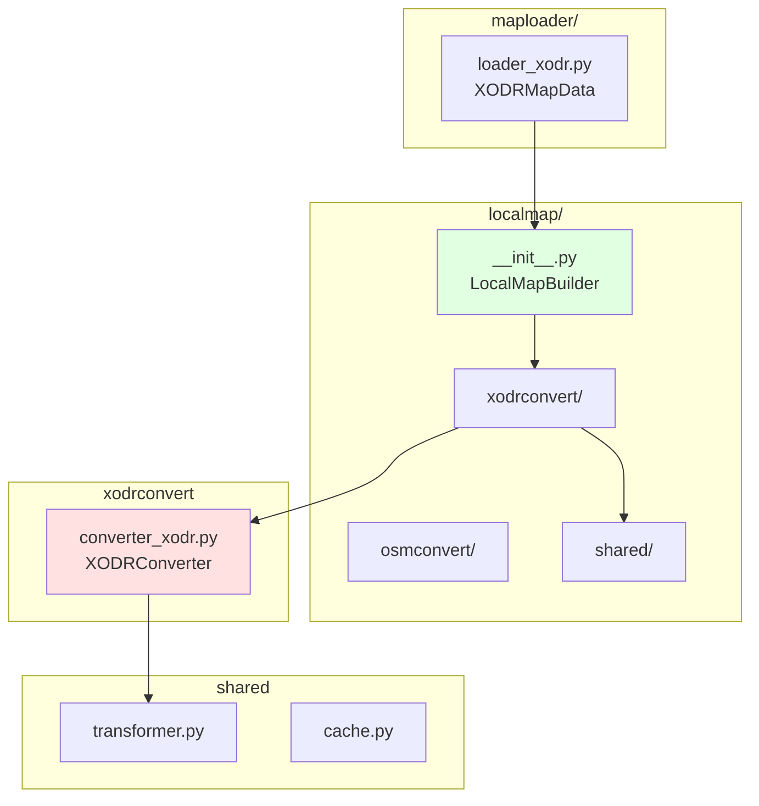
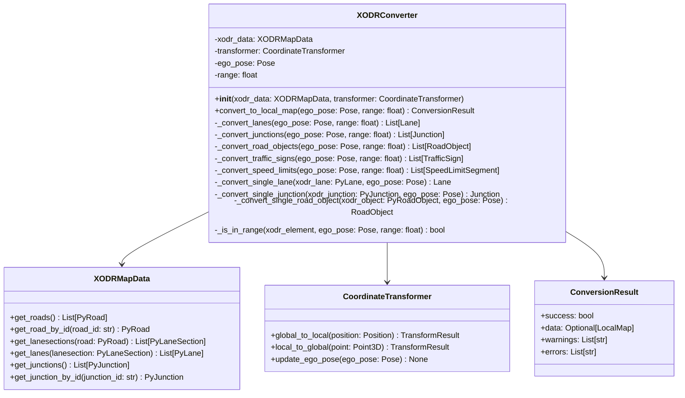
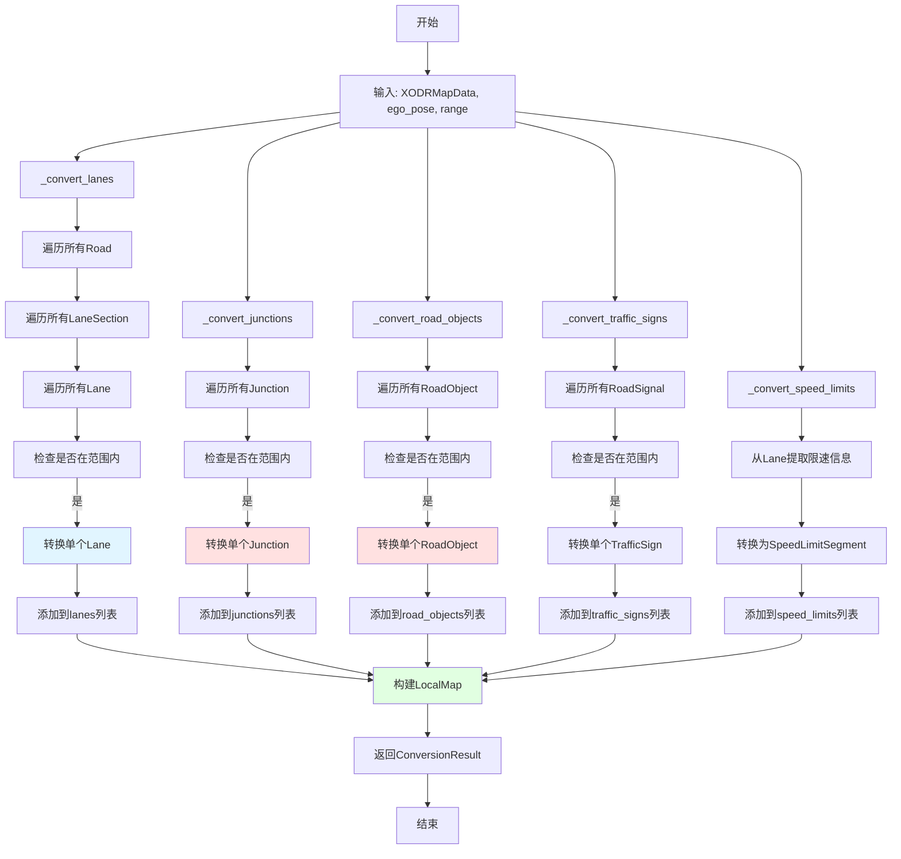
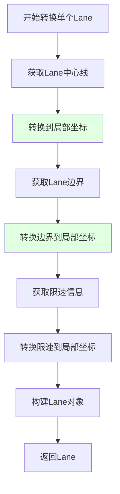
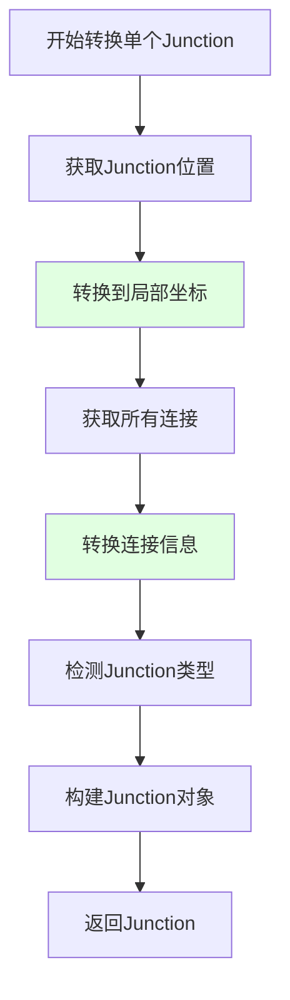
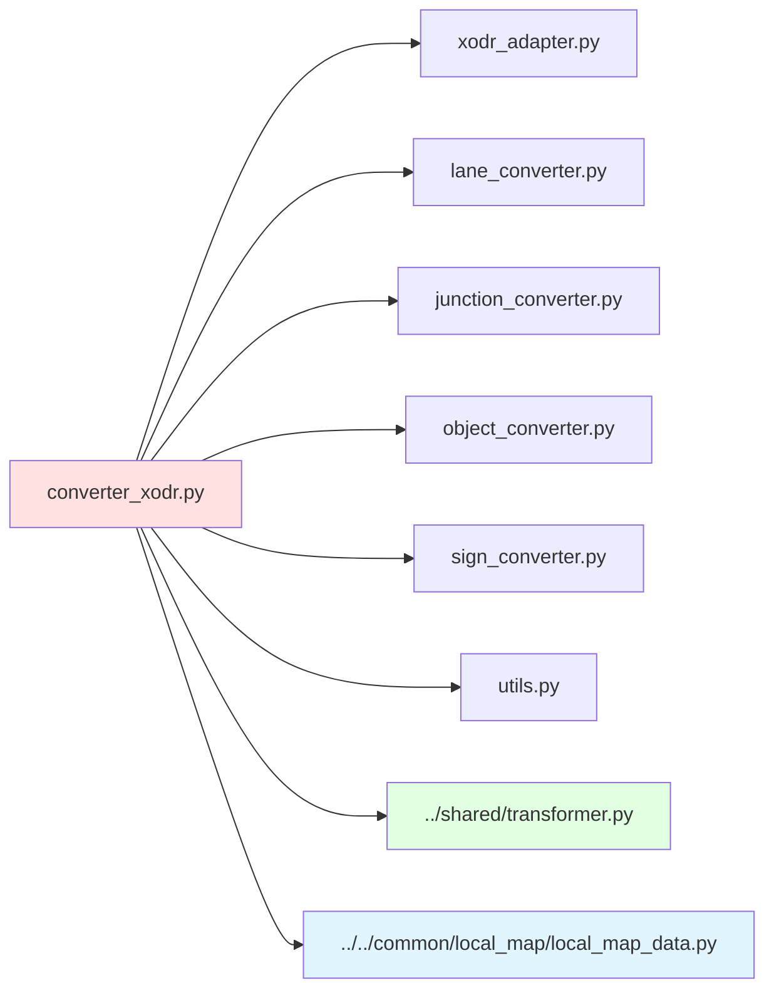

# XODRConverter 详细设计文档

## 1. 概述

XODRConverter负责将OpenDRIVE格式的地图数据转换为统一的LocalMap格式。该模块直接使用pyOpenDRIVE的原生API，不经过MapAPI层，以保留XODR特有属性（junctions、road objects等）。

## 2. 架构位置



## 3. 类设计

### 3.1 XODRConverter



## 4. 数据流设计

### 4.1 完整转换流程



### 4.2 Lane转换流程



### 4.3 Junction转换流程



## 5. 详细方法设计

### 5.1 convert_to_local_map

```python
def convert_to_local_map(self, ego_pose: Pose, range: float) -> ConversionResult:
    """
    将XODR数据转换为LocalMap
    
    Args:
        ego_pose: 自车位姿（局部坐标系原点）
        range: 局部地图范围（米）
        
    Returns:
        ConversionResult包含:
        - success: 转换是否成功
        - data: LocalMap对象（成功时）
        - warnings: 警告列表
        - errors: 错误列表
    """
```

**实现步骤：**
1. 更新transformer的ego_pose
2. 转换lanes
3. 转换junctions
4. 转换road_objects
5. 转换traffic_signs
6. 转换speed_limits
7. 构建LocalMap对象
8. 返回ConversionResult

### 5.2 _convert_lanes

```python
def _convert_lanes(self, ego_pose: Pose, range: float) -> List[Lane]:
    """
    转换所有在范围内的Lanes
    
    Args:
        ego_pose: 自车位姿
        range: 搜索范围（米）
        
    Returns:
        Lane对象列表
    """
```

**实现步骤：**
1. 遍历所有Road
2. 遍历每个Road的LaneSection
3. 遍历每个LaneSection的Lane
4. 检查Lane是否在范围内（使用Lane的s坐标）
5. 调用_convert_single_lane转换单个Lane
6. 收集所有转换后的Lane

**范围判断策略：**
- 使用Lane的s坐标（沿道路方向的距离）
- 计算Lane中心点到ego_pose的距离
- 距离 <= range的Lane被包含

### 5.3 _convert_single_lane

```python
def _convert_single_lane(self, xodr_lane: PyLane, ego_pose: Pose) -> Lane:
    """
    转换单个XODR Lane到LocalMap Lane
    
    Args:
        xodr_lane: pyOpenDRIVE的Lane对象
        ego_pose: 自车位姿
        
    Returns:
        LocalMap的Lane对象
    """
```

**转换内容：**

| XODR属性 | LocalMap属性 | 转换方法 |
|----------|-------------|----------|
| lane.id | lane_id | 直接使用 |
| lane.type | lane_type | 枚举映射 |
| center line | centerline_points | 转换坐标 |
| speed limit | speed_limits | 提取并转换 |
| lane width | - | 用于边界计算 |

**Lane类型映射：**

| XODR Lane Type | LocalMap LaneType |
|----------------|------------------|
| driving | DRIVING |
| sidewalk | SIDEWALK |
| parking | PARKING |
| stop | UNKNOWN |
| none | UNKNOWN |

### 5.4 _convert_junctions

```python
def _convert_junctions(self, ego_pose: Pose, range: float) -> List[Junction]:
    """
    转换所有在范围内的Junctions
    
    Args:
        ego_pose: 自车位姿
        range: 搜索范围（米）
        
    Returns:
        Junction对象列表
    """
```

**实现步骤：**
1. 遍历所有Junction
2. 检查Junction是否在范围内
3. 调用_convert_single_junction转换单个Junction
4. 收集所有转换后的Junction

**范围判断策略：**
- 使用Junction的中心位置
- 计算到ego_pose的距离
- 距离 <= range的Junction被包含

### 5.5 _convert_single_junction

```python
def _convert_single_junction(self, xodr_junction: PyJunction, ego_pose: Pose) -> Junction:
    """
    转换单个XODR Junction到LocalMap Junction
    
    Args:
        xodr_junction: pyOpenDRIVE的Junction对象
        ego_pose: 自车位姿
        
    Returns:
        LocalMap的Junction对象
    """
```

**转换内容：**

| XODR属性 | LocalMap属性 | 转换方法 |
|----------|-------------|----------|
| junction.id | junction_id | 直接使用 |
| junction.name | name | 直接使用 |
| junction position | position | 转换坐标 |
| connections | connections | 转换连接信息 |
| junction type | junction_type | 检测类型 |

**Junction类型检测：**

| 连接数 | 类型 |
|--------|------|
| 3 | t_junction |
| 4 | intersection |
| 环形 | roundabout |

### 5.6 _convert_road_objects

```python
def _convert_road_objects(self, ego_pose: Pose, range: float) -> List[RoadObject]:
    """
    转换所有在范围内的RoadObjects
    
    Args:
        ego_pose: 自车位姿
        range: 搜索范围（米）
        
    Returns:
        RoadObject对象列表
    """
```

**实现步骤：**
1. 遍历所有Road
2. 遍历每个Road的RoadObject
3. 检查RoadObject是否在范围内
4. 调用_convert_single_road_object转换单个RoadObject
5. 收集所有转换后的RoadObject

### 5.7 _convert_single_road_object

```python
def _convert_single_road_object(self, xodr_object: PyRoadObject, ego_pose: Pose) -> RoadObject:
    """
    转换单个XODR RoadObject到LocalMap RoadObject
    
    Args:
        xodr_object: pyOpenDRIVE的RoadObject对象
        ego_pose: 自车位姿
        
    Returns:
        LocalMap的RoadObject对象
    """
```

**转换内容：**

| XODR属性 | LocalMap属性 | 转换方法 |
|----------|-------------|----------|
| object.id | object_id | 直接使用 |
| object.type | object_type | 直接使用 |
| object position | position | 转换坐标 |
| object orientation | orientation | 直接使用 |
| object dimensions | dimensions | 转换尺寸 |

**RoadObject类型映射：**

| XODR Object Type | LocalMap Object Type |
|------------------|---------------------|
| barrier | barrier |
| pole | pole |
| tree | tree |
| building | building |
| wall | wall |

### 5.8 _convert_traffic_signs

```python
def _convert_traffic_signs(self, ego_pose: Pose, range: float) -> List[TrafficSign]:
    """
    转换所有在范围内的TrafficSigns（RoadSignals）
    
    Args:
        ego_pose: 自车位姿
        range: 搜索范围（米）
        
    Returns:
        TrafficSign对象列表
    """
```

**实现步骤：**
1. 遍历所有Road
2. 遍历每个Road的RoadSignal
3. 检查RoadSignal是否在范围内
4. 转换为TrafficSign对象
5. 收集所有转换后的TrafficSign

### 5.9 _convert_speed_limits

```python
def _convert_speed_limits(self, ego_pose: Pose, range: float) -> List[SpeedLimitSegment]:
    """
    转换所有在范围内的SpeedLimits
    
    Args:
        ego_pose: 自车位姿
        range: 搜索范围（米）
        
    Returns:
        SpeedLimitSegment对象列表
    """
```

**实现步骤：**
1. 遍历所有在范围内的Lane
2. 提取每个Lane的speed limit信息
3. 转换为SpeedLimitSegment对象
4. 收集所有转换后的SpeedLimitSegment

## 6. 坐标转换策略

### 6.1 全局坐标到局部坐标

```python
# XODR使用全局坐标（x, y, z）
# 需要转换为局部坐标（相对于ego_pose）

def global_to_local(global_pos: Tuple[float, float, float], ego_pose: Pose) -> Point3D:
    """
    将全局坐标转换为局部坐标
    
    Args:
        global_pos: 全局坐标 (x, y, z)
        ego_pose: 自车位姿（局部坐标系原点）
        
    Returns:
        局部坐标 Point3D
    """
    # 1. 计算相对位置
    dx = global_pos[0] - ego_pose.position.x
    dy = global_pos[1] - ego_pose.position.y
    dz = global_pos[2] - ego_pose.position.z
    
    # 2. 旋转到局部坐标系
    cos_h = math.cos(-ego_pose.heading)
    sin_h = math.sin(-ego_pose.heading)
    
    local_x = dx * cos_h - dy * sin_h
    local_y = dx * sin_h + dy * cos_h
    local_z = dz
    
    return Point3D(x=local_x, y=local_y, z=local_z)
```

### 6.2 范围判断

```python
def is_in_range(element_pos: Tuple[float, float], ego_pose: Pose, range: float) -> bool:
    """
    判断元素是否在范围内
    
    Args:
        element_pos: 元素位置 (x, y)
        ego_pose: 自车位姿
        range: 搜索范围（米）
        
    Returns:
        True如果在范围内
    """
    dx = element_pos[0] - ego_pose.position.x
    dy = element_pos[1] - ego_pose.position.y
    distance = math.sqrt(dx * dx + dy * dy)
    
    return distance <= range
```

## 7. 性能优化

### 7.1 空间索引

```python
class SpatialIndex:
    """空间索引用于快速范围查询"""
    
    def __init__(self):
        self.elements = []  # (position, element) tuples
    
    def add(self, position: Tuple[float, float], element):
        """添加元素"""
        self.elements.append((position, element))
    
    def query(self, ego_pose: Pose, range: float) -> List:
        """查询范围内的元素"""
        result = []
        for pos, elem in self.elements:
            if is_in_range(pos, ego_pose, range):
                result.append(elem)
        return result
```

### 7.2 缓存策略

```python
class ConversionCache:
    """转换结果缓存"""
    
    def __init__(self, max_size: int = 1000):
        self.cache = {}
        self.max_size = max_size
    
    def get(self, key: str) -> Optional[Any]:
        """获取缓存"""
        return self.cache.get(key)
    
    def set(self, key: str, value: Any):
        """设置缓存"""
        if len(self.cache) >= self.max_size:
            # 简单的LRU策略：删除第一个
            self.cache.pop(next(iter(self.cache)))
        self.cache[key] = value
```

## 8. 错误处理

### 8.1 错误类型

| 错误类型 | 描述 | 处理方式 |
|----------|------|----------|
| XODRDataError | XODR数据解析错误 | 记录错误，返回失败 |
| CoordinateTransformError | 坐标转换错误 | 记录警告，跳过该元素 |
| OutOfRangeError | 元素超出范围 | 跳过该元素 |
| ConversionError | 转换逻辑错误 | 记录错误，返回失败 |

### 8.2 错误处理示例

```python
try:
    lane = self._convert_single_lane(xodr_lane, ego_pose)
    lanes.append(lane)
except CoordinateTransformError as e:
    logger.warning(f"Failed to transform lane {lane.id}: {e}")
    warnings.append(f"Lane {lane.id} coordinate transform failed")
except ConversionError as e:
    logger.error(f"Failed to convert lane {lane.id}: {e}")
    errors.append(f"Lane {lane.id} conversion failed")
```

## 9. 测试策略

### 9.1 单元测试

```python
class TestXODRConverter(unittest.TestCase):
    """XODRConverter单元测试"""
    
    def setUp(self):
        """测试前准备"""
        self.xodr_data = load_test_xodr()
        self.transformer = CoordinateTransformer(Pose())
        self.converter = XODRConverter(self.xodr_data, self.transformer)
    
    def test_convert_single_lane(self):
        """测试单个Lane转换"""
        lane = get_test_lane()
        result = self.converter._convert_single_lane(lane, Pose())
        self.assertIsNotNone(result)
        self.assertEqual(result.lane_id, lane.id)
    
    def test_convert_junction(self):
        """测试Junction转换"""
        junction = get_test_junction()
        result = self.converter._convert_single_junction(junction, Pose())
        self.assertIsNotNone(result)
        self.assertEqual(result.junction_id, junction.id)
```

### 9.2 集成测试

```python
class TestXODRConverterIntegration(unittest.TestCase):
    """XODRConverter集成测试"""
    
    def test_full_conversion(self):
        """测试完整转换流程"""
        xodr_data = load_test_xodr("test.xodr")
        transformer = CoordinateTransformer(Pose())
        converter = XODRConverter(xodr_data, transformer)
        
        ego_pose = Pose(position=Point3D(x=0, y=0, z=0), heading=0)
        result = converter.convert_to_local_map(ego_pose, range=200.0)
        
        self.assertTrue(result.success)
        self.assertIsNotNone(result.data)
        self.assertGreater(len(result.data.lanes), 0)
```

## 10. 文件结构

```
src/localmap/xodrconvert/
├── __init__.py
├── converter_xodr.py        # 主转换器
├── xodr_adapter.py          # XODR数据适配器
├── lane_converter.py        # Lane转换
├── junction_converter.py     # Junction转换
├── object_converter.py       # RoadObject转换
├── sign_converter.py        # TrafficSign转换
├── utils.py               # 工具函数
└── tests/
    ├── test_converter.py
    ├── test_lane_converter.py
    └── test_junction_converter.py
```

## 11. 依赖关系



## 12. 实现优先级

| 优先级 | 功能 | 说明 |
|--------|------|------|
| P0 | Lane转换 | 核心功能，必须实现 |
| P0 | 坐标转换 | 核心功能，必须实现 |
| P1 | Junction转换 | 重要功能，需要实现 |
| P1 | RoadObject转换 | 重要功能，需要实现 |
| P2 | TrafficSign转换 | 次要功能，可以后续实现 |
| P2 | SpeedLimit转换 | 次要功能，可以后续实现 |
| P3 | 空间索引优化 | 性能优化，可以后续实现 |
| P3 | 缓存策略 | 性能优化，可以后续实现 |
