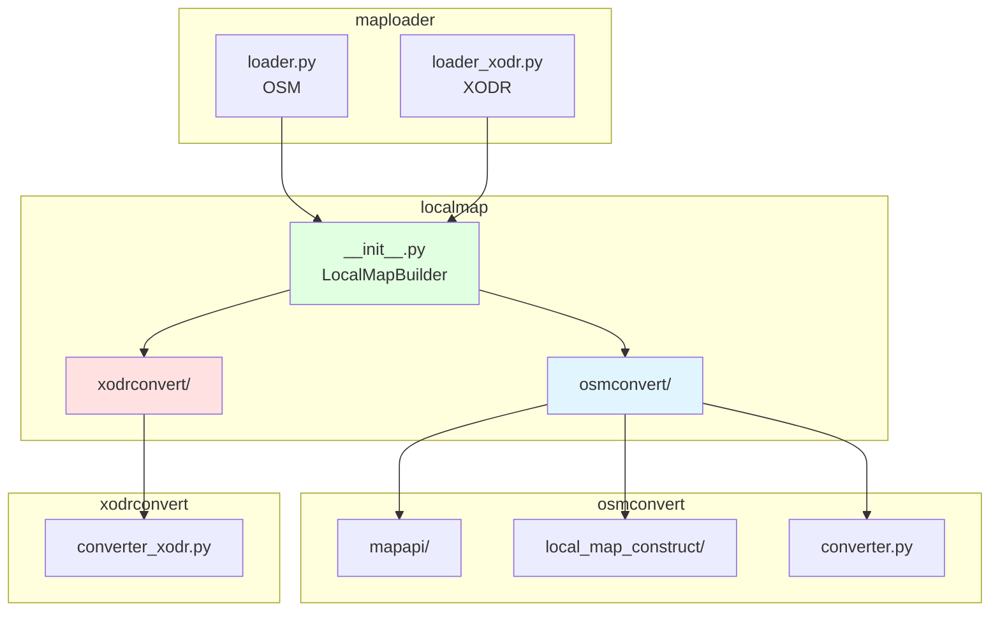
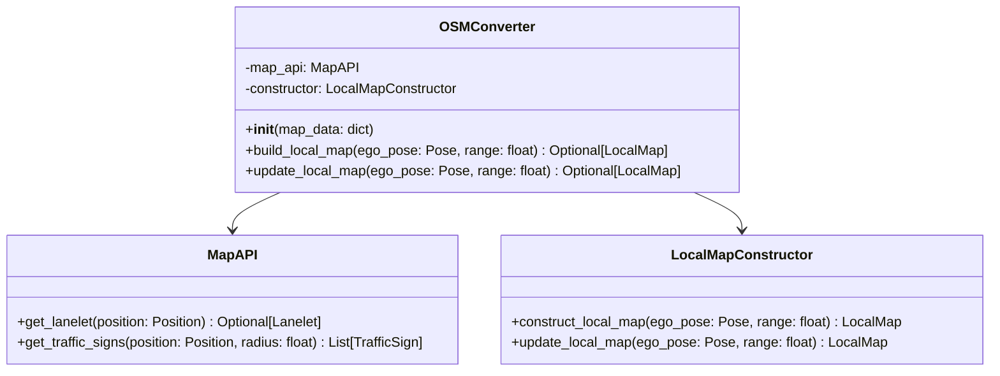
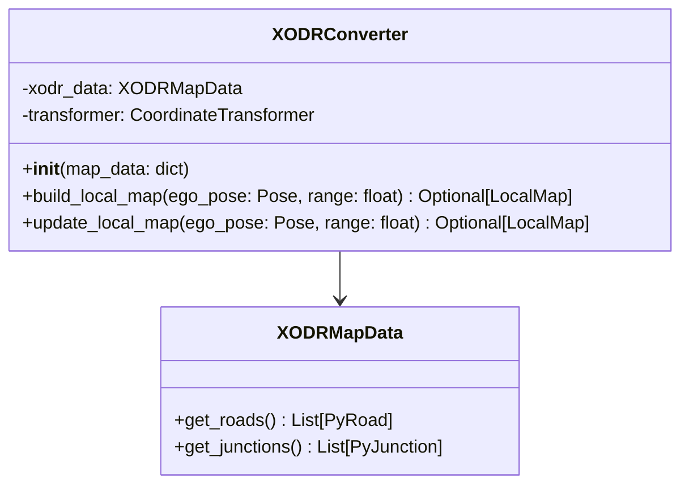
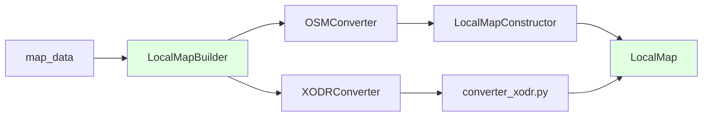
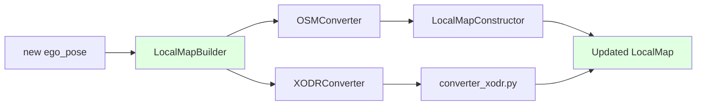
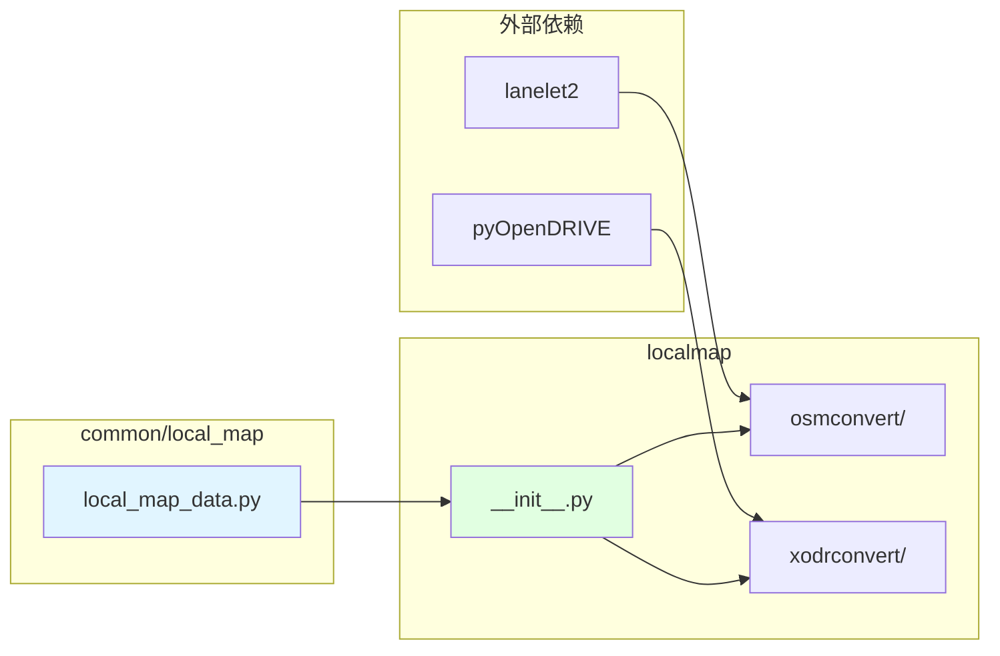

# LocalMap模块架构设计

## 1. 概述

LocalMap模块负责将不同格式的地图数据（OSM、XODR等）转换为统一的LocalMap格式。采用完全分离的架构，每种格式有独立的转换模块。

## 2. 目录结构

```
localmap/
├── __init__.py              # 主入口：LocalMapBuilder
├── osmconvert/              # OSM地图转换
│   ├── __init__.py
│   ├── mapapi/              # OSM查询接口（从map_node/mapapi移入）
│   ├── local_map_construct/ # OSM局部地图构建（从map_node/local_map_construct移入）
│   └── converter.py         # OSM转换器统一入口
└── xodrconvert/             # XODR地图转换
    ├── __init__.py
    ├── converter_xodr.py     # XODR转换器
    ├── lane_converter.py      # Lane转换
    ├── junction_converter.py   # Junction转换
    ├── object_converter.py     # RoadObject转换
    └── sign_converter.py      # TrafficSign转换
```

## 3. 架构图



## 4. 主入口设计

### 4.1 LocalMapBuilder

```python
# localmap/__init__.py

from typing import Optional, Dict, Any
from common.local_map.local_map_data import LocalMap, Pose

from .osmconvert import OSMConverter
from .xodrconvert import XODRConverter


class LocalMapBuilder:
    """局部地图构建器 - 统一入口"""
    
    SUPPORTED_FORMATS = ['osm', 'xodr']
    
    def __init__(self, map_data: Dict[str, Any]):
        """
        初始化LocalMapBuilder
        
        Args:
            map_data: 地图数据字典
        """
        self.map_data = map_data
        self.map_type = map_data.get('map_type')
        
        # 创建对应的转换器（只创建一次，后续复用）
        if self.map_type == 'osm':
            self.converter = OSMConverter(map_data)
        elif self.map_type == 'xodr':
            self.converter = XODRConverter(map_data)
        else:
            raise ValueError(f"Unknown map type: {self.map_type}")
    
    def build_local_map(
        self,
        ego_pose: Pose,
        range: float = 200.0
    ) -> Optional[LocalMap]:
        """
        构建局部地图（首次构建）
        
        Args:
            ego_pose: 自车位姿
            range: 局部地图范围（米）
            
        Returns:
            LocalMap对象，失败返回None
            
        Note:
            与update_local_map的区别：
            - build_local_map: 首次构建，可能涉及完整数据加载
            - update_local_map: 更新，复用已有数据，只更新ego_pose和范围
        """
        return self.converter.build_local_map(ego_pose, range)
    
    def update_local_map(
        self,
        ego_pose: Pose,
        range: float = 200.0
    ) -> Optional[LocalMap]:
        """
        更新局部地图（随自车位置变化）
        
        Args:
            ego_pose: 新的自车位姿
            range: 局部地图范围（米）
            
        Returns:
            更新后的LocalMap对象，失败返回None
            
        Note:
            与build_local_map的区别：
            - build_local_map: 首次构建，可能涉及完整数据加载
            - update_local_map: 更新，复用已有数据，只更新ego_pose和范围
            
        复用说明：
            - converter实例：在__init__中创建，后续复用
            - 数据源（map_data）：不变，只更新ego_pose和range
            - 坐标转换器：可以更新ego_pose，无需重新创建
        """
        return self.converter.update_local_map(ego_pose, range)
    
    @staticmethod
    def get_supported_formats() -> list:
        """
        获取支持的地图格式
        
        Returns:
            支持的格式列表
        """
        return LocalMapBuilder.SUPPORTED_FORMATS.copy()
```

## 5. OSMConverter设计

### 5.1 架构



### 5.2 实现要点

```python
# localmap/osmconvert/__init__.py

class OSMConverter:
    """OSM地图转换器"""
    
    def __init__(self, map_data: Dict[str, Any]):
        """
        初始化OSM转换器
        
        Args:
            map_data: 地图数据字典
        """
        self._initialize_components(map_data)
    
    def _initialize_components(self, map_data: Dict[str, Any]) -> None:
        """初始化组件"""
        from .mapapi import MapAPI
        from .local_map_construct import LocalMapConstructor
        
        self.map_api = MapAPI(map_data)
        self.constructor = LocalMapConstructor(
            self.map_api,
            ego_pose=Pose()  # 初始位姿
        )
    
    def build_local_map(
        self,
        ego_pose: Pose,
        range: float
    ) -> Optional[LocalMap]:
        """
        构建OSM局部地图
        """
        return self.constructor.construct_local_map(ego_pose, range)
    
    def update_local_map(
        self,
        ego_pose: Pose,
        range: float
    ) -> Optional[LocalMap]:
        """
        更新OSM局部地图
        """
        return self.constructor.update_local_map(ego_pose, range)
```

## 6. XODRConverter设计

### 6.1 架构



### 6.2 实现要点

```python
# localmap/xodrconvert/__init__.py

class XODRConverter:
    """XODR地图转换器"""
    
    def __init__(self, map_data: Dict[str, Any]):
        """
        初始化XODR转换器
        
        Args:
            map_data: 地图数据字典
        """
        self.xodr_data = map_data.get('xodr_data')
        self.transformer = None
    
    def build_local_map(
        self,
        ego_pose: Pose,
        range: float
    ) -> Optional[LocalMap]:
        """
        构建XODR局部地图
        """
        from .converter_xodr import XODRConverterImpl
        converter = XODRConverterImpl(self.xodr_data)
        return converter.convert_to_local_map(ego_pose, range)
    
    def update_local_map(
        self,
        ego_pose: Pose,
        range: float
    ) -> Optional[LocalMap]:
        """
        更新XODR局部地图
        """
        from .converter_xodr import XODRConverterImpl
        converter = XODRConverterImpl(self.xodr_data)
        return converter.convert_to_local_map(ego_pose, range)
```

## 7. 数据流

### 7.1 构建数据流



### 7.2 更新数据流



## 8. 依赖关系



## 9. 使用示例

### 9.1 初始化和构建

```python
from map_node.maploader.loader import MapLoader
from map_node.maploader.loader_xodr import XODRMapData
from localmap import LocalMapBuilder
from common.local_map.local_map_data import Pose, Point3D

# OSM地图
loader = MapLoader()
loader.load_map('map.osm', coordinate_type='local')
osm_map_data = {
    'map_type': 'osm',
    'lanelet_map': loader.lanelet_map,
    'projector': loader.projector,
    'map_info': loader.map_info
}
builder = LocalMapBuilder(osm_map_data)
ego_pose = Pose(position=Point3D(x=0, y=0, z=0), heading=0.0)
local_map = builder.build_local_map(ego_pose, range=200.0)

# XODR地图
xodr_data = XODRMapData('map.xodr')
xodr_map_data = {
    'map_type': 'xodr',
    'xodr_data': xodr_data,
    'map_info': None
}
builder = LocalMapBuilder(xodr_map_data)
ego_pose = Pose(position=Point3D(x=0, y=0, z=0), heading=0.0)
local_map = builder.build_local_map(ego_pose, range=200.0)
```

### 9.2 更新局部地图

```python
# 自车位置更新
new_ego_pose = Pose(
    position=Point3D(x=10, y=5, z=0),
    heading=0.5
)
updated_local_map = builder.update_local_map(new_ego_pose, range=200.0)
```

## 10. 迁移计划

1. 创建 `localmap/` 目录结构
2. 创建 `localmap/__init__.py` 主入口
3. 迁移 `map_node/mapapi/` → `localmap/osmconvert/mapapi/`
4. 迁移 `map_node/local_map_construct/` → `localmap/osmconvert/local_map_construct/`
5. 创建 `localmap/osmconvert/converter.py` 统一入口
6. 创建 `localmap/xodrconvert/converter_xodr.py`
7. 实现XODR转换逻辑
8. 测试和文档
