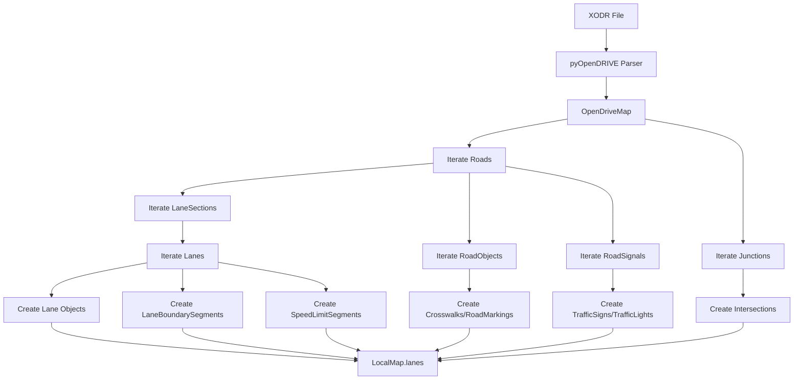

# XODR to LocalMap Data Type Mapping Document

## Overview

This document describes the complete mapping between OpenDRIVE (XODR) data structures and LocalMap data structures. It serves as a reference for implementing the XODR to LocalMap converter.

**Reference Files:**
- XODR Format: [`configs/maps/Town10HD.xodr`](../../configs/maps/Town10HD.xodr)
- LocalMap Data: [`src/common/local_map/local_map_data.py`](../../../common/local_map/local_map_data.py)
- pyOpenDRIVE API: [`pyOpenDRIVE/pyOpenDRIVE/`](../../../../pyOpenDRIVE/pyOpenDRIVE/)

---

## Important: Junction Connection Handling (Flattened Design)

### XODR Connection Hierarchy

XODR uses a **three-level connection hierarchy**:

1. **Road Level**: Road's successor points to a junction ID
   ```xml
   <road id="1">
       <link>
           <successor elementType="junction" elementId="664"/>
       </link>
   </road>
   ```

2. **Junction Level**: Junction's `connection` defines lane-level connections
   ```xml
   <junction id="664">
       <connection id="0" incomingRoad="1" connectingRoad="675" contactPoint="start">
           <laneLink from="1" to="1"/>
       </connection>
   </junction>
   ```

3. **Lane Level**: Lane's predecessor/successor typically point to lanes within same road (between lane sections)

### LocalMap Conversion Strategy: Flattened Lane Connections

**Key Principle:** All lane IDs are globally unique. Lane connections are expanded to lane level directly. No hierarchical queries needed.

For lanes connected to junctions, LocalMap stores:

1. **`successor_lane_ids`** - The actual successor lane IDs within junction (only lane IDs, NO junction IDs)
2. **`predecessor_lane_ids`** - The actual predecessor lane IDs (only lane IDs, NO junction IDs)
3. **`road_id`** - The road ID this lane belongs to (for quick queries)
4. **`junction_id`** - The junction ID this lane belongs to (for quick queries)

**Example:**

| Lane | XODR Connection | LocalMap `road_id` | LocalMap `junction_id` | LocalMap `successor_lane_ids` |
|------|------------------|---------------------|------------------------------|
| Road 1, Lane 1 | successor → junction 664 | None | [Road 675, Lane 1] |
| Road 675, Lane 1 | predecessor → junction 664 | 664 | [Road 2, Lane 1] |
| Road 2, Lane 1 | predecessor → junction 664 | 664 | [Road 676, Lane 2] |

**Benefits:**
- **Flattened design**: All lane IDs are globally unique, enabling direct lane-to-lane queries
- **No hierarchical queries**: Don't need Road→Lane or Junction→Road→Lane lookups
- **Metadata fields**: `road_id` and `junction_id` enable quick queries without traversal
- **Preserves XODR topology**: Connection relationships are maintained through lane IDs

**Conversion Logic:**

```python
# For a lane whose road connects to a junction
if road.successor.type == "junction":
    junction_id = road.successor.id
    lane.junction_id = None  # Not a junction internal lane
    
    # Find junction connections for this lane
    junction = odr_map.get_junction(junction_id)
    for conn in junction.id_to_connection.values():
        if conn.incoming_road == road.id:
            for lane_link in conn.lane_links:
                if lane_link.from == lane.id:
                    # Find successor lane in connecting road
                    connecting_road = odr_map.get_road(conn.connecting_road)
                    successor_lane_id = generate_lane_id(
                        conn.connecting_road,
                        conn.contact_point,
                        lane_link.to
                    )
                    # IMPORTANT: Only add lane ID, NOT junction ID
                    lane.successor_lane_ids.append(successor_lane_id)

# For a junction internal lane
if road.junction != "-1":
    lane.junction_id = int(road.junction)
    lane.is_junction_lane = True
```

**Special Cases:**

1. **Junction Internal Lanes**: Lanes whose `road.junction` attribute is set (not "-1")
   - `junction_id` = road.junction
   - `is_junction_lane` = True
   - `successor_lane_ids` = actual successor lanes (direct road-to-road or through junction)

2. **Direct Road-to-Road Connection**: When road's successor is another road (not a junction)
   - `junction_id` = None
   - `is_junction_lane` = False
   - `successor_lane_ids` = lanes from successor road

3. **Multiple Successors**: A lane may have multiple successors in a junction
   - `successor_lane_ids` contains all possible successor lane IDs
   - Used for routing through complex intersections

---

## 1. Basic Data Types

### 1.1 Point3D

| XODR Source | LocalMap Target | Conversion Notes |
|-------------|-----------------|-----------------|
| `Road.get_xyz(s, t, h)` | [`Point3D`](../../../common/local_map/local_map_data.py:21-25) | Convert from Frenet coordinates (s, t, h) to Cartesian (x, y, z) |
| `Vec3D` (from Math.pxd) | [`Point3D`](../../../common/local_map/local_map_data.py:21-25) | Direct mapping: Vec3D.x → Point3D.x, etc. |

**XODR Coordinate System:**
- `s`: Longitudinal position along reference line (meters)
- `t`: Lateral offset from reference line (meters)
- `h`: Height above road surface (meters)

**LocalMap Coordinate System:**
- `x`: East/West position (meters)
- `y`: North/South position (meters)
- `z`: Elevation (meters)

### 1.2 Point2D

| XODR Source | LocalMap Target | Conversion Notes |
|-------------|-----------------|-----------------|
| `Road.get_surface_pt(s, t, vn)` | [`Point2D`](../../../common/local_map/local_map_data.py:29-32) | Extract x, y from Vec3D, ignore z |

### 1.3 Pose

| XODR Source | LocalMap Target | Conversion Notes |
|-------------|-----------------|-----------------|
| Ego vehicle position | [`Pose`](../../../common/local_map/local_map_data.py:36-41) | Construct from Point3D + heading from road tangent |

---

## 2. Enum Type Mappings

### 2.1 LaneType

| XODR Lane.type | LocalMap [`LaneType`](../../../common/local_map/local_map_data.py:48-61) | Notes |
|----------------|---------------------------------------------------|-------|
| `driving` | `LaneType.DRIVING` | Standard driving lane |
| `shoulder` | `LaneType.SHOULDER` | Road shoulder |
| `sidewalk` | `LaneType.SIDEWALK` | Pedestrian sidewalk |
| `parking` | `LaneType.PARKING` | Parking lane |
| `biking` | `LaneType.BIKING` | Bicycle lane |
| `border` | `LaneType.UNKNOWN` | Road border - map to UNKNOWN |
| `restricted` | `LaneType.UNKNOWN` | Restricted lane - map to UNKNOWN |
| `none` | `LaneType.UNKNOWN` | No lane type specified |

### 2.2 LaneDirection

| XODR Lane ID | LocalMap [`LaneDirection`](../../../common/local_map/local_map_data.py:63-68) | Notes |
|--------------|--------------------------------------------------------|-------|
| `id > 0` (right lanes) | `LaneDirection.BACKWARD` | Positive IDs = lanes to the right of reference line |
| `id < 0` (left lanes) | `LaneDirection.FORWARD` | Negative IDs = lanes to the left of reference line |
| `id = 0` (reference line) | `LaneDirection.UNKNOWN` | Center reference line |

**Note:** In XODR, lane IDs are positive for right lanes and negative for left lanes. The driving direction depends on the road's `left_hand_traffic` attribute.

### 2.3 BoundaryType

| XODR RoadMark.type | LocalMap [`BoundaryType`](../../../common/local_map/local_map_data.py:71-78) | Notes |
|--------------------|--------------------------------------------------------|-------|
| `curb` | `BoundaryType.CURB` | Physical curb |
| `solid` | `BoundaryType.LINE` | Solid line boundary |
| `broken` | `BoundaryType.LINE` | Dashed line boundary |
| `none` | `BoundaryType.VIRTUAL` | No physical boundary |
| `botts_dots` | `BoundaryType.LINE` | Botts' dots pattern |

### 2.4 BoundaryLineShape

| XODR RoadMark.type | LocalMap [`BoundaryLineShape`](../../../common/local_map/local_map_data.py:81-91) | Notes |
|--------------------|-------------------------------------------------------------|-------|
| `solid` | `BoundaryLineShape.SOLID` | Solid line |
| `broken` | `BoundaryLineShape.DASHED` | Dashed line |
| `solid solid` | `BoundaryLineShape.DOUBLE_SOLID` | Double solid line |
| `solid broken` | `BoundaryLineShape.SOLID_DASHED` | Solid-dashed combination |
| `broken solid` | `BoundaryLineShape.LEFT_DASHED_RIGHT_SOLID` | Dashed-solid combination |

### 2.5 BoundaryColor

| XODR RoadMark.color | LocalMap [`BoundaryColor`](../../../common/local_map/local_map_data.py:94-100) | Notes |
|---------------------|-------------------------------------------------------|-------|
| `white` | `BoundaryColor.WHITE` | White marking |
| `yellow` | `BoundaryColor.YELLOW` | Yellow marking |
| `blue` | `BoundaryColor.BLUE` | Blue marking (rare) |
| `red` | `BoundaryColor.RED` | Red marking (rare) |
| (not specified) | `BoundaryColor.UNKNOWN` | Default to UNKNOWN |

### 2.6 TrafficSignType

| XODR RoadSignal.type | LocalMap [`TrafficSignType`](../../../common/local_map/local_map_data.py:155-215) | Notes |
|----------------------|-------------------------------------------------------------|-------|
| `274` | `TrafficSignType.SPEED_LIMIT` | Speed limit sign |
| `275` | `TrafficSignType.SPEED_LIMIT_END` | End of speed limit |
| `205` | `TrafficSignType.NO_ENTRY` | No entry |
| `206` | `TrafficSignType.NO_OVERTAKING` | No overtaking |
| `209` | `TrafficSignType.NO_LEFT_TURN` | No left turn |
| `211` | `TrafficSignType.NO_RIGHT_TURN` | No right turn |
| `222` | `TrafficSignType.STRAIGHT_ONLY` | Straight only |
| `223` | `TrafficSignType.LEFT_TURN_ONLY` | Left turn only |
| `224` | `TrafficSignType.RIGHT_TURN_ONLY` | Right turn only |
| `235` | `TrafficSignType.ROUNDABOUT` | Roundabout |
| (other codes) | `TrafficSignType.UNKNOWN` | Map to UNKNOWN for unsupported types |

**Note:** XODR uses numeric codes from the ASAM OpenDRIVE specification. A comprehensive mapping table should be implemented.

### 2.7 TrafficLightColor

| XODR Signal Type | LocalMap [`TrafficLightColor`](../../../common/local_map/local_map_data.py:113-122) | Notes |
|------------------|-------------------------------------------------------------|-------|
| (traffic light signal) | `TrafficLightColor.RED/YELLOW/GREEN` | Extract from signal state |

### 2.8 IntersectionType

| XODR Junction Connections | LocalMap [`IntersectionType`](../../../common/local_map/local_map_data.py:254-262) | Notes |
|--------------------------|-------------------------------------------------------------|-------|
| 4 roads connected | `IntersectionType.FOUR_WAY` | Standard 4-way intersection |
| 3 roads connected | `IntersectionType.THREE_WAY` | T-junction or Y-junction |
| Roundabout junction | `IntersectionType.ROUNDABOUT` | Detected from junction type |
| >4 roads connected | `IntersectionType.MULTI_LEG` | Multi-leg intersection |

---

## 3. Complex Data Structure Mappings

### 3.1 Lane

| XODR Source | LocalMap Target | Conversion Notes |
|-------------|-----------------|-----------------|
| `Lane` (pyOpenDRIVE) | [`Lane`](../../../common/local_map/local_map_data.py:346-387) | Primary mapping |
| `Lane.key.road_id + key.lanesection_s0 + key.id` | `lane_id` | Generate unique lane ID |
| `Lane.type` | `lane_type` | Map via LaneType enum |
| `Lane.id` | `lane_direction` | Positive → BACKWARD, Negative → FORWARD |
| `Road.get_lane_mesh(lane, eps)` | `centerline_points` | Extract centerline from mesh |
| `Road.get_lane_border_line(lane, eps, outer=True)` | `left_boundary_segment_indices` | Create boundary segment |
| `Road.get_lane_border_line(lane, eps, outer=False)` | `right_boundary_segment_indices` | Create boundary segment |
| `Road.s_to_speed` | `speed_limits` | Convert to SpeedLimitSegment list |
| `Lane.predecessor` | `predecessor_lane_ids` | Add to predecessor list |
| `Lane.successor` | `successor_lane_ids` | Add to successor list |
| `Road.junction` (if != "-1") | `associated_intersection_id` | Link to intersection |

**Lane ID Generation:**
```python
lane_id = hash(f"{road_id}_{lanesection_s0}_{lane_id}")
```

**Boundary Sharing:**
- Adjacent lanes (id and id+1 or id-1) share the same boundary
- Use boundary segment index to enable sharing

### 3.2 LaneBoundarySegment

| XODR Source | LocalMap Target | Conversion Notes |
|-------------|-----------------|-----------------|
| `RoadMark` | [`LaneBoundarySegment`](../../../common/local_map/local_map_data.py:295-320) | Primary mapping |
| `RoadMark.type` | `boundary_type` | Map via BoundaryType enum |
| `RoadMark.type` | `boundary_line_shape` | Map via BoundaryLineShape enum |
| `RoadMark.color` | `boundary_color` | Map via BoundaryColor enum |
| `RoadMark.width` | `boundary_thickness` | Direct mapping |
| `Road.get_lane_border_line(lane, eps, outer=True/False)` | `boundary_points` | Extract boundary points |

**Segmentation:**
- Create separate segments when road mark type changes along the lane
- Use `RoadMark.s_start` and `RoadMark.s_end` for segmentation

### 3.3 SpeedLimitSegment

| XODR Source | LocalMap Target | Conversion Notes |
|-------------|-----------------|-----------------|
| `SpeedRecord` (from Road.s_to_speed) | [`SpeedLimitSegment`](../../../common/local_map/local_map_data.py:324-342) | Primary mapping |
| `SpeedRecord.max` | `speed_limit` | Convert unit if needed (mph → m/s) |
| `SpeedRecord.unit` | N/A | Used for conversion |
| N/A | `speed_limit_type` | Default to `SpeedLimitType.REGULAR` |
| Road geometry at s position | `start_position` | Calculate from road geometry |
| Road geometry at s position | `end_position` | Calculate from road geometry |

**Unit Conversion:**
```python
if unit == "mph":
    speed_limit_mps = speed_limit_mph * 0.44704
elif unit == "km/h":
    speed_limit_mps = speed_limit_kmh / 3.6
```

### 3.4 TrafficLight

| XODR Source | LocalMap Target | Conversion Notes |
|-------------|-----------------|-----------------|
| `RoadSignal` (type = traffic light) | [`TrafficLight`](../../../common/local_map/local_map_data.py:404-414) | Primary mapping |
| `RoadSignal.id` | `traffic_light_id` | Direct mapping |
| `RoadSignal.s0` + `RoadSignal.t0` | `position` | Convert to Point3D using `Road.get_xyz()` |
| N/A (static data) | `current_state` | Set to default/unknown state |
| N/A | `predicted_states` | Empty list (no prediction) |
| N/A | `distance_to_stop_line` | Calculate if stop line available |
| N/A | `associated_stop_line_id` | Link if stop line available |
| N/A | `light_type` | Default to `TrafficLightType.VEHICLE` |
| N/A | `confidence` | Set to 1.0 (static data) |

**Position Calculation:**
```python
position = road.get_xyz(signal.s0, signal.t0, signal.zOffset)
```

### 3.5 TrafficSign

| XODR Source | LocalMap Target | Conversion Notes |
|-------------|-----------------|-----------------|
| `RoadSignal` (type = sign) | [`TrafficSign`](../../../common/local_map/local_map_data.py:422-433) | Primary mapping |
| `RoadSignal.id` | `traffic_sign_id` | Direct mapping |
| `RoadSignal.s0` + `RoadSignal.t0` | `position` | Convert to Point3D using `Road.get_xyz()` |
| `RoadSignal.type` | `sign_type` | Map via TrafficSignType enum |
| `RoadSignal.value` | `value` | Direct mapping |
| `RoadSignal.text` | `text_content` | Direct mapping |
| N/A | `distance_to_sign` | Calculate from ego position |
| N/A | `confidence` | Set to 1.0 (static data) |
| N/A | `is_valid` | Default to True |
| N/A | `valid_until` | None (no expiration) |

### 3.6 RoadMarking

| XODR Source | LocalMap Target | Conversion Notes |
|-------------|-----------------|-----------------|
| `RoadMark` (special markings) | [`RoadMarking`](../../../common/local_map/local_map_data.py:441-449) | Primary mapping |
| `RoadMarkGroup` | `road_marking_id` | Generate unique ID |
| `RoadMarkGroup.type` | `marking_type` | Map via RoadMarkingType enum |
| `RoadMarkGroup.color` | `marking_color` | Map via RoadMarkingColor enum |
| `RoadMarkGroup.width` | `marking_width` | Direct mapping |
| `Road.get_roadmark_mesh(lane, roadmark, eps)` | `marking_points` | Extract from mesh |
| N/A | `confidence` | Set to 1.0 (static data) |

### 3.7 Crosswalk

| XODR Source | LocalMap Target | Conversion Notes |
|-------------|-----------------|-----------------|
| `RoadObject` (type = crosswalk) | [`Crosswalk`](../../../common/local_map/local_map_data.py:457-467) | Primary mapping |
| `RoadObject.id` | `crosswalk_id` | Direct mapping |
| `RoadObject.width` | `crosswalk_width` | Direct mapping |
| `RoadObject.length` | `crosswalk_length` | Direct mapping |
| `Road.get_road_object_mesh(road_object, eps)` | `polygon_points` | Extract from mesh |
| Associated signal | `has_traffic_light` | Check if signal exists |
| Associated signal | `associated_traffic_light_id` | Link if available |
| N/A | `has_pedestrian_island` | Detect from geometry |
| N/A | `confidence` | Set to 1.0 (static data) |

### 3.8 StopLine

| XODR Source | LocalMap Target | Conversion Notes |
|-------------|-----------------|-----------------|
| `RoadMark` (type = stop line) | [`StopLine`](../../../common/local_map/local_map_data.py:475-485) | Primary mapping |
| `RoadMark` + lane info | `stop_line_id` | Generate unique ID |
| `RoadMark` geometry | `line_points` | Extract boundary points |
| N/A | `stop_line_type` | Default to `StopLineType.UNKNOWN` |
| Associated signal | `associated_traffic_light_id` | Link if available |
| Associated sign | `associated_sign_id` | Link if available |
| N/A | `distance_to_stop_line` | Calculate from ego position |
| N/A | `is_mandatory` | Default to True |
| N/A | `confidence` | Set to 1.0 (static data) |

### 3.9 Intersection (Junction)

| XODR Source | LocalMap Target | Conversion Notes |
|-------------|-----------------|-----------------|
| `Junction` | [`Intersection`](../../../common/local_map/local_map_data.py:493-507) | Primary mapping |
| `Junction.id` | `intersection_id` | Direct mapping |
| `Junction.id_to_connection` | `intersection_type` | Determine from connection count |
| Junction road geometry | `polygon_points` | Calculate from connecting roads |
| `Junction.id_to_connection` | `incoming_lane_ids` | Extract from connections |
| `Junction.id_to_connection` | `outgoing_lane_ids` | Extract from connections |
| `Junction.id_to_controller` | `has_traffic_light` | Check if controller exists |
| `Junction.id_to_controller` | `associated_traffic_light_id` | Link if available |

**Intersection Type Detection:**
```python
connection_count = len(junction.id_to_connection)
if connection_count == 4:
    intersection_type = IntersectionType.FOUR_WAY
elif connection_count == 3:
    intersection_type = IntersectionType.THREE_WAY
elif connection_count > 4:
    intersection_type = IntersectionType.MULTI_LEG
```

**Polygon Calculation:**
- Extract boundary points from all connecting roads
- Compute convex hull to get intersection polygon

---

## 4. XODR-Specific Attributes (Special Handling)

### 4.1 Junctions

**XODR Structure:**
```xml
<junction id="23" name="junction23">
    <connection id="0" incomingRoad="7" connectingRoad="24" contactPoint="end">
        <laneLink from="1" to="1"/>
    </connection>
    <controller id="964" type="0" sequence="0"/>
</junction>
```

**Mapping Strategy:**

1. **Create Intersection Object:**
   - `intersection_id = junction.id`
   - Determine `intersection_type` from connection count
   - Calculate `polygon_points` from road boundaries

2. **Process Connections:**
   - For each `JunctionConnection`:
     - Extract `incoming_road` and `connecting_road`
     - Process `lane_links` to map lane IDs
     - Add lanes to `incoming_lane_ids` and `outgoing_lane_ids`

3. **Process Controllers:**
   - If controller exists, set `has_traffic_light = True`
   - Link to associated traffic light IDs

4. **Link Lanes to Intersection:**
   - For each lane in connecting roads, set `associated_intersection_id`

**pyOpenDRIVE API:**
```python
junction = odr_map.get_junction(junction_id)
for conn in junction.id_to_connection.values():
    incoming_road = odr_map.get_road(conn.incoming_road)
    connecting_road = odr_map.get_road(conn.connecting_road)
    for lane_link in conn.lane_links:
        # Map lane_link.from → lane_link.to
```

### 4.2 Road Objects

**XODR Structure:**
```xml
<object type="barrier" id="obj1" s="10.0" t="-2.0" zOffset="0.0" 
       length="5.0" width="0.5" height="1.0" hdg="0.0"/>
```

**Mapping Strategy:**

1. **Identify Object Type:**
   - `type="crosswalk"` → Map to [`Crosswalk`](../../../common/local_map/local_map_data.py:457-467)
   - `type="barrier"` → Map to [`RoadMarking`](../../../common/local_map/local_map_data.py:441-449)
   - `type="pole"` → Store as custom data
   - `type="tree"` → Store as custom data
   - Other types → Store as custom data

2. **Extract Geometry:**
   - Use `Road.get_road_object_mesh(road_object, eps)` to get mesh
   - Extract vertices for polygon points

3. **Position Calculation:**
   ```python
   position = road.get_xyz(object.s0, object.t0, object.zOffset)
   ```

4. **Custom Data Storage:**
   - For unsupported object types, store in [`CustomData`](../../../common/local_map/local_map_data.py:515-518):
     ```python
     custom_data = CustomData(
         key="road_object",
         value={
             "id": object.id,
             "type": object.type,
             "position": position,
             "dimensions": {"length": object.length, "width": object.width, "height": object.height}
         }
     )
     ```

**pyOpenDRIVE API:**
```python
road_objects = road.get_road_objects()
for obj in road_objects:
    mesh = road.get_road_object_mesh(obj, eps)
    # Extract vertices and map to LocalMap
```

### 4.3 Road Signals

**XODR Structure:**
```xml
<signal id="sig1" type="274" s="50.0" t="2.0" zOffset="5.0" 
        value="60" unit="km/h" country="USA"/>
```

**Mapping Strategy:**

1. **Determine Signal Type:**
   - Check `type` attribute against known traffic light codes
   - Check `type` attribute against known sign codes
   - Map to appropriate LocalMap structure

2. **Position Calculation:**
   ```python
   position = road.get_xyz(signal.s0, signal.t0, signal.zOffset)
   ```

3. **Extract Sign Value:**
   - `signal.value` contains the sign value (e.g., speed limit)
   - `signal.unit` contains the unit (e.g., km/h, mph)

4. **Orientation:**
   - `signal.hOffset` (heading offset) can be used to determine facing direction
   - `signal.orientation` can be "+" or "-" indicating direction

**pyOpenDRIVE API:**
```python
road_signals = road.get_road_signals()
for signal in road_signals:
    mesh = road.get_road_signal_mesh(signal)
    # Extract position and map to LocalMap
```

### 4.4 Road Marks (Lane Markings)

**XODR Structure:**
```xml
<roadMark sOffset="0.0" type="broken" material="standard" 
          color="white" width="0.125" laneChange="both"/>
```

**Mapping Strategy:**

1. **Create Boundary Segments:**
   - Each `roadMark` creates a [`LaneBoundarySegment`](../../../common/local_map/local_map_data.py:295-320)
   - Map `type` to `boundary_type` and `boundary_line_shape`
   - Map `color` to `boundary_color`
   - Use `width` for `boundary_thickness`

2. **Extract Boundary Geometry:**
   ```python
   boundary_line = road.get_lane_border_line(lane, eps, outer=True/False)
   ```

3. **Handle Lane Change:**
   - `laneChange="both"` → Lane can be crossed from either side
   - `laneChange="increase"` → Lane can be crossed to increase lane ID
   - `laneChange="decrease"` → Lane can be crossed to decrease lane ID
   - `laneChange="none"` → Lane cannot be crossed

**pyOpenDRIVE API:**
```python
roadmarks = lane.get_roadmarks(s_start, s_end)
for roadmark in roadmarks:
    mesh = road.get_roadmark_mesh(lane, roadmark, eps)
    # Extract boundary and map to LocalMap
```

---

## 5. Conversion Workflow

### 5.1 Data Flow Diagram



### 5.2 Conversion Steps

1. **Load XODR File:**
   ```python
   from pyOpenDRIVE import OpenDriveMap
   odr_map = OpenDriveMap(file_path)
   ```

2. **Process Roads:**
   ```python
   for road in odr_map.roads:
       process_road(road, odr_map)
   ```

3. **Process Junctions:**
   ```python
   for junction in odr_map.get_junctions():
       process_junction(junction, odr_map)
   ```

4. **Create LocalMap:**
   ```python
   local_map = LocalMap(
       header=Header(...),
       metadata=LocalMapMetadata(...),
       lanes=[...],
       boundary_segments=[...],
       traffic_lights=[...],
       traffic_signs=[...],
       road_markings=[...],
       crosswalks=[...],
       stop_lines=[...],
       intersections=[...],
       custom_data=[...]
   )
   ```

### 5.3 Coordinate Transformation

**XODR to LocalMap:**
- XODR uses Frenet coordinates (s, t, h) along each road
- LocalMap uses global Cartesian coordinates (x, y, z)
- Use `Road.get_xyz(s, t, h)` to convert

**Ego Vehicle Position:**
- Convert ego pose to road coordinates
- Find nearest road and lane
- Extract local map around ego position

---

## 6. Data Loss and Limitations

### 6.1 Information Not Mapped

| XODR Attribute | Reason | Mitigation |
|----------------|--------|------------|
| `Road.elevationProfile` | LocalMap uses 2D + z from geometry | Store in custom data if needed |
| `Road.lateralProfile` | Superelevation not directly used | Store in custom data if needed |
| `Road.crossfall` | Crossfall not directly used | Store in custom data if needed |
| `Lane.s_to_height_offset` | Height offset not directly used | Store in custom data if needed |
| `RoadObject.repeats` | Repeated objects not expanded | Expand repeats during conversion |
| `RoadObject.outlines` | Complex outlines not fully supported | Use simplified bounding box |
| `Junction.priorities` | Junction priorities not used | Store in custom data if needed |
| `Junction.controllers` | Controller details not fully used | Store in custom data if needed |

### 6.2 Approximations

| Element | Approximation | Impact |
|---------|---------------|--------|
| Curved boundaries | Sampled at discrete points | Accuracy depends on sampling resolution |
| Complex road geometries | Approximated with line segments | Higher sampling needed for accuracy |
| Road object shapes | Simplified to bounding box | Loss of detailed geometry |
| Junction polygons | Convex hull approximation | May not match exact shape |

---

## 7. Implementation Notes

### 7.1 ID Generation

**Lane ID:**
```python
lane_id = hash(f"{road.id}_{lanesection.s0}_{lane.id}")
```

**Boundary Segment ID:**
```python
segment_id = hash(f"{road.id}_{lanesection.s0}_{lane.id}_{roadmark.s_start}")
```

**Traffic Element ID:**
```python
element_id = hash(f"{road.id}_{signal.id}")
```

### 7.2 Sampling Resolution

**Recommended Eps Values:**
- Lane boundaries: `eps = 0.1` (10 cm)
- Road objects: `eps = 0.05` (5 cm)
- Road signals: `eps = 0.1` (10 cm)

**Trade-offs:**
- Smaller eps = higher accuracy, more memory
- Larger eps = lower accuracy, less memory

### 7.3 Memory Optimization

1. **Boundary Sharing:**
   - Reuse boundary segments for adjacent lanes
   - Use index-based references

2. **Lazy Loading:**
   - Only load roads within ego vehicle range
   - Cache frequently used data

3. **Data Compression:**
   - Use float32 instead of float64 for coordinates
   - Compress point lists when possible

---

## 8. Testing and Validation

### 8.1 Test Cases

1. **Basic Lane Mapping:**
   - Verify lane ID generation
   - Verify lane type mapping
   - Verify lane direction mapping

2. **Boundary Segmentation:**
   - Test boundary type changes
   - Test boundary sharing between lanes

3. **Junction Processing:**
   - Test intersection type detection
   - Test lane connection mapping
   - Test controller linkage

4. **Road Object Mapping:**
   - Test crosswalk detection
   - Test barrier detection
   - Test custom data storage

5. **Signal Mapping:**
   - Test traffic light detection
   - Test traffic sign detection
   - Test sign value extraction

### 8.2 Validation Criteria

- All lanes in XODR map to LocalMap lanes
- All junctions map to intersections
- All road objects are either mapped or stored in custom data
- All signals are mapped to traffic lights or traffic signs
- Boundary sharing works correctly for adjacent lanes
- Coordinate transformations are accurate

---

## 9. References

- **ASAM OpenDRIVE Specification:** https://www.asam.net/
- **pyOpenDRIVE Documentation:** [`pyOpenDRIVE/README.md`](../../../../pyOpenDRIVE/README.md)
- **LocalMap Data Definition:** [`src/common/local_map/local_map_data.py`](../../../common/local_map/local_map_data.py)
- **XODR Architecture:** [`opendrive_support_architecture.md`](../../../../opendrive_support_architecture.md)
- **LocalMap Architecture:** [`local_map_construct_architecture.md`](../../../../local_map_construct_architecture.md)

---

## 10. Revision History

| Version | Date | Author | Changes |
|---------|------|--------|---------|
| 1.0 | 2026-02-08 | System | Initial version |
