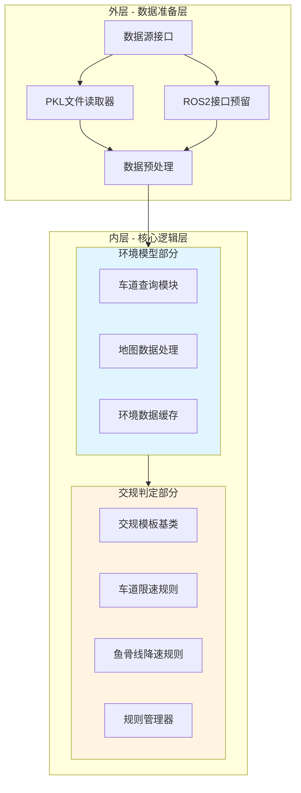
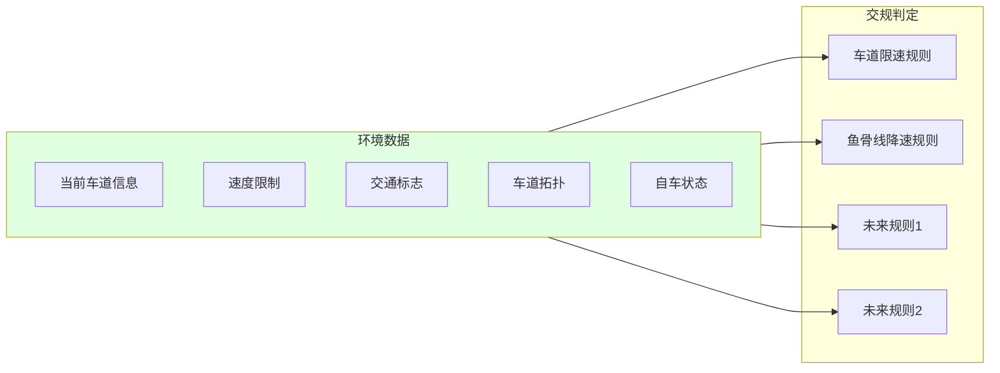
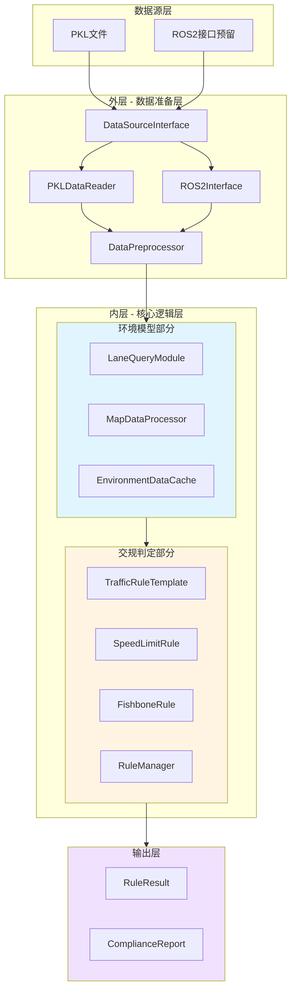

# 交规符合性验证系统 - 架构设计文档

## 1. 模块概述

### 1.1 模块目标
构建一个基于地图API的交规符合性验证系统，通过分层架构实现环境模型构建和交规判定功能，支持车道限速、鱼骨线降速等交规验证，并为后续扩展提供灵活的框架。

### 1.2 设计原则
- **分层架构**：内层专注核心逻辑，外层负责数据准备
- **模块化设计**：环境模型与交规判定分离，便于维护和扩展
- **模板模式**：基于模板类实现交规判定，便于添加新规则
- **数据复用**：环境模型数据可被多个交规判定共用
- **接口统一**：提供标准化的数据输入输出接口
- **可扩展性**：支持从pkl文件到ROS2的数据源扩展

### 1.3 核心设计决策

#### 1.3.1 两层架构设计

**内层专注核心逻辑，外层负责数据准备**



**架构说明**：
- **外层**：负责数据准备，当前从pkl文件获取数据，预留ROS2接口
- **内层**：专注核心逻辑，分为环境模型和交规判定两部分
- **环境模型**：处理地图API调用，获取相关环境数据，供多个交规判定共用
- **交规判定**：基于模板模式实现，便于扩展新的交规规则

#### 1.3.2 模板模式设计

**基于模板类实现交规判定**

```python
from abc import ABC, abstractmethod

class TrafficRuleTemplate(ABC):
    """交规判定模板基类"""
    
    def __init__(self, rule_name: str):
        self.rule_name = rule_name
    
    @abstractmethod
    def check_condition(self, environment_data: dict) -> bool:
        """检查交规条件是否满足"""
        pass
    
    @abstractmethod
    def get_action(self, environment_data: dict) -> dict:
        """获取交规动作（如降速要求）"""
        pass
    
    def execute_rule(self, environment_data: dict) -> dict:
        """执行交规判定"""
        if self.check_condition(environment_data):
            return self.get_action(environment_data)
        return {"action": "none", "reason": f"Rule {self.rule_name} not applicable"}
```

**优势**：
- 统一的交规判定接口
- 便于添加新的交规规则
- 规则之间相互独立
- 便于单元测试和维护

#### 1.3.3 环境模型数据共享

**环境数据可被多个交规判定共用**



**数据流**：
1. 环境模型从地图API获取数据
2. 数据标准化处理后存储在环境数据结构中
3. 各个交规规则共享同一份环境数据
4. 避免重复查询，提高性能

---

## 2. 需求分析

### 2.1 功能需求

| 需求编号 | 需求描述 | 优先级 |
|---------|---------|--------|
| TRV-001 | 支持从pkl文件读取自车状态数据 | P0 |
| TRV-002 | 基于地图API查询当前车道信息 | P0 |
| TRV-003 | 实现车道限速交规判定 | P0 |
| TRV-004 | 实现鱼骨线降速交规判定 | P0 |
| TRV-005 | 支持ROS2数据源接口预留 | P1 |
| TRV-006 | 提供交规判定结果输出 | P0 |
| TRV-007 | 支持多交规并行判定 | P1 |
| TRV-008 | 提供交规规则管理功能 | P1 |

### 2.2 非功能需求

| 需求编号 | 需求描述 | 优先级 |
|---------|---------|--------|
| TRVN-001 | 交规判定响应时间 < 50ms | P1 |
| TRVN-002 | 环境模型查询响应时间 < 20ms | P1 |
| TRVN-003 | 代码模块化，易于扩展新规则 | P0 |
| TRVN-004 | 支持动态添加/移除交规规则 | P1 |

---

## 3. 系统架构设计

### 3.1 整体架构



**架构说明**：
- **数据源层**：支持pkl文件和ROS2数据源
- **外层**：负责数据读取和预处理，为内层提供标准化的输入
- **内层**：核心逻辑层，分为环境模型和交规判定两部分
- **环境模型**：处理地图API调用，获取和缓存环境数据
- **交规判定**：基于模板模式实现各种交规规则
- **输出层**：提供标准化的交规判定结果

### 3.2 类图设计

```mermaid
classDiagram
    class TrafficRuleVerificationSystem {
        -environment_model: EnvironmentModel
        -rule_engine: RuleEngine
        +__init__()
        +verify_compliance(vehicle_state: dict) ComplianceReport
        +add_rule(rule: TrafficRuleTemplate)
        +remove_rule(rule_name: str)
    }
    
    class EnvironmentModel {
        -map_api: MapAPI
        -cache: EnvironmentDataCache
        +__init__(map_api: MapAPI)
        +get_current_lane(position: Position) Optional[Lanelet]
        +get_speed_limit(position: Position) Optional[float]
        +get_traffic_signs(position: Position, radius: float) List[TrafficSign]
        +get_environment_data(vehicle_state: dict) dict
    }
    
    class RuleEngine {
        -rules: List[TrafficRuleTemplate]
        -rule_manager: RuleManager
        +__init__()
        +add_rule(rule: TrafficRuleTemplate)
        +remove_rule(rule_name: str)
        +execute_rules(environment_data: dict) List[RuleResult]
    }
    
    class TrafficRuleTemplate {
        <<abstract>>
        #rule_name: str
        +__init__(rule_name: str)
        +check_condition(environment_data: dict) bool
        +get_action(environment_data: dict) dict
        +execute_rule(environment_data: dict) dict
    }
    
    class SpeedLimitRule {
        -current_speed: float
        +check_condition(environment_data: dict) bool
        +get_action(environment_data: dict) dict
    }
    
    class FishboneRule {
        -fishbone_distance: float
        +check_condition(environment_data: dict) bool
        +get_action(environment_data: dict) dict
    }
    
    class RuleManager {
        -rules: Dict[str~TrafficRuleTemplate~]
        +add_rule(rule: TrafficRuleTemplate)
        +remove_rule(rule_name: str)
        +get_rule(rule_name: str) Optional[TrafficRuleTemplate]
        +list_rules() List[str]
    }
    
    class DataSourceInterface {
        <<interface>>
        +read_data() dict
        +is_available() bool
    }
    
    class PKLDataReader {
        -file_path: str
        +read_data() dict
        +is_available() bool
    }
    
    class ROS2Interface {
        <<interface>>
        +read_data() dict
        +is_available() bool
    }
    
    class DataPreprocessor {
        +preprocess_data(raw_data: dict) dict
        +normalize_vehicle_state(vehicle_state: dict) dict
    }
    
    class EnvironmentDataCache {
        -cache_data: dict
        -cache_timestamp: float
        +get_data(key: str) Optional[any]
        +set_data(key: str, value: any)
        +is_valid() bool
    }
    
    class ComplianceReport {
        +timestamp: datetime
        +vehicle_state: dict
        +rule_results: List[RuleResult]
        +is_compliant: bool
        +get_summary() str
    }
    
    class RuleResult {
        +rule_name: str
        +is_triggered: bool
        +action: dict
        +reason: str
        +confidence: float
    }
    
    class VehicleState {
        +latitude: float
        +longitude: float
        +heading: float
        +speed: float
        +acceleration: float
        +driving_mode: str
        +target_speed: float
    }
    
    TrafficRuleVerificationSystem --> EnvironmentModel
    TrafficRuleVerificationSystem --> RuleEngine
    EnvironmentModel --> MapAPI
    EnvironmentModel --> EnvironmentDataCache
    RuleEngine --> TrafficRuleTemplate
    RuleEngine --> RuleManager
    TrafficRuleTemplate <|.. SpeedLimitRule
    TrafficRuleTemplate <|.. FishboneRule
    DataSourceInterface <|.. PKLDataReader
    DataSourceInterface <|.. ROS2Interface
    DataPreprocessor --> DataSourceInterface
    
    note for TrafficRuleTemplate "交规判定模板基类"
    note for EnvironmentModel "环境模型，处理地图API调用"
    note for RuleEngine "交规判定引擎"
    note for DataSourceInterface "数据源接口，支持多种数据源"
```



**关键点**：
- `TrafficRuleVerificationSystem` 是主系统入口，协调环境模型和交规判定
- `EnvironmentModel` 负责与地图API交互，获取环境数据
- `TrafficRuleTemplate` 是交规判定的抽象基类，定义统一接口
- `SpeedLimitRule` 和 `FishboneRule` 是具体的交规实现
- `DataSourceInterface` 支持多种数据源，当前实现PKL文件读取
- `ComplianceReport` 提供标准化的交规判定结果输出

---

## 4. 数据结构设计

### 4.1 自车状态信息

```python
from dataclasses import dataclass
from typing import Optional
from datetime import datetime

@dataclass
class VehicleState:
    """自车状态信息"""
    latitude: float  # 纬度
    longitude: float  # 经度
    heading: float  # 航向角（度）
    speed: float  # 当前速度 (km/h)
    acceleration: float  # 加速度 (m/s²)
    driving_mode: str  # 智能驾驶状态
    target_speed: float  # 智能驾驶设定速度 (km/h)
    timestamp: Optional[datetime] = None  # 时间戳
    
    def to_dict(self) -> dict:
        """转换为字典格式"""
        return {
            "latitude": self.latitude,
            "longitude": self.longitude,
            "heading": self.heading,
            "speed": self.speed,
            "acceleration": self.acceleration,
            "driving_mode": self.driving_mode,
            "target_speed": self.target_speed,
            "timestamp": self.timestamp
        }
```

### 4.2 环境数据结构

```python
from typing import Dict, List, Optional, Any
from dataclasses import dataclass

@dataclass
class EnvironmentData:
    """环境数据结构"""
    current_lane: Optional[Lanelet] = None
    speed_limit: Optional[float] = None
    traffic_signs: List[TrafficSign] = None
    lane_topology: Dict[str, Any] = None
    nearby_fishbones: List[Dict[str, Any]] = None
    
    def to_dict(self) -> dict:
        """转换为字典格式，供交规判定使用"""
        return {
            "current_lane": self.current_lane.to_dict() if self.current_lane else None,
            "speed_limit": self.speed_limit,
            "traffic_signs": [sign.to_dict() for sign in self.traffic_signs] if self.traffic_signs else [],
            "lane_topology": self.lane_topology,
            "nearby_fishbones": self.nearby_fishbones,
            "vehicle_state": None  # 由外部传入
        }
```

### 4.3 交规判定结果

```python
from dataclasses import dataclass
from typing import Dict, Any
from datetime import datetime

@dataclass
class RuleResult:
    """单条交规判定结果"""
    rule_name: str  # 规则名称
    is_triggered: bool  # 是否触发
    action: Dict[str, Any]  # 动作（如降速要求）
    reason: str  # 触发原因
    confidence: float  # 置信度 (0-1)
    
    def to_dict(self) -> dict:
        """转换为字典格式"""
        return {
            "rule_name": self.rule_name,
            "is_triggered": self.is_triggered,
            "action": self.action,
            "reason": self.reason,
            "confidence": self.confidence
        }

@dataclass
class ComplianceReport:
    """交规符合性验证报告"""
    timestamp: datetime  # 验证时间
    vehicle_state: VehicleState  # 自车状态
    rule_results: List[RuleResult]  # 各规则判定结果
    is_compliant: bool  # 是否整体符合
    
    def get_summary(self) -> str:
        """获取验证结果摘要"""
        triggered_rules = [r for r in self.rule_results if r.is_triggered]
        if not triggered_rules:
            return "符合所有交规要求"
        else:
            rule_names = [r.rule_name for r in triggered_rules]
            return f"违反交规: {', '.join(rule_names)}"
    
    def to_dict(self) -> dict:
        """转换为字典格式"""
        return {
            "timestamp": self.timestamp.isoformat(),
            "vehicle_state": self.vehicle_state.to_dict(),
            "rule_results": [r.to_dict() for r in self.rule_results],
            "is_compliant": self.is_compliant,
            "summary": self.get_summary()
        }
```

---

## 5. 接口设计

### 5.1 主系统接口

```python
from typing import List, Optional
from .environment_model import EnvironmentModel
from .rule_engine import RuleEngine
from .data_structures import VehicleState, ComplianceReport, RuleResult

class TrafficRuleVerificationSystem:
    """交规符合性验证系统主入口"""
    
    def __init__(self, map_api):
        """
        初始化系统
        
        Args:
            map_api: 地图API接口
        """
        self.environment_model = EnvironmentModel(map_api)
        self.rule_engine = RuleEngine()
        
        # 默认添加基础交规规则
        self._add_default_rules()
    
    def verify_compliance(self, vehicle_state: VehicleState) -> ComplianceReport:
        """
        验证交规符合性
        
        Args:
            vehicle_state: 自车状态信息
            
        Returns:
            交规符合性验证报告
        """
        # 1. 获取环境数据
        environment_data = self.environment_model.get_environment_data(vehicle_state)
        
        # 2. 执行交规判定
        rule_results = self.rule_engine.execute_rules(environment_data)
        
        # 3. 生成验证报告
        is_compliant = all(not result.is_triggered for result in rule_results)
        
        return ComplianceReport(
            timestamp=datetime.now(),
            vehicle_state=vehicle_state,
            rule_results=rule_results,
            is_compliant=is_compliant
        )
    
    def add_rule(self, rule):
        """
        添加交规规则
        
        Args:
            rule: 交规规则对象
        """
        self.rule_engine.add_rule(rule)
    
    def remove_rule(self, rule_name: str):
        """
        移除交规规则
        
        Args:
            rule_name: 规则名称
        """
        self.rule_engine.remove_rule(rule_name)
    
    def list_rules(self) -> List[str]:
        """
        列出所有规则名称
        
        Returns:
            规则名称列表
        """
        return self.rule_engine.list_rules()
    
    def _add_default_rules(self):
        """添加默认的交规规则"""
        from .rules import SpeedLimitRule, FishboneRule
        
        self.add_rule(SpeedLimitRule())
        self.add_rule(FishboneRule())
```

### 5.2 环境模型接口

```python
from typing import Dict, List, Optional
from .data_structures import VehicleState, Lanelet, TrafficSign

class EnvironmentModel:
    """环境模型，负责处理地图API调用"""
    
    def __init__(self, map_api):
        """
        初始化环境模型
        
        Args:
            map_api: 地图API接口
        """
        self.map_api = map_api
        self.cache = EnvironmentDataCache()
    
    def get_current_lane(self, position) -> Optional[Lanelet]:
        """
        获取当前车道
        
        Args:
            position: 位置信息
            
        Returns:
            车道信息，如果不在任何车道内则返回None
        """
        return self.map_api.get_lanelet(position)
    
    def get_speed_limit(self, position) -> Optional[float]:
        """
        获取速度限制
        
        Args:
            position: 位置信息
            
        Returns:
            速度限制 (km/h)，如果无限制则返回None
        """
        return self.map_api.get_speed_limit(position)
    
    def get_traffic_signs(self, position, radius: float = 100.0) -> List[TrafficSign]:
        """
        获取交通标志
        
        Args:
            position: 中心位置
            radius: 搜索半径（米）
            
        Returns:
            交通标志列表
        """
        return self.map_api.get_traffic_signs(position, radius)
    
    def get_environment_data(self, vehicle_state: VehicleState) -> Dict:
        """
        获取环境数据
        
        Args:
            vehicle_state: 自车状态信息
            
        Returns:
            环境数据字典
        """
        # 检查缓存
        cache_key = f"env_{vehicle_state.latitude}_{vehicle_state.longitude}"
        cached_data = self.cache.get_data(cache_key)
        if cached_data and self.cache.is_valid():
            # 添加车辆状态到缓存数据
            cached_data["vehicle_state"] = vehicle_state.to_dict()
            return cached_data
        
        # 从地图API获取数据
        position = Position(
            latitude=vehicle_state.latitude,
            longitude=vehicle_state.longitude
        )
        
        current_lane = self.get_current_lane(position)
        speed_limit = self.get_speed_limit(position)
        traffic_signs = self.get_traffic_signs(position)
        
        # 构建环境数据
        environment_data = EnvironmentData(
            current_lane=current_lane,
            speed_limit=speed_limit,
            traffic_signs=traffic_signs,
            lane_topology=self._get_lane_topology(current_lane),
            nearby_fishbones=self._get_nearby_fishbones(traffic_signs)
        )
        
        # 缓存数据
        self.cache.set_data(cache_key, environment_data.to_dict())
        
        # 添加车辆状态
        environment_data_dict = environment_data.to_dict()
        environment_data_dict["vehicle_state"] = vehicle_state.to_dict()
        
        return environment_data_dict
    
    def _get_lane_topology(self, lane: Optional[Lanelet]) -> Dict:
        """获取车道拓扑信息"""
        # 实现车道拓扑查询逻辑
        return {}
    
    def _get_nearby_fishbones(self, traffic_signs: List[TrafficSign]) -> List[Dict]:
        """获取附近的鱼骨线信息"""
        fishbones = []
        for sign in traffic_signs:
            if sign.sign_type == SignType.FISHBONE:
                fishbones.append({
                    "position": sign.position.to_dict(),
                    "direction": sign.direction,
                    "value": sign.value
                })
        return fishbones
```

### 5.3 交规规则接口

```python
from abc import ABC, abstractmethod
from typing import Dict, Any

class TrafficRuleTemplate(ABC):
    """交规判定模板基类"""
    
    def __init__(self, rule_name: str):
        """
        初始化规则
        
        Args:
            rule_name: 规则名称
        """
        self.rule_name = rule_name
    
    @abstractmethod
    def check_condition(self, environment_data: Dict[str, Any]) -> bool:
        """
        检查交规条件是否满足
        
        Args:
            environment_data: 环境数据
            
        Returns:
            是否满足条件
        """
        pass
    
    @abstractmethod
    def get_action(self, environment_data: Dict[str, Any]) -> Dict[str, Any]:
        """
        获取交规动作
        
        Args:
            environment_data: 环境数据
            
        Returns:
            动作字典
        """
        pass
    
    def execute_rule(self, environment_data: Dict[str, Any]) -> Dict[str, Any]:
        """
        执行交规判定
        
        Args:
            environment_data: 环境数据
            
        Returns:
            判定结果
        """
        if self.check_condition(environment_data):
            return {
                "rule_name": self.rule_name,
                "is_triggered": True,
                "action": self.get_action(environment_data),
                "reason": f"Rule {self.rule_name} triggered",
                "confidence": self._calculate_confidence(environment_data)
            }
        else:
            return {
                "rule_name": self.rule_name,
                "is_triggered": False,
                "action": {"action": "none"},
                "reason": f"Rule {self.rule_name} not applicable",
                "confidence": 0.0
            }
    
    def _calculate_confidence(self, environment_data: Dict[str, Any]) -> float:
        """
        计算判定置信度
        
        Args:
            environment_data: 环境数据
            
        Returns:
            置信度 (0-1)
        """
        # 默认实现，子类可以重写
        return 1.0
```

### 5.4 具体交规规则实现

```python
from .traffic_rule_template import TrafficRuleTemplate
from .data_structures import VehicleState

class SpeedLimitRule(TrafficRuleTemplate):
    """车道限速交规规则"""
    
    def __init__(self):
        super().__init__("SpeedLimitRule")
    
    def check_condition(self, environment_data: Dict[str, Any]) -> bool:
        """
        检查是否超速
        
        Args:
            environment_data: 环境数据
            
        Returns:
            是否超速
        """
        vehicle_state = environment_data.get("vehicle_state", {})
        speed_limit = environment_data.get("speed_limit")
        current_speed = vehicle_state.get("speed", 0)
        
        # 如果没有速度限制，不检查
        if speed_limit is None:
            return False
        
        # 超速超过5%触发规则
        return current_speed > speed_limit * 1.05
    
    def get_action(self, environment_data: Dict[str, Any]) -> Dict[str, Any]:
        """
        获取降速动作
        
        Args:
            environment_data: 环境数据
            
        Returns:
            降速动作
        """
        speed_limit = environment_data.get("speed_limit")
        return {
            "action": "speed_reduction",
            "target_speed": speed_limit,
            "reason": "Speed limit exceeded"
        }
    
    def _calculate_confidence(self, environment_data: Dict[str, Any]) -> float:
        """计算超速置信度"""
        vehicle_state = environment_data.get("vehicle_state", {})
        speed_limit = environment_data.get("speed_limit")
        current_speed = vehicle_state.get("speed", 0)
        
        if speed_limit is None:
            return 0.0
        
        # 超速越多，置信度越高
        speed_ratio = current_speed / speed_limit
        return min(1.0, (speed_ratio - 1.0) * 2.0)

class FishboneRule(TrafficRuleTemplate):
    """鱼骨线降速交规规则"""
    
    def __init__(self):
        super().__init__("FishboneRule")
    
    def check_condition(self, environment_data: Dict[str, Any]) -> bool:
        """
        检查是否接近鱼骨线
        
        Args:
            environment_data: 环境数据
            
        Returns:
            是否需要降速
        """
        vehicle_state = environment_data.get("vehicle_state", {})
        nearby_fishbones = environment_data.get("nearby_fishbones", [])
        current_speed = vehicle_state.get("speed", 0)
        
        # 如果没有鱼骨线，不检查
        if not nearby_fishbones:
            return False
        
        # 检查鱼骨线距离
        for fishbone in nearby_fishbones:
            distance = self._calculate_distance(vehicle_state, fishbone["position"])
            # 距离小于100米且速度大于40km/h时触发
            if distance < 100 and current_speed > 40:
                return True
        
        return False
    
    def get_action(self, environment_data: Dict[str, Any]) -> Dict[str, Any]:
        """
        获取降速动作
        
        Args:
            environment_data: 环境数据
            
        Returns:
            降速动作
        """
        return {
            "action": "speed_reduction",
            "target_speed": 20,  # 鱼骨线限速20km/h
            "reason": "Approaching fishbone line"
        }
    
    def _calculate_distance(self, vehicle_state: Dict, fishbone_position: Dict) -> float:
        """
        计算车辆到鱼骨线的距离
        
        Args:
            vehicle_state: 车辆状态
            fishbone_position: 鱼骨线位置
            
        Returns:
            距离（米）
        """
        # 简化的距离计算，实际应使用更精确的地理距离计算
        lat_diff = vehicle_state["latitude"] - fishbone_position["latitude"]
        lon_diff = vehicle_state["longitude"] - fishbone_position["longitude"]
        
        # 近似距离计算（米）
        return ((lat_diff * 111000) ** 2 + (lon_diff * 111000) ** 2) ** 0.5
    
    def _calculate_confidence(self, environment_data: Dict[str, Any]) -> float:
        """计算鱼骨线置信度"""
        vehicle_state = environment_data.get("vehicle_state", {})
        nearby_fishbones = environment_data.get("nearby_fishbones", [])
        current_speed = vehicle_state.get("speed", 0)
        
        if not nearby_fishbones:
            return 0.0
        
        # 找到最近的鱼骨线
        min_distance = float('inf')
        for fishbone in nearby_fishbones:
            distance = self._calculate_distance(vehicle_state, fishbone["position"])
            min_distance = min(min_distance, distance)
        
        # 距离越近，速度越快，置信度越高
        distance_factor = max(0, (100 - min_distance) / 100)
        speed_factor = min(1.0, current_speed / 80)
        
        return distance_factor * speed_factor
```

---

## 6. 目录结构设计

```
traffic_rule_verification/
├── traffic_rule_verification_architecture.md  # 架构文档（本文件）
├── src/
│   ├── __init__.py
│   ├── core/
│   │   ├── __init__.py
│   │   ├── system.py              # 主系统入口
│   │   ├── environment_model.py    # 环境模型
│   │   ├── rule_engine.py         # 交规判定引擎
│   │   └── data_structures.py      # 数据结构定义
│   ├── rules/
│   │   ├── __init__.py
│   │   ├── traffic_rule_template.py  # 交规模板基类
│   │   ├── speed_limit_rule.py    # 车道限速规则
│   │   ├── fishbone_rule.py       # 鱼骨线降速规则
│   │   └── rule_manager.py         # 规则管理器
│   ├── data_sources/
│   │   ├── __init__.py
│   │   ├── data_source_interface.py  # 数据源接口
│   │   ├── pkl_data_reader.py      # PKL文件读取器
│   │   └── ros2_interface.py      # ROS2接口预留
│   ├── utils/
│   │   ├── __init__.py
│   │   ├── data_preprocessor.py    # 数据预处理
│   │   └── environment_cache.py   # 环境数据缓存
│   └── examples/
│       ├── __init__.py
│       ├── basic_usage.py          # 基本使用示例
│       └── custom_rule_example.py  # 自定义规则示例
├── tests/
│   ├── __init__.py
│   ├── test_system.py             # 系统测试
│   ├── test_environment_model.py  # 环境模型测试
│   ├── test_rules.py              # 规则测试
│   └── test_data_sources.py        # 数据源测试
├── configs/
│   └── traffic_rule_config.yaml   # 交规配置
└── requirements.txt               # Python依赖
```

---

## 7. 配置管理

### 7.1 交规配置文件 (traffic_rule_config.yaml)

```yaml
# 交规配置
traffic_rules:
  # 车道限速规则配置
  speed_limit:
    enabled: true
    tolerance_ratio: 1.05  # 超速容忍比例（5%）
    confidence_threshold: 0.8
    
  # 鱼骨线规则配置
  fishbone:
    enabled: true
    trigger_distance: 100  # 触发距离（米）
    target_speed: 20      # 目标速度（km/h）
    max_speed_to_trigger: 40  # 最大触发速度（km/h）

# 环境模型配置
environment_model:
  cache:
    enabled: true
    ttl: 5.0  # 缓存有效期（秒）
    max_size: 100  # 最大缓存条目数
  
  map_query:
    default_radius: 100.0  # 默认查询半径（米）
    max_search_distance: 50.0  # 最大搜索距离（米）

# 数据源配置
data_sources:
  pkl:
    enabled: true
    default_file_path: "vehicle_state.pkl"
    
  ros2:
    enabled: false  # 预留接口
    topic_name: "/vehicle_state"
```

---

## 8. 技术选型

| 组件 | 技术选型 | 说明 |
|-----|---------|------|
| 地图API | Lanelet2 | 基于现有的地图API接口 |
| 数据结构 | dataclasses | Python数据类，类型安全 |
| 设计模式 | 模板模式 | 统一的交规判定接口 |
| 缓存 | 内存缓存 | 提高环境数据查询性能 |
| 配置管理 | PyYAML | 配置文件解析 |
| 类型检查 | typing | Python类型注解 |
| 测试 | pytest | 单元测试 |

---

## 9. 实施计划

### 9.1 第一阶段：基础框架
- [ ] 搭建项目目录结构
- [ ] 定义基础数据结构（VehicleState, EnvironmentData, RuleResult等）
- [ ] 实现TrafficRuleTemplate模板基类
- [ ] 实现EnvironmentModel环境模型
- [ ] 实现RuleEngine交规判定引擎

### 9.2 第二阶段：核心规则实现
- [ ] 实现SpeedLimitRule车道限速规则
- [ ] 实现FishboneRule鱼骨线降速规则
- [ ] 实现PKLDataReader数据读取器
- [ ] 实现环境数据缓存机制
- [ ] 编写测试用例

### 9.3 第三阶段：系统集成和优化
- [ ] 实现TrafficRuleVerificationSystem主系统
- [ ] 实现数据预处理模块
- [ ] 添加配置管理功能
- [ ] 性能优化和缓存策略
- [ ] 编写示例代码

### 9.4 第四阶段：扩展和完善
- [ ] 实现ROS2接口预留
- [ ] 支持动态规则管理
- [ ] 添加更多交规规则
- [ ] 完善文档和示例
- [ ] 集成测试

---

## 10. 使用示例

### 10.1 基本使用

```python
from traffic_rule_verification.core.system import TrafficRuleVerificationSystem
from traffic_rule_verification.core.data_structures import VehicleState
from traffic_rule_verification.data_sources.pkl_data_reader import PKLDataReader
from traffic_rule_verification.utils.data_preprocessor import DataPreprocessor

# 1. 初始化系统
map_api = MapAPI()  # 基于现有的地图API
system = TrafficRuleVerificationSystem(map_api)

# 2. 从pkl文件读取数据
data_reader = PKLDataReader("vehicle_state.pkl")
raw_data = data_reader.read_data()

# 3. 数据预处理
preprocessor = DataPreprocessor()
vehicle_state = preprocessor.normalize_vehicle_state(raw_data)

# 4. 验证交规符合性
report = system.verify_compliance(vehicle_state)

# 5. 输出结果
print(f"验证时间: {report.timestamp}")
print(f"车辆速度: {vehicle_state.speed} km/h")
print(f"是否符合: {report.is_compliant}")
print(f"验证摘要: {report.get_summary()}")

# 6. 详细结果
for result in report.rule_results:
    print(f"规则: {result.rule_name}")
    print(f"触发: {result.is_triggered}")
    print(f"动作: {result.action}")
    print(f"原因: {result.reason}")
    print(f"置信度: {result.confidence}")
    print("-" * 50)
```

### 10.2 自定义交规规则

```python
from traffic_rule_verification.rules.traffic_rule_template import TrafficRuleTemplate

class CustomRule(TrafficRuleTemplate):
    """自定义交规规则示例"""
    
    def __init__(self):
        super().__init__("CustomRule")
    
    def check_condition(self, environment_data):
        """自定义条件检查"""
        vehicle_state = environment_data.get("vehicle_state", {})
        current_speed = vehicle_state.get("speed", 0)
        
        # 示例：速度超过60km/h时触发
        return current_speed > 60
    
    def get_action(self, environment_data):
        """自定义动作"""
        return {
            "action": "warning",
            "message": "Speed is too high",
            "target_speed": 60
        }

# 添加自定义规则
system.add_rule(CustomRule())

# 使用自定义规则
report = system.verify_compliance(vehicle_state)
custom_result = next(r for r in report.rule_results if r.rule_name == "CustomRule")
print(f"自定义规则结果: {custom_result}")
```

### 10.3 动态规则管理

```python
# 列出所有规则
print("当前规则列表:")
for rule_name in system.list_rules():
    print(f"  - {rule_name}")

# 移除规则
system.remove_rule("FishboneRule")
print("移除FishboneRule后的规则列表:")
for rule_name in system.list_rules():
    print(f"  - {rule_name}")

# 添加新规则
new_rule = CustomRule()
system.add_rule(new_rule)
print("添加自定义规则后的规则列表:")
for rule_name in system.list_rules():
    print(f"  - {rule_name}")
```

---

## 11. 风险和挑战

| 风险 | 影响 | 缓解措施 |
|-----|------|---------|
| 地图API性能问题 | 高 | 实现缓存机制，优化查询算法 |
| 交规规则复杂度 | 中 | 采用模板模式，统一接口设计 |
| 数据源扩展性 | 中 | 抽象数据源接口，便于扩展 |
| 规则冲突处理 | 中 | 实现规则优先级和冲突解决机制 |
| 实时性要求 | 高 | 优化算法，确保响应时间要求 |

---

## 12. 附录

### 12.1 术语表

| 术语 | 说明 |
|-----|------|
| 交规符合性验证 | 验证车辆行为是否符合交通规则 |
| 环境模型 | 构建车辆周围环境的抽象表示 |
| 模板模式 | 定义操作算法骨架，子类实现具体步骤 |
| 鱼骨线 | 道路上的减速标线，要求车辆减速 |
| 车道限速 | 道路或车道的最高允许速度 |

### 12.2 扩展指南

#### 12.2.1 添加新的交规规则

1. 继承 `TrafficRuleTemplate` 类
2. 实现 `check_condition` 方法
3. 实现 `get_action` 方法
4. 可选：重写 `_calculate_confidence` 方法
5. 注册到系统中

```python
class NewRule(TrafficRuleTemplate):
    def __init__(self):
        super().__init__("NewRule")
    
    def check_condition(self, environment_data):
        # 实现条件检查逻辑
        pass
    
    def get_action(self, environment_data):
        # 实现动作逻辑
        pass

# 注册规则
system.add_rule(NewRule())
```

#### 12.2.2 添加新的数据源

1. 实现 `DataSourceInterface` 接口
2. 实现 `read_data` 和 `is_available` 方法
3. 在配置文件中启用新数据源
4. 系统会自动使用可用的数据源

```python
class NewDataSource(DataSourceInterface):
    def read_data(self) -> dict:
        # 实现数据读取逻辑
        pass
    
    def is_available(self) -> bool:
        # 检查数据源是否可用
        pass
```

### 12.3 参考资料

- 设计模式：模板模式 - https://refactoring.guru/design-patterns/template-method
- Python dataclasses - https://docs.python.org/3/library/dataclasses.html
- Lanelet2 - https://github.com/fzi-forschungszentrum-informatik/Lanelet2
- PyYAML - https://pyyaml.org/